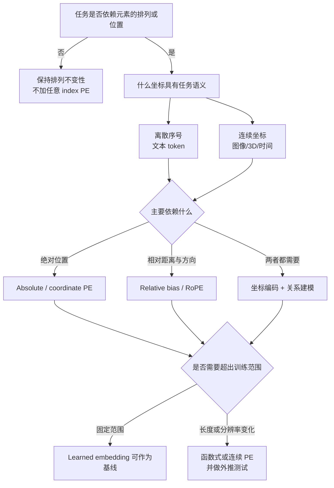

# 深度学习中的位置编码

## 学习目标

读完本文后，应当能够：

1. 从排列对称性的角度解释为什么模型需要 Positional Encoding（PE）；
2. 区分绝对、相对、旋转、attention bias、连续坐标和条件位置编码；
3. 判断一个任务是否应该加入 PE，以及应该表达哪一种坐标；
4. 根据 PE 想影响的计算，选择输入、Q/K、attention logits 或特征调制等注入位置；
5. 为文本、图像、点云、BEV 和时序特征设计位置编码并排查常见错误。

## 前置知识与范围

需要了解 token/feature、embedding，以及 attention 中 query、key、value 的基本含义。

本文中的 PE 统一指 **Positional Encoding 或 Positional Embedding**。文献对两个词的使用并不严格：固定函数通常称 encoding，可学习参数通常称 embedding，但选择方法时应关注它表达什么关系、注入在哪里，而不是名称。

PE 不只表示序列下标。凡是模型需要显式感知的坐标或关系，都可视为广义位置编码，例如：

- 文本中的 token index；
- 图像 patch 的 $(x,y)$；
- 点云或 BEV cell 的 $(x,y,z)$；
- 视频帧的时间戳与时间差；
- 多尺度特征的 level id；
- 图结构中的距离、边类型或相对关系。

## 核心心智模型：PE 在选择模型的对称性

不带位置相关 mask 和 PE 的 content-only self-attention 对 token 排列是等变的。设 $P$ 是排列矩阵，则

$$
\operatorname{Attention}(PX)
=
P\operatorname{Attention}(X).
$$

模型看到了相同的一组内容，只是输出跟着输入一起换位；它没有额外依据判断哪个 token 在前、哪个 patch 在左上角。

因此 PE 的首要问题不是“用哪条公式”，而是：

> 哪些变换不应改变任务结果，哪些变换必须被模型区分？

- 集合分类通常应保持对输入排列不敏感，不应添加任意序号。
- 文本、轨迹和视频改变顺序后语义会变化，需要顺序或时间信息。
- 图像平移后分类结果可能不变，但检测位置必须相应移动；PE 应与任务需要的等变性一致。
- 点云的存储顺序无意义，但真实的 3D 坐标与点间距离有意义。

PE 可以提供三类信息：

1. **身份**：我是第几个 token、哪个 feature level；
2. **坐标**：我位于什么空间或时间位置；
3. **关系**：我与另一个元素相距多远、方向如何、是否相邻。



图中的关键不是某一种 PE 永远最好，而是先确定对称性、坐标和关系，再选择实现。

## 从最小例子开始

假设有三个内容 token：

```text
猫 追 老鼠
老鼠 追 猫
```

两句话包含相同的 token multiset，但主客体关系相反。仅根据内容两两计算 attention 时，模型缺少区分两个排列的显式线索。最直接的做法是在输入中加入位置向量：

$$
z_i=x_i+p_i,
$$

其中 $x_i$ 是内容 embedding，$p_i$ 是第 $i$ 个位置的编码。

原始 Transformer 使用正弦—余弦编码：

$$
PE(pos,2i)=\sin\left(\frac{pos}{10000^{2i/d}}\right),
$$

$$
PE(pos,2i+1)=\cos\left(\frac{pos}{10000^{2i/d}}\right).
$$

不同通道对应不同频率，使每个位置得到一组多尺度周期信号。[Attention Is All You Need](https://arxiv.org/abs/1706.03762)

一个最小 PyTorch 实现如下：

```python
import math

import torch


def sinusoidal_pe(length: int, dim: int, *, device=None) -> torch.Tensor:
    if dim % 2 != 0:
        raise ValueError("dim must be even")

    position = torch.arange(length, device=device).float().unsqueeze(1)
    frequency = torch.exp(
        torch.arange(0, dim, 2, device=device).float()
        * (-math.log(10_000.0) / dim)
    )

    pe = torch.zeros(length, dim, device=device)
    pe[:, 0::2] = torch.sin(position * frequency)
    pe[:, 1::2] = torch.cos(position * frequency)
    return pe


tokens = torch.randn(2, 128, 256)  # [batch, length, channel]
tokens = tokens + sinusoidal_pe(128, 256, device=tokens.device)[None]
```

这个例子只解决“每个输入位置可区分”。它没有保证模型一定学会距离、方向或长序列外推，因此需要理解下面的不同类型。

## PE 的主要类型

| 类型 | 典型形式 | 信息进入哪里 | 擅长表达 | 主要限制 |
| --- | --- | --- | --- | --- |
| 固定绝对位置 | sinusoidal PE | 输入 feature | 位置身份、多尺度序号 | 关系需要网络间接推导 |
| 可学习绝对位置 | embedding table | 输入 feature | 固定长度或固定网格中的任务适配 | 超出训练长度、换分辨率需扩展或插值 |
| 相对位置表示 | $r_{i-j}$ | K/V 或 attention score | 距离、方向、邻接关系 | 关系表和计算可能随维度增大 |
| Relative bias | $b(i,j)$ | attention logits | 直接改变关注模式 | bias 本身不携带完整内容特征 |
| RoPE | 位置相关旋转 Q/K | Q、K | 点积中的相对位移 | 长上下文仍需验证频率与缩放策略 |
| ALiBi | 与距离成比例的 head-wise bias | attention logits | 距离衰减和长度外推先验 | 线性、单调先验未必适合所有任务 |
| 连续坐标/Fourier | $\gamma(x,y,z,t)$ | 输入或坐标 MLP | 连续位置和高频空间变化 | 频率尺度选择敏感 |
| 条件位置编码 | 由邻域 feature 生成 | feature | 局部结构、可变输入尺寸 | 位置与内容耦合，分析更复杂 |

### 1. 固定绝对位置编码

固定函数把位置 $i$ 映射为向量 $p_i=f(i)$，然后与内容特征相加。sinusoidal PE 的优势是：

- 不需要维护长度为 $L$ 的参数表；
- 任意整数位置都能计算；
- 多个频率同时描述局部和较长距离变化。

但“公式可以计算更长位置”不等于模型自动具备长度外推能力。训练时没有见过的 attention pattern、频率范围和任务依赖仍可能导致性能下降。

### 2. 可学习绝对位置编码

维护参数表

$$
E_{pos}\in\mathbb{R}^{L_{max}\times d},
$$

并取 $p_i=E_{pos}[i]$。它简单、容量充足，常作为固定长度任务的强基线。ViT 将图像 patch 视为 token 并加入可学习位置 embedding；当图像分辨率改变时，位置表通常需要插值。[An Image Is Worth 16x16 Words](https://arxiv.org/abs/2010.11929)

适用条件：

- 训练和测试长度基本固定；
- 空间网格尺寸稳定；
- 不要求可靠地访问未训练位置。

### 3. 相对位置表示与 Relative Bias

许多任务更关心“两个 token 相距几步”，而不是各自在整个序列中的绝对编号。可把 attention score 写成：

$$
s_{ij}
=
\frac{q_i^\top k_j}{\sqrt d}
+b_{\operatorname{clip}(i-j)}.
$$

也可以把相对向量加入 key/value 的计算。Shaw 等人将相对距离表示直接纳入 self-attention，并将其推广为 relation-aware attention。[Self-Attention with Relative Position Representations](https://arxiv.org/abs/1803.02155)

Relative bias 常见设计包括：

- 为每个离散位移学习一个 bias；
- 对远距离做 bucket，近距离细分、远距离共享；
- 2D 中分别编码 $\Delta x$ 和 $\Delta y$；
- 图结构中根据边类型或图距离选择 bias。

### 4. RoPE

RoPE 不把位置向量直接加到 token 上，而是在每一层 attention 中旋转 Q/K 的二维通道对：

$$
q_i'=R(i)q_i,
\qquad
k_j'=R(j)k_j.
$$

于是点积满足：

$$
(q_i')^\top k_j'
=
q_i^\top R(i)^\top R(j)k_j
=
q_i^\top R(j-i)k_j.
$$

绝对位置通过旋转角进入 Q/K，而二者点积显式依赖相对位移 $j-i$。这也是 RoPE 同时具有绝对构造和相对 attention 性质的原因。[RoFormer](https://arxiv.org/abs/2104.09864)

注意：使用 RoPE 不意味着任意长度都能无损外推。训练长度、频率基底、数值精度和具体的 scaling 方法仍需共同验证。

### 5. ALiBi

ALiBi 不修改输入 embedding，而是直接对 attention score 加距离惩罚。对 causal attention，可概括为：

$$
s_{ij}^{(h)}
=
\frac{q_i^\top k_j}{\sqrt d}
-m_h(i-j),
\qquad j\le i,
$$

其中不同 attention head 使用不同斜率 $m_h$。它把“通常更关注近邻”作为结构先验，并以长度外推为主要设计目标。[Train Short, Test Long: Attention with Linear Biases Enables Input Length Extrapolation](https://openreview.net/forum?id=R8sQPpGCv0)

这种单调距离先验很高效，但周期性、二维方向、图关系或远距离精确配对未必适合仅用线性 bias 表达。

### 6. 连续坐标与 Fourier Features

对图像、3D、BEV、时间戳或隐式神经表示，位置往往是连续坐标 $p\in\mathbb{R}^k$。可直接输入归一化坐标，也可映射为：

$$
\gamma(p)
=
[\sin(2\pi Bp),\cos(2\pi Bp)].
$$

不同频率让普通 MLP 更容易表示随坐标快速变化的函数。Fourier Features 工作从频谱偏置角度分析了这种映射。[Fourier Features Let Networks Learn High Frequency Functions in Low Dimensional Domains](https://proceedings.neurips.cc/paper/2020/hash/55053683268957697aa39fba6f231c68-Abstract.html)

需要明确坐标的：

- 原点和单位；
- 归一化范围；
- 每个轴的尺度；
- 数据增强后坐标是否同步更新；
- 周期频率能否覆盖任务需要的空间细节。

### 7. 条件位置编码

条件 PE 根据输入 token 的局部邻域动态产生位置线索，例如用 depthwise convolution 构造 Position Encoding Generator。它试图同时获得局部结构、一定的平移性质和可变输入尺寸能力。[Conditional Positional Encodings for Vision Transformers](https://arxiv.org/abs/2102.10882)

这类方法适合视觉 feature map，但位置与内容耦合后，不再能把 PE 单独解释为一个固定坐标表。

## PE 可以加在哪里

### 1. 加到输入 feature

$$
z_i=x_i+p_i.
$$

这是最便宜的方式，不改变通道数。适合 absolute PE 和 learned embedding，通常在 token 第一次进入 Transformer 时加入一次。

风险是内容和位置共用同一表示空间；若二者数值尺度差异过大，较弱的一方可能被淹没。

### 2. 与 feature 拼接后投影

$$
z_i=\operatorname{MLP}([x_i;p_i]).
$$

拼接保留原始坐标和内容的可分辨性，适合低维连续坐标、时间差、相机参数和任务条件。代价是增加通道、参数和显存，通常需要线性层或 $1\times1$ convolution 压缩。

### 3. 作用于 Q/K

RoPE 属于这一类。位置直接改变 query 与 key 的匹配方式，所以需要在每一个使用该位置关系的 attention layer 中应用，而不是只在网络输入处做一次。

### 4. 加到 attention logits

$$
S=\frac{QK^\top}{\sqrt d}+B_{pos}.
$$

Relative bias、ALiBi 和窗口距离 bias 属于这一类。它们直接控制“哪些位置更容易互相关注”，不会修改 V 中传递的内容。

### 5. 同时编码 query 与 memory

在 encoder-decoder 或检测模型中，query 和 memory 有不同角色：

- memory PE 描述图像、BEV 或其他输入 token 的位置；
- query PE 描述查询槽位、reference point 或目标假设；
- cross-attention 需要二者位于可比较的坐标语义中。

DETR 使用 learned object queries，并为图像 memory 保留空间位置编码，展示了“输出槽位身份”和“输入空间位置”是两种不同 PE。[End-to-End Object Detection with Transformers](https://arxiv.org/abs/2005.12872)

### 6. 用 PE 调制 feature

还可以由位置、时间或条件产生 scale/shift：

$$
z_i=\gamma(p_i)\odot\operatorname{Norm}(x_i)+\beta(p_i).
$$

FiLM、conditional normalization、AdaLN 一类方法都可承担这种角色。它们适合需要位置影响 feature 解释方式、但不希望简单相加或扩大通道的场景。

## 什么时候加入或重新加入

不同 PE 的生命周期不同：

- **Absolute additive PE**：通常在输入 token 化后加入一次；层层重复相加可能让位置信号不断放大。
- **RoPE/relative bias**：在每个 attention layer 计算 Q/K 或 logits 时应用。
- **多尺度视觉 PE**：每个分辨率重新按该 feature map 的 $H\times W$ 生成，并用 level embedding 区分尺度。
- **连续几何 PE**：在坐标生成或坐标系改变后，使用与当前 feature 对应的坐标重新编码。
- **时间 PE**：在多帧 feature 或 memory 汇合前加入；不规则采样时优先使用真实 $\Delta t$，不要只使用 frame index。
- **模态 PE**：多模态 token 汇合时加入 modality/sensor id，但它不能替代各模态内部的空间或时间坐标。

可以同时使用多个 PE，但最好对应正交语义，例如：

$$
p_i=p_i^{space}+p_i^{time}+p_i^{level}+p_i^{modality}.
$$

若多个编码重复表达同一个位置关系，应通过消融确认是否互补，而不是默认“加得越多越好”。

## 不同任务的选择建议

| 场景 | 有意义的位置 | 推荐起点 | 不应做什么 |
| --- | --- | --- | --- |
| 固定长度文本 encoder | token index、相对距离 | learned/sinusoidal absolute PE 或 relative bias | 假设 learned table 能自动外推到新位置 |
| 长文本 causal LM | token index、历史距离 | RoPE 或 ALiBi，并单独验证目标长度 | 把“支持更长输入”当作“长上下文能力不下降” |
| 固定分辨率图像分类 | patch $(x,y)$ | learned 2D/1D grid PE | 无依据地把 raster index 当成最佳 2D关系 |
| 可变分辨率检测/分割 | $(x,y)$、尺度 level | 2D sinusoidal、continuous PE、relative bias 或 CPE | 忘记为 padding 和无效区域加 mask |
| 点云/无序集合 | 真实 $(x,y,z)$、点间关系 | coordinate MLP、Fourier features、relative geometry | 为存储顺序添加 index PE |
| BEV/3D query | 米制 $(x,y,z)$、reference point | 归一化坐标 MLP、2D/3D PE、几何 bias | 混用像素坐标、ego 坐标和全局坐标 |
| 视频/轨迹 | timestamp、$\Delta t$、空间位置 | spatial PE + continuous temporal PE | 采样间隔变化时仍只编码帧编号 |
| 多尺度 feature pyramid | 每层空间位置与 level id | per-level spatial PE + level embedding | 所有尺度复用不匹配的网格 PE |

## 一套可复用的设计方法论

### 第一步：确定应保留和打破的对称性

做两个思想实验：

1. 随机打乱 token，标签是否应该改变？
2. 整体平移、旋转或缩放输入，输出应该不变、等变，还是完全改变？

如果随机顺序无意义，保持 permutation invariance；如果物理位置有意义，就编码物理坐标，而不是数组序号。

### 第二步：选择坐标，而不是先选 PE 名字

明确写出：

```text
coordinate = (reference frame, origin, unit, axes, range, timestamp convention)
```

例如“归一化到 $[-1,1]$ 的图像坐标”和“以米为单位的 ego-frame BEV 坐标”不是同一种位置，即使最后都输入一个 MLP。

### 第三步：判断任务依赖 absolute 还是 relative 信息

- 边界、固定槽位、地图区域：常需要 absolute position；
- 局部邻域、距离衰减、平移泛化：常需要 relative position；
- 检测和 3D 感知：通常同时需要 query/reference point 的绝对坐标以及 query-key 的相对几何。

### 第四步：明确训练域与测试域

记录训练和测试可能变化的：

- sequence length；
- image/feature resolution；
- 空间范围和坐标单位；
- 时间采样间隔；
- 传感器数量和排列。

只要测试域可能越界，就必须把外推作为单独实验，而不能根据 PE 的数学形式推断结果。

### 第五步：根据希望影响的计算选择注入点

- 只需标识位置：输入相加；
- 希望内容和坐标保持可分：拼接后投影；
- 希望改变 token 匹配关系：Q/K 或 attention bias；
- 希望位置控制 feature 的解释方式：normalization/modulation；
- 希望表达 query 与 observation 的几何关系：在 cross-attention 两侧编码一致坐标。

### 第六步：用最小消融验证

至少比较：

1. 无 PE；
2. 简单 absolute PE；
3. 任务匹配的 relative 或 continuous PE；
4. 训练范围内与范围外测试；
5. 坐标增强、分辨率变化或不规则时间间隔测试。

不要只看最终精度，还要看收敛速度、显存、延迟、长度/分辨率外推和注意力是否出现异常距离偏置。

## 常见误区与排查

### 把数组顺序当作真实位置

点云、检测 queries 或集合元素的数组顺序常是实现细节。错误地加入 index PE 会破坏任务本来需要的排列不变性。

排查方法：固定样本，随机排列元素。如果输出发生不合理变化，检查是否混入了序号或顺序相关 mask。

### 2D/3D 数据只用展平后的 1D 下标

相邻 raster index 不一定代表相同方向的空间邻居，跨行边界尤其明显。优先显式编码 $(x,y)$、$(x,y,z)$ 或相对位移。

### 坐标系或数据增强不一致

feature 已经过 crop、resize、flip 或旋转，但 PE 仍使用增强前坐标，会让内容和位置产生系统性错配。

排查方法：选择几个可手算的角点和中心点，把从原始输入到 feature token 的全部变换逐步打印出来。

### 只看 shape，不看数值尺度

即使 $x_i$ 和 $p_i$ 都是 $d$ 维，也可能有

$$
\lVert p_i\rVert\gg\lVert x_i\rVert
\quad\text{或}\quad
\lVert p_i\rVert\ll\lVert x_i\rVert.
$$

监控二者 norm、attention logits 中内容项与位置 bias 的分布，并检查混合精度下高频三角函数的数值稳定性。

### 忽略 padding 与 mask

padding token 即使拥有合法 PE，也不应成为可读取内容。PE 与 attention mask 解决的是不同问题，不能互相替代。

### 认为函数式 PE 自动解决外推

sinusoidal、RoPE 或 ALiBi 能为新位置定义数值，但整个模型是否会正确使用这些数值仍是经验问题。必须在更长序列、更大网格或不同采样率上测量。

### 重复编码同一关系

输入 absolute PE、Q/K rotary 和 logits relative bias 可以共存，但它们可能重复或冲突。逐项消融，并检查模型是否过度偏向局部或固定位置。

## 调试清单

- [ ] 移除 PE 后，任务是否按预期明显退化？
- [ ] 随机打乱无序元素后，输出是否保持应有的不变性？
- [ ] 坐标的原点、轴方向、单位和归一化范围是否明确？
- [ ] crop、resize、flip、rotation 后 PE 是否同步变化？
- [ ] padding、无效区域和跨模态缺失数据是否正确 mask？
- [ ] PE 与内容 feature 的 norm 是否处于可学习的量级？
- [ ] 训练长度内、训练长度边界和范围外表现是否分别测试？
- [ ] 图像换分辨率时，learned PE 的插值方式是否与 token grid 对应？
- [ ] 不规则视频采样是否使用真实时间差而非固定 frame index？
- [ ] 多种 PE 同时使用时，是否完成逐项消融？

## 自测与练习

1. 为什么不带位置的 full self-attention 无法区分两个 token 排列？causal mask 会改变其中哪些条件？
2. learned absolute PE 能在训练长度内表现很好，为什么仍可能无法外推？
3. 推导 $(R(i)q)^\top(R(j)k)$ 为什么依赖 $j-i$。
4. 对一个 $H\times W$ feature map，分别实现 1D raster PE 和 2D separable PE，比较换分辨率时的处理方式。
5. 对不等时间间隔的轨迹，比较 frame index、timestamp 和 $\Delta t$ 编码分别丢失什么信息。
6. 为点云分类和点云检测各设计一种 PE，并解释为什么二者对 absolute position 的需求不同。

## 相关知识与论文

- [Attention Is All You Need](https://arxiv.org/abs/1706.03762)：Transformer 与 sinusoidal PE。
- [Self-Attention with Relative Position Representations](https://arxiv.org/abs/1803.02155)：相对位置 attention。
- [RoFormer](https://arxiv.org/abs/2104.09864)：RoPE 的旋转构造和相对位置性质。
- [Train Short, Test Long](https://openreview.net/forum?id=R8sQPpGCv0)：ALiBi 与长度外推。
- [An Image Is Worth 16x16 Words](https://arxiv.org/abs/2010.11929)：ViT 的 patch position embedding。
- [Conditional Positional Encodings for Vision Transformers](https://arxiv.org/abs/2102.10882)：根据局部内容生成视觉位置编码。
- [Fourier Features Let Networks Learn High Frequency Functions](https://proceedings.neurips.cc/paper/2020/hash/55053683268957697aa39fba6f231c68-Abstract.html)：连续坐标的频率映射。
- [End-to-End Object Detection with Transformers](https://arxiv.org/abs/2005.12872)：object query 与图像空间位置编码。
- [PETR 论文笔记](../../papers/query-based-bev-temporal-fusion/2022-petr/README.md)：将多相机射线的 3D 坐标编码进图像 token。
- [Query-based BEV 时序融合](../query-based-bev-temporal-fusion/README.md)：空间、时间、pose 与 query memory 条件化的应用。

## 下一步

1. 运行最小 PyTorch 示例，观察不同位置的 cosine similarity 随距离如何变化。
2. 实现 learned absolute PE、relative bias 和 RoPE，并在同一个小型排序任务上对比。
3. 分别改变测试序列长度与图像分辨率，验证“可计算新位置”和“能够外推”并不是同一件事。
4. 阅读一个实际模型的 forward path，标记每一种 spatial、temporal、level 和 query PE 的坐标语义与注入位置。
