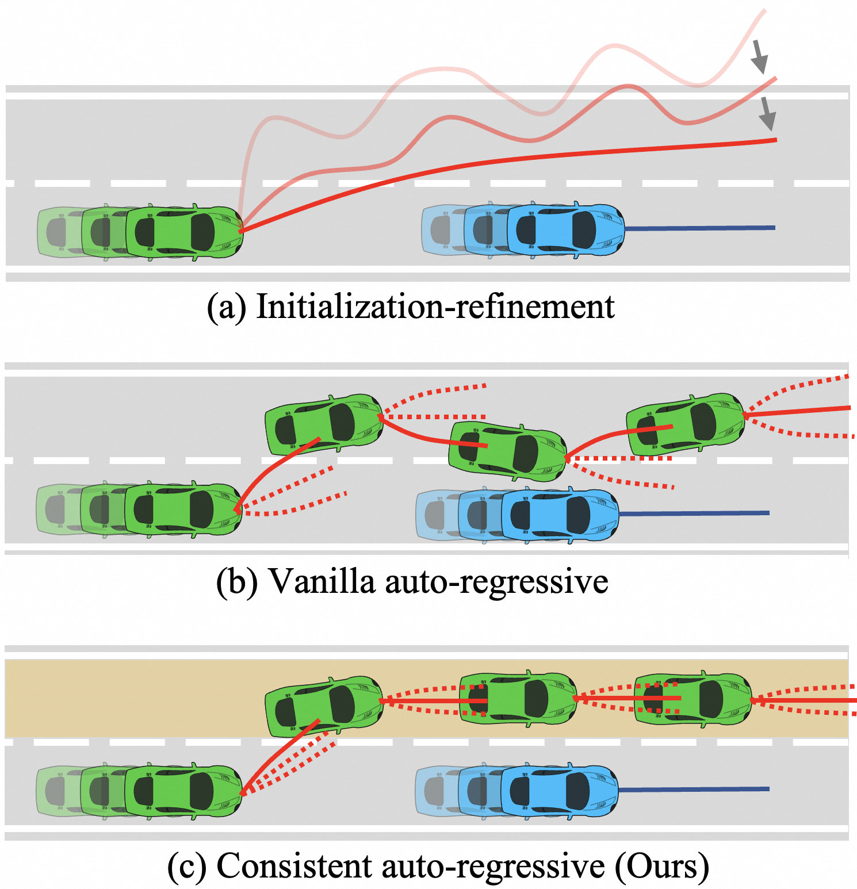
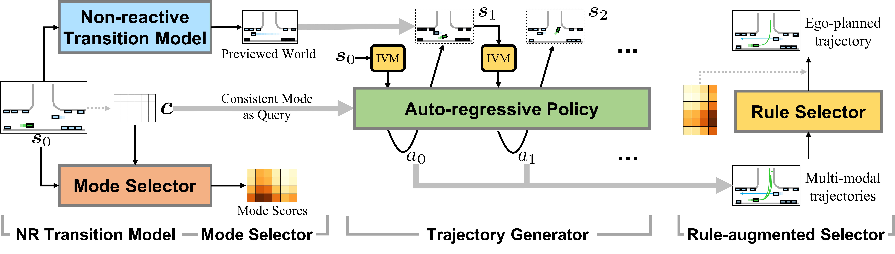

# CarPlanner: Consistent Auto-regressive Trajectory Planning for Large-scale Reinforcement Learning in Autonomous Driving

## 一句话结论

CarPlanner 的关键不是“用 PPO 一次生成整条轨迹”，而是在学习到的交通参与者预测世界中逐步生成下一个自车位姿，并用整段 rollout 不变的“路线 $\times$ 速度”模式约束时序一致性；它在 nuPlan 非交互闭环上表现很强，但本质仍是“专家奖励 + 非响应世界模型 + 规则选轨”的混合系统，还不是能自主探索、处理真实交互的纯 RL 规划器。

## 论文信息

- Authors: Dongkun Zhang, Jiaming Liang, Ke Guo, Sha Lu, Qi Wang, Rong Xiong, Zhenwei Miao, Yue Wang
- Year: 2025
- Venue: CVPR 2025
- Source: arXiv:2502.19908v3
- Local input: `_inbox/papers/carplanner/main.tex`
- Project URL: <https://arxiv.org/abs/2502.19908>
- Code: TeX 源码未提供项目或代码地址

## 背景问题

自动驾驶轨迹规划要把地图、自车历史和其他交通参与者状态转换为未来自车位姿。模仿学习（IL）可以从大量日志高效学习，却有两个经典问题：

- **分布偏移**：闭环中一次偏离就会把系统带到专家轨迹未覆盖的状态。
- **因果混淆**：只有轨迹回归损失时，网络可能利用自车历史等“捷径”，而不是学会对环境的正确因果响应。

RL 能直接优化碰撞、可驶区域、进度和舒适性，但在大规模真实驾驶数据上面临两个瓶颈：CPU 仿真器 rollout 慢，而多步连续动作的探索空间巨大。朴素自回归策略在每一步独立从高斯分布采样，还可能在“加速/减速”或“左转/直行”之间不断改变意图，导致长期轨迹不一致。

这张图表达的不是“CarPlanner 没有步内随机性”，而是高层模式在整个时域内固定，因此各时刻动作被限制在同一路线和相近速度意图内。

## 核心贡献

1. 把轨迹规划写成模型化的多步 MDP：动作是下一个自车位姿，交通参与者未来由神经预测模型一次生成，从而能在 GPU 上并行 rollout。
2. 引入全时域不变的路线—速度模式，将多模态来源从“每步随机噪声”改为“可解释的高层意图”，缩小 PPO 的探索空间。
3. 设计 Invariant-View Module（IVM）：每步将地图、交通参与者和路线变换到当前自车坐标系，并用 KNN 保留附近元素。
4. 用专家位移误差与碰撞/可驶区域奖励训练 PPO，推理时再用安全、进度、舒适性规则分数选轨。

## 方法拆解

### 总体流程

这是全文最重要的算法架构图。它把 CarPlanner 明确分成四个部分：非响应转移模型、模式选择器、轨迹生成器和规则增强选择器。

按从左到右的顺序阅读：

1. **非响应转移模型**：由初始状态 $\boldsymbol{s}_0$ 一次预测其他交通参与者的未来，构造策略 rollout 所需的 previewed world。它不接收后续自车动作，因此其他车辆不会对规划结果作出反应。
2. **模式选择器**：将初始状态 $\boldsymbol{s}_0$ 与候选模式集合 $\boldsymbol{c}$ 融合，为每个“路线 $\times$ 速度”组合产生 mode score。这个分数表达某种高层驾驶意图与当前场景的匹配程度。
3. **轨迹生成器**：每个模式都作为整个时域内不变的 query。策略在时刻 $t$ 先通过 IVM 把 $\boldsymbol{s}_t$ 转到当前自车视角，再输出动作 $a_t=s^0_{t+1}$；新自车位姿与预先预测的 agent 未来共同组成下一状态，循环后得到一条模式对齐轨迹。所有模式可在 GPU 上并行 rollout，因此最终得到多模态候选轨迹。
4. **规则增强选择器**：同时读取候选轨迹、预测的 agent 未来和 mode score，以安全、进度、舒适性等规则分数进行重打分，输出最终 ego-planned trajectory。也就是说，RL 策略负责“生成”，但最终决策仍有显式规则安全层参与。

图中的核心信息是：$\boldsymbol{c}$ 只在 rollout 开始时确定一次，却在 $a_0,a_1,\ldots$ 的每一步重复进入同一个自回归策略。这才是“consistent auto-regressive”的具体结构。每个横向路线与 12 个纵向速度模式组合，最多形成 $5 \times 12=60$ 个并行世界；同一个世界在 $T=8$ 个时刻始终使用同一模式，但状态会随自车动作递推。

### 1. 从轨迹到多步 MDP

论文将动作定义为下一时刻自车位姿：

$$
a_t=s^0_{t+1}.
$$

因此策略通过反复预测下一个位姿，累积出一条轨迹。状态 $\boldsymbol{s}_t$ 包含地图 $m$、自车与 $N$ 个交通参与者的 $H$ 步历史。地图折线/多边形与 agent 历史分别经 PointNet 编码，再由 Transformer 融合。

朴素自回归分解为：

$$
p(\boldsymbol{s}_{0:T})
=
\rho_0(\boldsymbol{s}_0)
\prod_{t=0}^{T-1}
\underbrace{\pi(a_t\mid\boldsymbol{s}_t)}_{\text{ego policy}}
\underbrace{P_\tau(s^{1:N}_{t+1}\mid\boldsymbol{s}_t)}_{\text{agent transition}}.
$$

每一步的 $\pi$ 都可能重新采样意图，长时域上容易出现方向与速度抖动。

### 2. 一致模式：路线 $\times$ 速度

CarPlanner 引入只在初始状态上选择一次、之后保持不变的模式 $\boldsymbol{c}$：

$$
\begin{aligned}
p(\boldsymbol{s}_{0:T})
= {} & \rho_0(\boldsymbol{s}_0)
\prod_{t=0}^{T-1}P_\tau(s^{1:N}_{t+1}\mid\boldsymbol{s}_t) \\
& \cdot \int
p(\boldsymbol{c}\mid\boldsymbol{s}_0)
\prod_{t=0}^{T-1}
\pi(a_t\mid\boldsymbol{s}_t,\boldsymbol{c})
\,d\boldsymbol{c}.
\end{aligned}
$$

- 纵向模式 $c_{\text{lon},j}=j/N_{\text{lon}}$ 表示不同平均速度档位，$N_{\text{lon}}=12$。
- 横向模式由地图图搜索获得自车可能遵循的车道路线，最多 $N_{\text{lat}}=5$。
- 两者组合成 $N_{\text{mode}}=N_{\text{lat}}N_{\text{lon}}$ 个可解释候选意图。

模式选择器估计 $p(\boldsymbol{c}\mid\boldsymbol{s}_0)$，轨迹生成器实现 $\pi(a_t\mid\boldsymbol{s}_t,\boldsymbol{c})$。“一致”指模式不变，不是轨迹不能根据当前状态反馈而调整。

### 3. 非响应转移模型

作者最终没有在每一步预测“其他 agent 如何响应自车”，而是一次性预测：

$$
s^{1:N}_{1:T}=\beta(\boldsymbol{s}_0).
$$

该模型用真实未来轨迹的 L1 损失训练：

$$
L_{\text{tm}}
=
\frac{1}{T}\sum_{t=1}^{T}\sum_{n=1}^{N}
\left\|s_t^n-s_t^{n,\text{gt}}\right\|_1.
$$

训练规划器时冻结 $\beta$。这是高吞吐的根源，也是主要现实假设：它能在日志回放世界中快速预演，却不能做“如果我向前挤，对方会不会让”的反事实交互推演。

### 4. IVM 与自回归生成器

IVM 在每个时刻做三件事：

1. 地图与 agent 分别只保留距离自车最近的一半元素。
2. 路线从当前自车最近点向前截取 $K_r=N_r/4$ 个点。
3. 所有几何量变换到当前自车坐标系，历史时间重置到 $[-H,0]$。

变换后的模式作为 Transformer decoder 的 query，当前地图和 agent 特征作为 key/value。策略头输出高斯动作分布，价值头预测状态价值；训练时采样，推理时使用高斯均值。

### 5. 训练与推理

训练分两阶段：

1. 用其他交通参与者的真实未来训练 $\beta$，然后冻结。
2. 用专家轨迹终点分配唯一正模式 $c^*$：横向选终点最近路线，纵向选终点所在距离区间。选择器用交叉熵和轨迹回归副任务训练，生成器只在 $c^*$ 下 rollout，采用 winner-takes-all。

选择器损失为：

$$
L_{\text{CE}}
=-
\sum_{i=1}^{N_{\text{mode}}}
\mathbb{I}(c_i=c^*)\log\sigma_i,
$$

$$
L_{\text{side}}
=
\frac{1}{T}\sum_{t=1}^{T}
\left\|\bar{s}_t^0-s_t^{0,\text{gt}}\right\|_1.
$$

按论文文字，单步奖励由专家引导项与质量项组成：

$$
R_t
=
-\operatorname{DE}(s_t^0,s_t^{0,\text{gt}})
-\mathbb{I}[\text{collision at }t]
-\mathbb{I}[\text{outside drivable area at }t].
$$

原文没有给出 DE 与两个 $-1$ 罚项之间的精确缩放或权重，所以上式只是按文字还原。只有质量奖励时，停在初始安全位置是局部最优；DE 实际提供了“向前走”的专家引导。

PPO 的核心裁剪目标是：

$$
L_{\text{policy}}
=
-\frac{1}{T}\sum_{t=0}^{T-1}
\min\!\left(
r_tA_t,
\operatorname{clip}(r_t,1-\epsilon,1+\epsilon)A_t
\right),
$$

$$
r_t
=
\frac{\pi_{\text{new}}(a_t\mid\boldsymbol{s}_t,c^*)}
{\pi_{\text{old}}(a_t\mid\boldsymbol{s}_t,c^*)}.
$$

实现使用 $\gamma=0.1$、GAE $\lambda=0.9$、$\epsilon=0.2$、旧策略更新间隔 $I=8$；价值、策略、熵损失权重为 $3$、$100$、$0.001$。

推理时生成所有模式的候选轨迹，将规则分数与模式分数按 $1:0.3$ 加权；若没有轨迹通过安全规则，则紧急刹停。因此最终产品是学习生成器和显式安全规则的混合规划器。

## 实验设置

- 数据：nuPlan，原始日志超过 1,500 小时、4 个城市。训练集 176,218 个场景，验证集 1,118 个场景。
- 闭环评测：Test14-Random（261 场景）与 Reduced-Val14（318 场景）。指标为 nuPlan Closed-Loop Score（CLS），综合碰撞、TTC、可驶区域、进度和舒适性。
- 仿真：每场景 15 秒、10 Hz，规划轨迹由 LQR 跟踪。其他车辆分为日志回放的非响应（NR）和 IDM 控制的响应（R）设置。
- 轨迹时域：8 秒，训练时 1 秒一点，推理时插值到 0.1 秒。Test14-Random 以 10 Hz 重规划，Reduced-Val14 为对齐 Gen-Drive 使用 1 Hz。
- 训练：2 张 RTX 3090，50 epochs，每卡 batch size 64，AdamW，初始学习率 $10^{-4}$。

## 实验结论

### 主结果

| Benchmark | Setting | CarPlanner | 最强对比方法 | 差值 |
| --- | --- | ---: | ---: | ---: |
| Test14-Random | CLS-NR | **94.07** | PLUTO 91.92 | +2.15 |
| Test14-Random | CLS-R | 91.10 | PDM-Closed **91.64** | -0.54 |
| Reduced-Val14 | CLS-NR | **91.45** | PDM-Closed 91.21 | +0.24 |

这些结果支持一个有边界的结论：CarPlanner 在与训练世界模型假设对齐的**非响应闭环**中是强方法，但在未训练过的 IDM 交互环境中没有超过规则式 PDM-Closed。Reduced-Val14 对 PDM-Closed 的优势仅 $0.24$ 分，需要方差或显著性检验才能判断是否稳健。

### 最能说明机制的消融

| 对比 | CLS-NR | 含义 |
| --- | ---: | --- |
| 仅质量奖励 | 31.79 | 只奖励不碰撞/不出界会导致静止策略，专家 DE 是必要进度信号。 |
| 仅 DE 奖励 | 90.44 | 专家轨迹能引导探索，但安全和可驶性不足。 |
| DE + 质量奖励 + IVM | **94.07** | 专家引导与任务奖励互补。 |
| 朴素自回归 + DE | $86.89\pm0.28$ | 随机采样 60 条轨迹仍不如显式模式。 |
| 一致自回归 + DE | **94.07** | 一致模式是主要结构增益。 |
| 只有纵向模式 | 90.57 | 只约束速度不够。 |
| 纵向 + 横向模式 | **94.07** | 显式路线意图进一步缩小探索空间。 |

时序一致率也支持这一解释：朴素 RL 的横向/纵向一致率仅 $20.00\%/8.33\%$，一致模式 + RL 达到 $79.58\%/43.03\%$。与同架构 IL 的 $68.26\%/43.01\%$ 相比，RL 的主要提升发生在横向路线一致性。

### RL 真正比 IL 强多少

同一 CarPlanner 架构下，最佳 IL 是 $93.41$，RL 是 $94.07$，差距仅 $0.66$。RL 的碰撞分数从 $98.85$ 升到 $99.22$，进度从 $93.87$ 升到 $95.06$，但舒适性从 $96.15$ 降到 $91.09$。更准确的说法是：**RL 带来小幅总分改善，并把策略偏好从舒适性推向安全与进度**；外部 IL SOTA 的 $2.15$ 分差距不能全部归因于 RL。

### 训练效率

CarPlanner 达到 $1{,}632.25$ samples/s，ScenarioNet 为 $25.72$ samples/s，约为 $63.5\times$；训练时间从 3 天 12 小时降到约 12 小时，同时 CarPlanner 处理的样本更多。这说明 GPU 上的学习转移模型能避开 CPU 仿真瓶颈。不过原文称“两个数量级”并不严格，$63.5\times$ 约为 $1.80$ 个十进制数量级，而且表中没有给出 ScenarioNet 的硬件条件。

### 长时域与 RL 监督

训练时域从 1 秒增大到 8 秒时，最佳 CLS-NR 从 $75.79$ 升到 $94.07$，说明多步训练很重要。对相同碰撞和可驶区域信号，RL 版多候选轨迹的开环质量也优于可微损失版。作者的解释是：时刻 $t$ 的直接可微损失只优化对齐时刻，而 reward-to-go 能将后续失败反馈到更早动作。

## 局限与问题

### 方法边界

- **不是交互世界模型**：其他 agent 的未来与自车动作无关，无法学习让行、博弈和协商。在非响应环境中比较“响应 vs. 非响应转移模型”本身也偏向后者，不能说明非响应假设在真实世界更优。
- **仍强依赖专家**：正模式由专家终点指定，选择器由专家标签训练，奖励又含每步 DE。它是专家整形的 RL，无法验证策略能否超越专家行为空间。
- **推理也不是纯 RL**：规则分数权重为 $1$，学习模式分数为 $0.3$，并有硬性紧急刹停。“RL 超过规则方法”更准确地应表述为“带规则安全层的 RL 生成—选择系统超过对比系统”。
- **一致性与响应性有张力**：固定路线/速度意图有助稳定，但突发阻塞或他车强插入时，最佳高层意图可能需要中途改变。频繁重规划能缓解，论文却没有测量模式切换延迟与稳定性。

### 证据与复现问题

- 主表只在 261 和 318 个场景上报告单点数值，没有多随机种子方差、置信区间或显著性检验；尤其 $+0.24$ 的优势不宜过度解读。
- 同架构 RL 对 IL 的总分优势仅 $0.66$，且舒适性明显降低；“RL 解决因果混淆”的结论主要来自 ego-history dropout 对 RL 不利的消融，不足以确认已学得真正因果关系。
- 奖励精确归一化/权重、速度档位的物理范围、部分规则分数细节未给出，源码也未附代码链接，完整复现存在空缺。
- $\gamma=0.1$ 非常小：$k$ 步后回报折扣为 $0.1^k$，GAE 跨步系数为 $\gamma\lambda=0.09$。这与论文强调 8 秒长期优化存在表面张力；可能的解释是多步状态访问和每步 DE 本身带来价值，而不是遥远奖励的大权重传播。这是基于超参数的推断，原文未直接分析。

## 与其他论文的关系

- **PDM-Closed**：同为生成—选择架构，但候选轨迹由 IDM/规则生成。CarPlanner 保留规则选择安全网，将生成器换成模式条件 RL 策略。
- **PLUTO / PlanTF**：代表 nuPlan 强 IL 路线，依靠对比学习、数据增强、ego-history masking 缓解闭环失配。CarPlanner 的消融表明这些 IL 技巧不一定适合价值估计。
- **Gen-Drive**：先用 IL 预训练扩散规划器，再用偏好奖励微调。CarPlanner 不用 IL 损失预训练策略，但仍通过模式分配和 DE 奖励使用专家数据。
- **ASAP-RL**：把整段轨迹作为动作，在低频决策与响应性间折中。CarPlanner 把动作降回单步位姿，用转移模型在训练时预演长轨迹。
- **MotionLM / BehaviorGPT**：同样强调交通序列的自回归建模；CarPlanner 的特殊之处是固定显式高层模式并用 PPO 优化闭环目标。

## 个人复盘

- 我真正理解的部分：最有价值的想法是将高维轨迹探索拆成“离散、可解释的长期意图”和“依状态反馈的低层位姿策略”；这比单纯增大采样数更有效。
- 仍然不清楚的问题：去掉专家 DE 后，怎样设计不导致静止崩溃的进度奖励？如何学习动作条件化的交互式多智能体转移模型？模式能否在突发事件后可控地重选？
- 后续要读的内容：PDM-Closed 理解生成—选择强基线；PLUTO/PlanTF 比较 IL 闭环技巧；Gen-Drive 对比两种 RL 路线；MotionLM/BehaviorGPT 补足多智能体自回归建模；交互式世界模型和 model-based RL 用于解决非响应假设。

## 建议的阅读顺序

1. 先看图 1，理解“每步随机采样”为什么会破坏长时域意图。
2. 再看从 $\pi(a_t\mid s_t)$ 到 $\pi(a_t\mid s_t,c)$ 的变化，这是整篇的数学核心。
3. 沿“转移模型—模式选择器—生成器—规则选择器”检查训练与推理的信息流。
4. 最后读三组消融：朴素 vs. 一致自回归、RL vs. 同架构 IL、非响应 vs. 响应转移模型，把机制收益与“SOTA”叙事分开。
