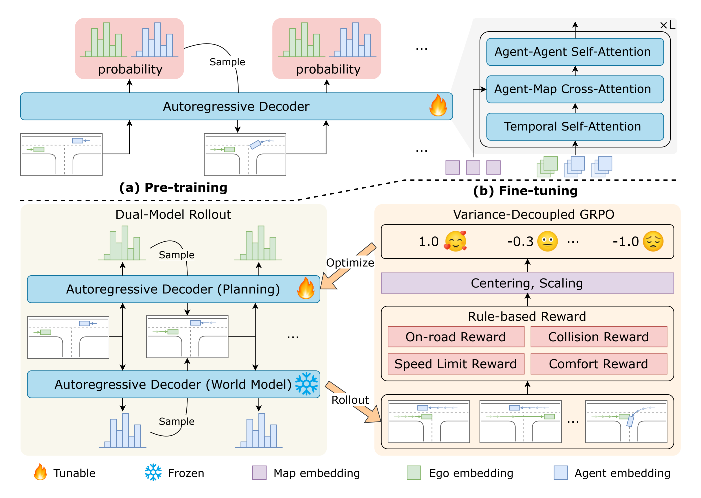
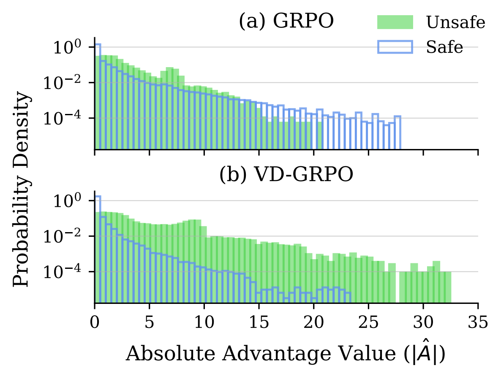

# Plan-R1：把轨迹规划建模为语言模型，再用规则奖励做强化学习

## 一句话结论

Plan-R1 的关键不只是“把轨迹离散成 token”，而是把同一个多智能体生成模型拆成**可训练的自车策略**和**冻结的反应式世界模型**：前者用规则奖励优化，后者在 rollout 中根据自车的新动作实时生成其他交通参与者的反应；同时，论文用 VD-GRPO 去掉标准差归一化造成的隐式样本组重加权，使稀少但关键的不安全轨迹获得更强学习信号。

## 论文信息

- 论文：Plan-R1: Safe and Feasible Trajectory Planning as Language Modeling
- 作者：Xiaolong Tang, Meina Kan, Shiguang Shan, Xilin Chen
- arXiv：[2505.17659](https://arxiv.org/abs/2505.17659)
- 代码：[XiaolongTang23/Plan-R1](https://github.com/XiaolongTang23/Plan-R1)
- 版本：本笔记基于本地 arXiv v5 源码；模板标注为 ICLR 2026
- Local input: `_inbox/papers/plan_r1/iclr2026_conference.tex`

## 1. 论文想解决什么问题

学习式规划通常从专家日志做 imitation learning，但日志并不等于完美监督：

1. **负例稀缺**：真实事故、越界等高风险事件本来就少，行为克隆很难直接学会如何远离它们。
2. **专家也可能违规或次优**：论文统计 nuPlan 训练数据中超过 10% 的场景含超速行为，纯模仿会把这些缺陷一起学进去。
3. **开环预测与闭环交互脱节**：如果 rollout 时其他车辆沿固定真值轨迹运动，就无法反映它们对自车动作的反应，策略会在一个过于静态的环境中学习。
4. **标准 GRPO 可能削弱安全信号**：按每组奖励标准差归一化后，高方差的不安全组反而得到较小权重。

因此，Plan-R1 的目标不是提高轨迹拟合精度，而是在保留数据先验的同时，以明确规则把模型推向“安全、可行、守规且有进度”的闭环行为。

## 2. 方法总览

整套方法分为两阶段：

### 阶段一：多智能体 next-token 预训练

把每个交通参与者未来 0.5 秒的运动片段离散为 token，然后像语言模型预测下一个词一样，自回归预测所有参与者的下一段运动。模型因此同时获得：

- 道路结构与交通语义先验；
- 单体运动连续性；
- 多车之间的交互模式；
- 可作为强化学习初始化和 KL 参考的行为分布。

### 阶段二：双模型 rollout + VD-GRPO

预训练模型复制为两份：

- **自车规划器** \(\pi_e\)：参数可训练，生成 ego token；
- **世界模型** \(p_a\)：参数冻结，为其他 agent 生成 token。

每一步都把刚生成的联合历史送回模型。世界模型看到自车实际采样出来的新动作，因此其他车辆不是沿固定日志轨迹播放，而会作出模型化的反应。完整轨迹由规则奖励评分，再用 VD-GRPO 更新自车规划器。

这个拆分是论文最值得关注的架构设计：预训练阶段学习的是联合交通分布，强化学习阶段则把其中一份转成 policy、另一份转成 simulator。

## 3. 轨迹如何变成“语言”

### 3.1 Motion token

论文把连续轨迹按 0.5 秒切成固定长度片段，并用基于平均角点距离的 K-disk 聚类构建离散词表。Vehicle、Pedestrian、Cyclist 分别有 1024 个 token；ego 与 Vehicle 共用词表。

一个 token 不是自然语言词，而是局部坐标系下的一小段运动原语。所谓 trajectory planning as language modeling，准确含义是：

> 用离散运动词表和自回归 next-token prediction 建模轨迹，而不是让大语言模型直接输出坐标。

### 3.2 联合自回归分解

令 \(y_{t,n}\) 表示第 \(n\) 个参与者在时刻 \(t\) 的运动 token，\(C\) 是场景上下文，\(P\) 是规划相关条件。论文将联合分布近似为：

$$
p(Y\mid C,P)
\approx
\prod_t
\pi_e(y_{t,0}\mid y_{<t,0:N},C,P)
\prod_n
p_a(y_{t,n}\mid y_{<t,0:N},C).
$$

其中 \(n=0\) 是 ego。规划条件 \(P\) 只直接提供给自车策略，其他 agent 通过联合历史间接感知自车行为。

### 3.3 网络结构与预训练

骨干是 6 层 Transformer decoder，8 个 attention heads，隐藏维度 128。每层组合：

- temporal self-attention：建模单个 agent 的时序依赖；
- agent-map cross-attention：读取地图；
- agent-agent attention：建模交通参与者交互；
- relative spatiotemporal positional embedding：表达相对时空关系。

预训练目标是所有参与者 token 的负对数似然：

$$
\mathcal L_{\text{pretrain}}
=
-\sum_t\sum_n
\log p_a(y_{t,n}\mid y_{<t,0:N},C).
$$

单个预测器约 5.05M 参数；双模型总计约 10.1M。这个规模说明结果并不是靠大参数量语言模型堆出来的，核心在表示方式和训练机制。

## 4. 冻结的反应式世界模型

很多规划器在训练或评测时把其他车辆未来轨迹固定为日志真值。这种 non-reactive rollout 有两个问题：

- 自车偏离专家轨迹后，其他车辆仍像没看见一样行驶；
- 策略可能利用这个不真实假设，得到无法在交互环境成立的动作。

Plan-R1 每一时刻执行以下循环：

1. 自车规划器从当前联合历史采样 ego token；
2. 冻结世界模型在同一历史下生成其他 agent token；
3. 所有 token 转成下一段连续轨迹；
4. 新状态加入联合历史，进入下一轮。

这样，其他 agent 能对 ego 的实际 rollout 轨迹作出反应。冻结模型还有两个工程优势：一是环境不会与策略同时漂移，二是预训练交通先验不会被自车奖励直接污染。

但需要准确理解这里的“世界模型”：它是从观测日志学习的条件生成模型，没有显式因果或反事实训练。附录用 ego 状态噪声测试得到的 ADE/FDE 变化，只能说明一定程度的扰动鲁棒性，不能单独证明模型学到了真实的反事实反应规律。

## 5. 规则奖励

### 5.1 硬约束乘软目标

单步奖励写成：

$$
R(y_t)
=
\prod_{k\in\mathcal I_{\text{safe}}}
\mathbf 1_{k,t}
\cdot
\sum_{j\in\mathcal I_{\text{cost}}}
w_j r_j(y_t).
$$

硬约束包括：

- 位于可行驶区域；
- 不与动态目标碰撞；
- 不与静态障碍物碰撞。

碰撞判定使用完整包围盒，而不是只检查轨迹中心点。一旦硬约束失败，软奖励整体归零。

软目标及权重为：

| 项目 | 权重 | 作用 |
| --- | ---: | --- |
| 舒适性 | 2 | 约束加速度、jerk 等 |
| TTC | 5 | 鼓励保留安全时距 |
| 限速合规 | 2 | 避免继承日志中的超速行为 |
| 行驶进度 | 1 | 避免只靠停车取得安全分 |

速度和进度先按整条轨迹计算、归一化到 \([0,1]\)，再复制到每个 token。进度以专家最终进度作归一化参考，但并不要求逐点模仿专家轨迹。

### 5.2 规则奖励的含义

规则的优势是清楚、可审计，也不需要额外训练 reward model。但论文称规则能提供 unbiased guidance，这个说法偏强：规则仍体现人工价值选择，权重、阈值和指标定义都会产生偏置。更准确的说法是，它避免了从专家动作或偏好模型中继承某些统计偏差。

## 6. 为什么标准 GRPO 会伤害安全学习

对每个场景采样 \(G\) 条 rollout。论文的策略损失可概括为：

$$
\mathcal L_{\text{ft}}
=
-\frac{1}{GF}
\sum_{g,t}
\left[
\frac{\pi_e(y_t^g\mid\cdot)}
{\pi_{\text{old}}(y_t^g\mid\cdot)}
\hat A_t^g
-\beta
D_{\mathrm{KL}}(\pi_e\Vert\pi_{\text{ref}})
\right].
$$

return-to-go 为：

$$
\hat A_t^g
=
\sum_{\tau=t}^{F}
\widetilde R(y_\tau^g).
$$

标准 GRPO 对组内奖励使用：

$$
\widetilde R
=
\frac{R-\mu}{\sigma}.
$$

从梯度尺度看，这相当于给每组乘上 \(1/\sigma\)。而硬安全约束会把失败轨迹奖励直接置零，所以同一场景中只要安全与不安全 rollout 混在一起，奖励方差通常会变大。结果是：

- 真正包含危险失败的不安全组，因为 \(\sigma\) 大而被降权；
- 全部安全、只在软指标上轻微波动的组，因为 \(\sigma\) 小而被放大。

这与“优先修正安全错误”的目的相反。

## 7. VD-GRPO：固定尺度而不是除以组内标准差

VD-GRPO 将归一化改为：

$$
\widetilde R
=
\frac{R-\mu}{c},
\qquad c=0.1.
$$

固定常数 \(c\) 消除了由每组方差带来的隐式重加权，组间的原始奖励差异得以保留。

图中的关键不是分布“更宽”本身，而是 unsafe 组不再被大方差压扁。论文报告 unsafe group ratio 从 6.7% 降至 4.7%，相对下降 29.8%。

论文的理论解释依赖数据条件：不安全组比例 \(\alpha<0.3\)，且软奖励期望大于 0.8。因此它更像是对当前任务统计的机制分析，而不是对所有奖励分布都成立的普遍定理。

## 8. 实验设置

- 数据集：nuPlan
- 预训练：约 1M instances，32 epochs，batch size 64
- 强化学习：100K scenarios，5 epochs
- 优化器：AdamW
- 预训练学习率：\(3\times10^{-4}\)
- 微调学习率：\(4\times10^{-6}\)
- weight decay：\(10^{-4}\)
- dropout：0.1
- GRPO group size：\(G=4\)
- KL 系数：\(\beta=0.1\)
- VD 常数：\(c=0.1\)
- 硬件：8 张 RTX 4090
- 仿真：15 秒、10 Hz，bicycle model + LQR controller
- 推理：每一步取 top-1 token；pass@k 只作为辅助分析
- 测试集：Val14、Test14-random、Test14-hard，均报告 non-reactive 与 reactive 指标

## 9. 主要结果怎么读

### 9.1 不加规则后处理的学习式规划

| 测试集 | Diffusion Planner NR / R | Plan-R1 NR / R | Plan-R1 的主要优势 |
| --- | ---: | ---: | --- |
| Val14 | 89.87 / 82.80 | 88.98 / 87.69 | reactive +4.89 |
| Test14-hard | 75.99 / 69.22 | 77.45 / 77.20 | reactive +7.98 |
| Test14-random | 89.19 / 82.93 | 91.23 / 90.04 | reactive +7.11 |

Plan-R1 在 non-reactive Val14 上并非最佳，但在三个 reactive 设置中都明显优于 Diffusion Planner。这个结果与论文的设计目标一致：优势主要来自闭环交互，而不是单纯开环轨迹拟合。

### 9.2 加规则后处理的结果

Plan-R1* 的得分为：

| 测试集 | NR | R |
| --- | ---: | ---: |
| Val14 | 94.72 | 93.54 |
| Test14-hard | 78.46 | 81.70 |
| Test14-random | 94.64 | 93.71 |

星号表示额外使用规则式 post-processing。它增强了整体表现，但不能把所有增益都归因于学习算法：例如 PLUTO* 在 hard NR 为 80.08，高于 Plan-R1*；Diffusion Planner* 在 hard R 为 82.00、random NR 为 94.80，也略高于 Plan-R1*。因此公平评价核心方法时，应优先看无星号结果。

### 9.3 VD-GRPO 的消融

| 方法 | NR | R | Collision | TTC | Drivable | Speed | Comfort | Progress |
| --- | ---: | ---: | ---: | ---: | ---: | ---: | ---: | ---: |
| Pretrain only | 85.61 | 82.81 | 94.83 | 90.04 | 94.64 | 96.57 | 99.62 | 91.64 |
| + GRPO | 88.65 | 88.35 | 93.87 | 91.57 | 96.93 | 99.65 | 99.62 | 94.11 |
| + VD-GRPO | 91.23 | 90.04 | 97.32 | 95.02 | 97.32 | 99.45 | 99.62 | 91.94 |

最值得注意的是：普通 GRPO 虽提高总分，却让 Collision 从 94.83 降到 93.87；VD-GRPO 将其提升到 97.32。相对普通 GRPO，VD-GRPO 的 NR/R 分别增加 2.58/1.69，代价是 Progress 从 94.11 降到 91.94。这反映出方法确实把优化重点重新偏向安全，而非所有子指标同时提升。

### 9.4 反应式世界模型是否有效

| rollout 环境 | Reactive score |
| --- | ---: |
| 单模型预训练基线 | 82.81 |
| 同参数量扩大的预训练模型 | 84.94 |
| GT trajectory replay | 87.44 |
| Frozen reactive world model | 90.04 |

仅扩大模型参数无法解释全部增益，冻结的反应式生成模型比回放真值轨迹更好。这是架构贡献最直接的实验证据。

### 9.5 奖励项和 group size

去掉 collision reward 后 NR 直接跌至 73.10；去掉 progress 后跌至 80.01，说明二者分别防止碰撞和“安全停车”退化。去掉 drivable、speed、comfort 后 NR 分别为 88.88、90.04、90.83。

group size 从 2、4、6 增加时，显存约为 12、24、36 GB；\(G=4\) 得到最佳 R 分数 90.04，而 \(G=6\) 没有继续提高，说明更多样本并非单调有益。

### 9.6 interPlan 泛化

在 335 个交互密集场景上，学习式 Plan-R1 得分 56.64，略低于 PLUTO 的 57.74；加入规则模块后 Plan-R1* 达到 72.33，高于 PDM-Closed* 的 69.64。这里同样应把“学习策略本身”和“学习策略 + 规则系统”分开解读。

## 10. 论文最重要的贡献

1. **统一的多智能体 token 模型**：同一预训练模型既提供规划初始化，也能复制成世界模型。
2. **双模型反应式 rollout**：自车策略可训练、交通世界模型冻结，使 RL 环境能随 ego 行为变化。
3. **安全导向的方差分析**：指出标准 GRPO 的组内标准差归一化会隐式压低高方差危险场景。
4. **VD-GRPO**：用固定尺度保留跨组奖励大小，改动很小，却显著改善碰撞和 reactive 指标。
5. **规则与数据先验结合**：预训练保证可行运动分布，规则奖励修正专家日志中的违规和稀缺负例问题。

## 11. 局限与复现时要警惕的地方

### 11.1 “group-wise”统计公式不一致

正文描述 \(\mu\) 和 \(\sigma\) 应跨同一场景的 \(G\) 条 rollout 计算，但附录公式写成对单条轨迹的 \(F\) 个时间步求均值：

$$
\mu_R=\frac{1}{F}\sum_t R(y_t^g).
$$

这里没有对 \(g\) 求和。它究竟是 group normalization、trajectory temporal normalization，还是二者组合，会直接改变算法，应以代码为准。

### 11.2 论文中的 GRPO loss 没写 clipping

公式使用 importance ratio，却没有标准 PPO/GRPO 常见的 clipped surrogate，也未给 clip epsilon。可能是正文省略，也可能实现确实不裁剪；这是另一处需要检查代码的复现细节。

### 11.3 奖励范围与理论假设没有完全对齐

理论分析把软奖励 \(C_t^g\) 假设在 \([0,1]\)，但实现中四项权重之和为 10，文本只明确各子项经过归一化，没有清楚说明加权和是否再次归一化。这会影响 advantage 的绝对尺度，也会影响相关推导。

### 11.4 固定常数 \(c\) 的表述存在矛盾

由 \((R-\mu)/c\) 可知，\(c\) 越小，强化学习梯度通常越大；附录却有“larger \(c\) amplifies”之类的相反表述。此外，论文声称改变 \(c\) 不改变最优策略，只对孤立的 RL 项较容易成立；当 KL 系数 \(\beta\) 固定时，\(c\) 会改变 RL 与 KL 的相对权重，因而可能改变最终最优点。论文后文的实验实际上也承认存在 trade-off。

### 11.5 世界模型不是已验证的因果模拟器

将 ego 输入加高斯噪声后，世界模型 ADE/FDE 从 1.03/3.01 平缓增加到 1.26/3.59，说明对输入扰动有一定鲁棒性。但这不等于验证其他车辆会对未见过的 ego 干预作出真实反应。闭环外推仍可能受 observational bias 影响。

### 11.6 仍然依赖专家数据

虽然 fine-tuning 不再逐点模仿专家，但预训练、KL reference，以及 progress 的归一化都依赖专家日志。Plan-R1 是“在专家先验上做规则校正”，不是完全摆脱专家监督。

### 11.7 统计报告有限

主结果没有随机种子方差或置信区间。若不同方法只有零点几个分数的差距，不宜把排序解读成稳定优势。

## 12. 与相关工作的关系

- **MotionLM / SMART / Trajeglish**：共同使用离散 motion token 和自回归多智能体生成；Plan-R1 在此基础上把模型复制成 policy 与 frozen world model，并加入在线 RL。
- **CarPlanner**：两者都用自回归 rollout 和 RL。CarPlanner 依赖专家 displacement reward，且环境中的其他 agent 不随 ego 动作反应；Plan-R1 用规则奖励和反应式世界模型，安全目标更直接。
- **Gen-Drive / TrajHF**：这些方法使用 preference 或 learned reward model；Plan-R1 选择显式规则，换取可解释性与较低 reward hacking 风险，但也引入人工权重偏置。
- **GRPO / Dr.GRPO / DAPO**：Plan-R1 关注的不是语言推理能力，而是归一化方式对轨迹安全组的梯度重加权。
- **PLUTO / Diffusion Planner**：是强学习式规划基线。Plan-R1 的主要优势集中在 reactive evaluation，而非所有 non-reactive 榜单。

## 13. 我的判断

这篇论文最扎实的部分是**系统设计与优化机制互相匹配**：

- 离散多智能体预训练提供可复用的交通生成先验；
- 冻结副本提供相对稳定、能响应 ego 的 rollout 环境；
- 硬安全门控让违规轨迹产生清晰奖励断点；
- VD-GRPO 又避免这些高方差安全断点被标准差归一化削弱。

所以它不是几个独立技巧的简单堆叠，而是一条闭环逻辑。

不过，VD-GRPO 的数学和实现描述存在数处不够严谨的地方。复现时不能只照论文公式写，至少应核对官方代码中的：

1. 均值究竟跨 rollout、跨时间还是同时计算；
2. 是否使用 ratio clipping；
3. 加权软奖励是否二次归一化；
4. \(c\) 与 KL 系数的实际标度；
5. frozen world model 的采样方式和 agent 更新顺序。

整体而言，Plan-R1 对“如何把生成式多智能体模型真正用于闭环规划 RL”给出了清楚且有启发性的答案；它最值得借鉴的是双模型 rollout 和安全样本重加权，而不是把标题中的 language modeling 理解成引入通用 LLM。

## 14. 推荐阅读顺序

1. 先看架构图，明确预训练模型如何拆成 ego policy 与 world model。
2. 再看奖励定义，理解 hard safety gate 与 soft cost 的组合。
3. 对照 advantage 分布图阅读 VD-GRPO 动机。
4. 最后看消融表，特别关注普通 GRPO 的 collision 下降和 VD-GRPO 的 progress 代价。
5. 若准备复现，直接对照代码核查第 11 节列出的公式歧义。
