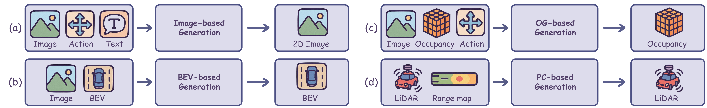
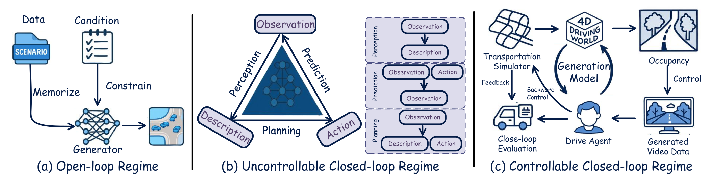
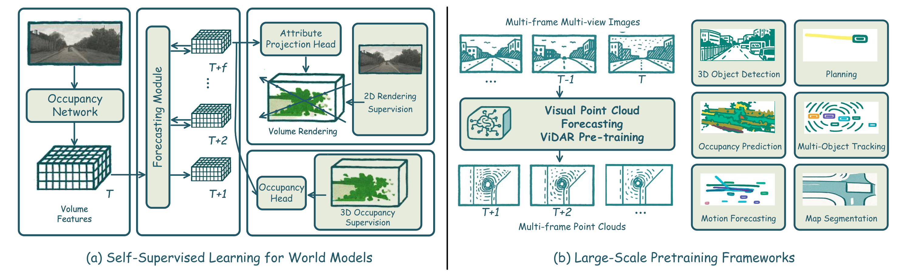

# A Survey of World Models for Autonomous Driving

## 一句话结论

这篇综述把自动驾驶世界模型理解为一个“可压缩、可预测、可交互”的时空内部环境：真正的技术演进不只是生成更逼真的未来画面，而是从开放环生成走向能够接受动作、遵守物理约束并与规划器相互反馈的可控闭环系统。

## 论文信息

- Authors: Tuo Feng, Wenguan Wang, Yi Yang
- Year: 2025（TeX 记录收稿日期为 2025-09-07）
- Venue: arXiv preprint；稿件使用 ACM Computing Surveys 模板，但源码中没有已接收或正式出版信息
- Source: arXiv:2501.11260v4
- Local input: `_inbox/papers/ad_wm/CSUR-WMAD.tex`
- Project URL: <https://arxiv.org/abs/2501.11260>
- Keywords: Autonomous Driving, World Models, Self-Supervised Learning, Behavior Planning, Generative Approaches

## 背景问题

自动驾驶系统必须同时解决三个彼此耦合的问题：理解当前环境、预测环境与交通参与者如何演化、为自车选择安全动作。传统模块化流水线通常分别进行感知、预测和规划，模块间的信息压缩和误差累积会削弱长时推理；纯端到端策略虽然接口简洁，却可能缺少可检查的中间状态和反事实推演能力。

论文采用的世界模型概念，是将相机、LiDAR、雷达和地图等观测编码为紧凑的时空隐状态，再在候选动作条件下滚动预测未来。这样，规划器可以在执行动作前先在内部环境中进行“what-if”推演。自动驾驶场景尤其要求模型同时具备几何精度、多模态一致性、长尾覆盖、实时性和闭环因果响应。

## 核心贡献

1. 提出三层分类框架：未来物理世界生成、智能体行为规划、预测与规划交互。它比仅按生成模态或仅讨论仿真的综述更强调从环境建模到决策闭环的连续关系。
2. 将未来生成进一步按输出空间分为图像、鸟瞰图（BEV）、占用栅格（OG）和点云（PC），系统整理其输入条件、核心架构、输出与常用数据集。
3. 对规划方法按学习式、规则式和搜索式路线整理，并用开放环、不可控闭环、可控闭环描述预测—规划交互的演进。
4. 汇总自监督学习、大规模预训练和生成式数据增强，以及场景理解、运动预测、仿真和端到端驾驶四类应用；最后比较 4D 场景生成、点云预测、4D 占用预测和运动规划的指标与结果。

## 方法拆解

### 总体流程

论文不是提出一个可复现的新算法，而是建立如下分析坐标：

1. **表示什么**：RGB 图像保留外观，BEV 强调道路拓扑，OG 显式表达可通行空间与语义体素，PC 保留传感器几何。
2. **怎样预测**：Transformer、自回归 token 模型和扩散模型从历史观测与动作条件生成未来状态。
3. **如何做决策**：规划器可由监督学习、强化学习、MPC、LLM/VLM，或采样、图搜索、势场等规则方法构成。
4. **是否形成因果闭环**：预测结果是否会随规划动作改变，系统又是否允许注入规则、罕见事件和物理约束。

### 模型或系统结构

#### 1. 未来物理世界生成

- **Image-based**：直接生成未来多视角图像或视频，优势是外观真实且便于数据增强；弱点是 3D 几何、跨视角一致性和长时稳定性难保证。演进方向是从无控制视频走向轨迹、BEV、文本、深度、3D 框和物理流共同控制的多视角 4D 生成。
- **BEV-based**：将多传感器信息压缩到鸟瞰隐空间，适合承载地图、车辆与道路拓扑，并连接预测和规划；但高度信息、遮挡和细粒度外观会被压缩。
- **OG-based**：预测随时间变化的 3D 语义占用，即 4D occupancy。它直接提供自由空间和碰撞风险，是连接世界模型与规划器最自然的表示之一，但体素计算和标注成本高。
- **PC-based**：生成未来 LiDAR 扫描或点云，几何意义明确，适合自监督预训练；难点是稀疏性、传感器运动补偿以及远期误差累积。

#### 2. 行为规划

- **学习式规划**涵盖神经轨迹规划、RL/MPC、生成式规划和以 LLM/VLM 为推理器的规划。其优势是可从大规模数据学习复杂交互，风险则是分布外失效、约束不透明和闭环验证不足。
- **规则式规划**包括采样法、图搜索、优化/MPC、状态格与人工势场。它们的约束和失败模式更容易解释，但复杂场景下可能计算昂贵或依赖手工代价函数。
- 实际可行方向通常是混合式：学习模型提供场景先验、候选轨迹或代价，优化器与安全约束负责最终可行性。

#### 3. 预测与规划交互

论文最有启发性的组织方式，是将系统区分为三个阶段：

- **开放环**：从日志生成固定未来，自车动作不会改变后续世界；适合训练数据扩充，但不能证明策略在交互中的安全性。
- **不可控闭环**：感知、预测和规划自回归运行，动作能影响后续观测，但环境规则与罕见事件仍难编辑。
- **可控闭环**：环境具有可编辑的 4D 状态、占用约束、物理反馈和多智能体控制，可进行干预式压力测试。

### 训练、推理或实验流程

论文归纳了三类训练来源：

- **自监督世界模型**：由未来帧、未来点云、跨视角重建或可微渲染产生监督，减少 3D/4D 人工标注。NeRF/渲染路线成本低但细节常落后于 LiDAR 监督，扩散和体渲染还带来较大延迟与显存负担。
- **大规模预训练**：在图像—点云时序上学习共享骨干，然后适配检测、跟踪、地图、占用与规划任务。关键问题是不同传感器异步、尺度不同以及下游任务间目标冲突。
- **生成式数据增强**：用视频、占用或仿真生成器补充恶劣天气、事故和稀有交互。生成数据只有在几何、动力学与行为分布都可信时才真正有益。

评测覆盖 CarlaSC、nuScenes、Occ3D-nuScenes、Occ3D-Waymo 和 OpenScene，任务包括 4D 场景生成、点云预测、占用预测和运动规划。需要注意：综述表格中的结果来自各原论文，不一定采用完全相同的训练设置、输入模态和辅助监督，因此更适合观察趋势，而不是做严格排行榜。

## 关键公式与定义

### 统一任务定义

给定最近 $t+1$ 帧多视角图像与 LiDAR 点云，世界模型 $\boldsymbol{w}$ 同时预测下一时刻的环境状态 $\boldsymbol{z}^{T+1}$ 和自车轨迹 $\tau^{T+1}$：

$$
\boldsymbol{z}^{T+1},\tau^{T+1}
=
\boldsymbol{w}\!\left(
(\boldsymbol{I}^{T},\ldots,\boldsymbol{I}^{T-t}),
(\boldsymbol{P}^{T},\ldots,\boldsymbol{P}^{T-t})
\right).
$$

这个写法抓住了论文的核心观点：环境未来与自车行为不是两个独立输出，而是同一个耦合动力学系统的结果。不过原式没有显式写出候选动作、地图、文本条件或随机变量，因而更像任务级抽象，而非完整的生成建模公式。

更一般地，可将带动作条件的隐状态转移写成：

$$
p_\theta(\boldsymbol{z}_{T+1}\mid \boldsymbol{z}_{\le T},\boldsymbol{a}_{\le T},\boldsymbol{c}),
$$

其中 $\boldsymbol{a}$ 是自车或多智能体动作，$\boldsymbol{c}$ 可包含地图、文本、天气和交通规则。只有模型对 $\boldsymbol{a}$ 的变化产生合理响应，内部 rollout 才具有规划所需的反事实意义。

### 常见指标

- 4D 生成：IS 越高越好，FID/KID 越低越好，Precision/Recall 分别近似反映样本保真度与分布覆盖。
- 点云预测：Chamfer Distance 衡量预测点集与真实点集的双向最近邻距离，越低越好。
- 4D 占用：IoU 衡量几何占用重叠，mIoU 对语义类别取平均；论文按 $1$、$2$、$3$ 秒预测时域报告结果。
- 规划：轨迹 $L_2$ 误差衡量对参考轨迹的偏差，碰撞率衡量安全性；两者必须结合解读，因为低模仿误差不自动等价于安全。

## 实验结论

- 在 CarlaSC 与 Occ3D-Waymo 的 16 帧 4D 场景生成比较中，DynamicCity 相对 OccSora 在多数 2D/3D 感知质量指标上更强，支持了几何一致 4D 生成的发展方向；但表中 Occ3D-Waymo 的 3D KID 数值与“全部更优”的文字总结并不完全一致，阅读时应回查原始论文和指标实现。
- OpenScene-mini 点云预测中，DFIT-OccWorld-O 的平均 CD 为 $0.70\,\mathrm{m}^2$，DFIT-OccWorld-V 为 $0.76\,\mathrm{m}^2$，明显低于 ViDAR 的 $1.58\,\mathrm{m}^2$；优势随预测时域增大仍然存在。
- Occ3D-nuScenes 的 4D 占用预测中，I$^2$-World-O 获得最高平均 mIoU $39.73$；T$^3$Former-O 的平均 IoU 为 $76.40$。两种指标的领先者不同，说明语义分类质量与总体几何占用并非同一能力。
- nuScenes 规划表中，UniAD 加入 DriveWorld 后，平均 $L_2$ 从 $1.03\,\mathrm{m}$ 降到 $0.69\,\mathrm{m}$，平均碰撞率从 $0.31\%$ 降到 $0.19\%$。这支持共享世界表示有助于规划，但两者使用相同的丰富辅助监督，不能由此单独证明世界模型是全部增益来源。
- FSDrive 报告最低平均 $L_2$（$0.28\,\mathrm{m}$）和碰撞率（$0.10\%$），但使用 ego status 特权监督；T$^3$Former-O 则直接使用 3D occupancy。不同输入与监督条件使其不能与纯视觉、无辅助监督方法直接横比。

## 局限与问题

### 论文指出的领域局限

- 自监督 3D/4D 表示仍落后于强监督基线，尤其容易丢失小物体和精细几何。
- 扩散 rollout、体素表示与神经渲染消耗大量算力，和车载实时约束矛盾。
- 多模态传感器存在时间不同步、缺失和退化，统一隐空间尚未解决可靠校准问题。
- 视觉逼真不等于物理正确；如果生成器不尊重动力学和交通参与者的因果响应，闭环评测仍可能产生虚假安全感。
- 长时 rollout 会累积误差，且对认知不确定性与分布外场景的校准仍不充分。

### 这篇综述自身的局限

- 分类覆盖面广，但各分支深度不均；大量方法以一句话概述，难以从本文独立复现或严格判断差异。
- 统一公式过于简化，没有显式建模动作条件、随机性、多智能体和地图约束。
- 性能表聚合自不同论文，训练数据、输入、辅助监督和评估实现不统一；横向数值只能作参考。
- 稿件收录大量 2025 年 arXiv 工作，部分方法尚缺独立复现或真实道路验证。
- “世界模型”的边界较宽：视频生成器、占用预测器、端到端规划器和仿真平台都被纳入，容易把具备预测能力的模型与真正可用于反事实规划的动作条件动力学模型混为一谈。
- 论文个别文字与表格可能不一致，且摘要中的三层编号重复使用了 “(ii)”，反映该版本仍需要编辑校验。

## 与其他论文的关系

- **经典 World Models / Dreamer**：提供“压缩观测—学习隐状态动力学—在想象中优化策略”的基本范式；本文把它扩展到多传感器、3D/4D 和安全关键的道路环境。
- **GAIA-1、DriveDreamer、Drive-WM**：代表动作或条件控制的视频世界模型，强调逼真未来生成；它们仍需证明几何一致性和闭环因果有效性。
- **OccWorld、RenderWorld、DOME、T$^3$Former、I$^2$-World**：把世界状态放在 4D occupancy 中，更容易计算自由空间和碰撞，是世界模型连接规划的关键路线。
- **DriveWorld、UniAD、GenAD、Drive-OccWorld**：尝试共享感知、预测与规划表示，代表从模块级世界预测走向端到端决策。
- **CARLA、MetaDrive、UniSim、DriveArena、DrivingSphere**：展示闭环仿真从规则物理引擎到神经/混合渲染器的演进；核心权衡是可控性、物理真实性、视觉真实性和运行效率。

## 个人复盘

- 我真正理解的部分：世界模型的价值不在“生成视频”本身，而在于提供一个动作条件、可反事实查询的未来状态分布；在自动驾驶中，4D occupancy 是目前最直接连接预测与安全规划的中间表示。
- 仍然不清楚的问题：如何证明隐空间中的干预具有正确因果含义？视觉/占用指标改善到什么程度才会稳定转化为闭环安全收益？如何对生成世界中未见过的失败模式进行不确定性校准？
- 后续要读的内容：World Models 与 Dreamer 系列打基础；DriveWorld/UniAD 看共享记忆对规划的作用；OccWorld、DOME、T$^3$Former、I$^2$-World 比较 occupancy 动力学；DriveArena/DrivingSphere 研究可控闭环评测。

## 建议的阅读顺序

1. 先看背景定义与统一公式，明确作者把哪些模型纳入“世界模型”。
2. 再看三层 taxonomy，重点比较四种生成表示和三种闭环状态。
3. 阅读性能表时按输入模态和辅助监督分组，不直接追逐全表最优值。
4. 最后用四个问题审视具体方法：状态是否可解释？是否动作条件化？是否保持物理一致？是否经过闭环验证？
