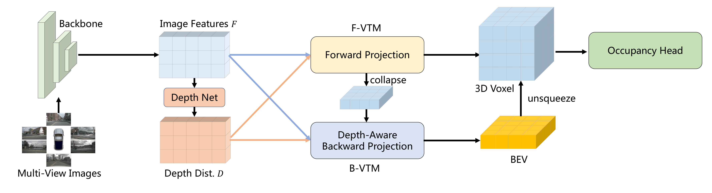
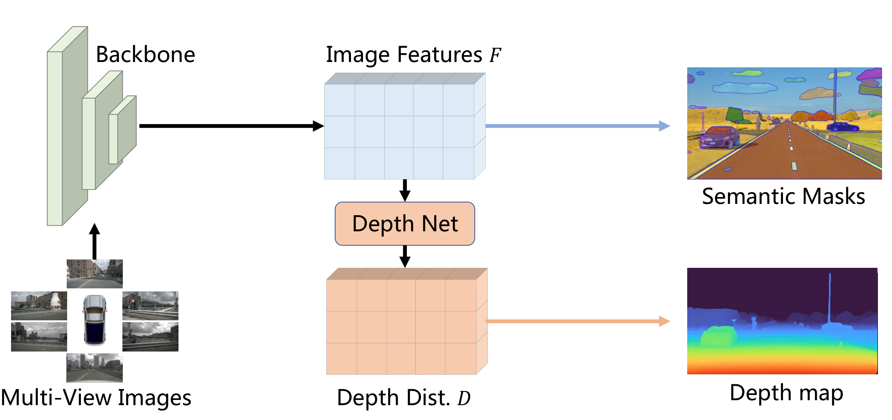

# FB-OCC: 3D Occupancy Prediction based on Forward-Backward View Transformation

## 一句话结论

FB-OCC 先用显式深度分布把图像特征 forward-project 成 3D voxel，再把其高度压缩后的语义 BEV 作为 query，backward-project 回图像补充细节，最后融合两路 voxel 做 occupancy；这条“深度给几何、BEV query 给语义纠错”的互补路线赢得了挑战赛，但 54.19 mIoU 来自 12 亿参数 backbone、七模型集成和高强度 TTA，且训练使用 LiDAR 深度/语义及外部数据，不能理解为轻量纯相机单模型能力。

## 论文信息

- Authors: Zhiqi Li, Zhiding Yu, David Austin, Mingsheng Fang, Shiyi Lan, Jan Kautz, Jose M. Alvarez
- Year: 2023
- Venue: CVPR 2023 3D Occupancy Prediction Challenge technical report / workshop
- Source: arXiv:2307.01492
- Local input: `_inbox/papers/FB-OCC/fb-occ.tex`
- Code: <https://github.com/NVlabs/FB-BEV>
- Paper: <https://arxiv.org/abs/2307.01492>

## 任务：从框检测走向每个 voxel 的语义

3D occupancy prediction 不只输出有限个物体框，而是在预设三维网格中判断每个 voxel 是 free 还是某个语义类别。它能表达不规则物体、路面、植被和未知障碍，输出更接近规划真正需要的场景空间，但计算量和监督复杂度也远高于 object-query 检测。

FB-OCC 在 Occ3D-nuScenes 上使用 $x,y\in[-40,40]$ 米、$z\in[-1,5.4]$ 米、0.4 米体素，形成 $200\times200\times16$ 网格，评价 18 类（含 free）的 class-mean IoU，并用 camera visibility mask 忽略相机不可见 voxel。

## 方法拆解

### Forward–Backward 总体结构

系统有三段：

1. **Forward projection**：图像网络预测像素深度分布，像 LSS/BEVDepth 一样将图像特征沿深度 lift 到 3D；与普通 LSS 立即压到 BEV 不同，这里保留高度轴，形成初始 voxel feature。
2. **Backward projection**：先把初始 voxel 沿高度聚合成语义 BEV，再将该 BEV 作为 queries，借助标定投影到多相机特征中查询细节。
3. **Fusion and occupancy head**：把优化后的 BEV 重新沿高度展开，与 forward voxel 融合，经 3D encoder 和 occupancy head 输出每个 voxel 的类别。

### 为什么两种 view transformation 互补

Forward projection 的优势是深度分布给出了明确的像素到 3D 分配，能直接建立几何体素；缺点是深度预测错误会把语义散射到错误位置，而且远距和遮挡区域的深度不可靠。

Backward projection 类似 BEVFormer：从目标空间 query 出发，把 3D reference points 投到图像并采样。它不必完全相信一次 lift 的结果，但从随机 BEV queries 开始学习又比较困难。FB-OCC 的关键折中是用 forward voxel 汇聚出的**语义 BEV**初始化 backward queries，并用预测深度分布增强投影对应关系。因此 backward 分支是在已有几何与语义先验上做校正，不是从零查询图像。

### 一个必须注意的结构瓶颈

backward 分支先把 3D voxel 沿 $z$ 压成 2D BEV，优化后再 unsqueeze 回高度维。这提高了效率，也让水平位置共享全局语义；但压缩时可能丢失桥面、卡车顶部、树冠等垂直结构，重新展开的修正也容易在不同高度层之间过度共享。最终保留的 forward 3D feature 能缓解这一问题，却没有完全消除它。

## 监督与预训练

### 多目标 occupancy loss

训练目标不是单一交叉熵，而是组合：

- distance-aware focal loss，平衡远近与类别难度；
- Dice loss 与 Lovász-Softmax，直接改善区域重叠和 mIoU surrogate；
- geometric / semantic affinity losses，约束局部几何和语义一致性；
- depth supervision，训练 forward projection 的深度分布；
- 2D semantic supervision，增强图像 backbone 的语义。

因此最终效果是结构、密集辅助监督与 loss engineering 的共同结果，不能只归因于 forward–backward transformation。

### 大模型联合预训练并非“纯相机训练”

backbone 先在 Objects365 做 2D detection，再在 nuScenes 上联合训练深度与语义。深度真值来自 LiDAR；语义伪标签由 SAM 生成：thing 类使用 2D box prompt，stuff 类把 LiDAR semantic points 投影到图像，再随机取点作为 prompt。

模型推理只输入相机，但训练和预训练明确利用 LiDAR depth、LiDAR semantic labels、Objects365 以及基础分割模型。因此更准确的说法是 **camera-only inference**，而不是从数据监督到推理都纯视觉。

## 关键实现设置

- 图像输入约 $640\times1600$。
- 80 个深度 bins，范围 2–42 米。
- occupancy grid 为 $200\times200\times16$。
- backward view transformation module 使用一层。
- 大模型在 32 张 A100 上、总 batch size 32，训练约 50 epochs。
- Intern-H 版本默认使用 6 个过去帧，显存允许时扩到 16 帧。

## 实验怎么读

### 小模型消融是逐步累加，不能当独立因果实验

| Variant | 累加改动 | mIoU |
| --- | --- | ---: |
| A | baseline | 23.12 |
| B | + depth supervision | 27.09 |
| C | + ignore invisible voxels | 35.36 |
| D | + bug fixes | 37.39 |
| E | + 16 frames | 39.11 |
| F | + joint pretraining | 39.89 |
| G | + losses + 3D temporal alignment | 40.69 |
| H | + TTA | 42.06 |

最大的跳变来自 visibility mask 和 bug fixes，而不是某个新注意力模块。由于每行继承前面所有改动，这张表只能说明完整工程管线逐步提高，不能严谨隔离每个组件的独立作用，尤其无法单独量化 forward–backward fusion 相比 forward-only 的净收益。

### 模型尺度贡献非常大

| Variant | Parameters | mIoU |
| --- | ---: | ---: |
| H | 67.8M | 42.06 |
| I | 130.8M | 48.90 |
| J | 428.8M | 50.47 |
| K | 1.2B | 52.79 |
| Final ensemble | 7 models | **54.19** |

从 6780 万到 12 亿参数带来约 10.7 mIoU，说明 leaderboard 成绩高度依赖 scale。最终 54.19 还组合七个模型，不能用于代表普通单模型的部署性能。

### TTA 与集成非常重

图像水平翻转和 3D 水平/垂直翻转组合出每帧 8 次推理。Temporal TTA 还用前一时刻预测替换当前帧远处静态区域；模型集成对不同类别和模型搜索权重。它们适合挑战赛离线提交，却增加巨大延迟，并引入“远处区域短时静态”的假设。

## 与其余四篇的关系

- [PETR](../../query-based-bev-temporal-fusion/2022-petr/README.md) 与 [StreamPETR](../../query-based-bev-temporal-fusion/2023-streampetr/README.md) 用稀疏 object queries 输出框；FB-OCC 必须保留密集 voxel，计算目标和表示粒度完全不同。
- [SOLOFusion](../../camera-based-bev-temporal-fusion/2023-solofusion/README.md) 与 [VideoBEV](../../camera-based-bev-temporal-fusion/2024-videobev/README.md) 都基于图像到 BEV 的 forward lift 并融合时间；FB-OCC 保留高度轴，再增加一次语义 query 驱动的 backward projection。
- 它也可以看作 BEVDepth 与 BEVFormer 两条路线的结合：显式深度负责从图像向 3D 散射，query-based attention 负责从 3D 目标空间回看图像。

## 局限与问题

- 54.19 mIoU 是挑战赛系统成绩：1.2B backbone、七模型集成、8-way TTA，不具备实时部署代表性。
- camera-only inference 背后使用 LiDAR 深度/语义、外部检测数据和 SAM 伪标签，数据成本高。
- 顺序消融混入 visibility policy、bug fixes、loss、时间和预训练，核心 architecture 的独立贡献不够清楚。
- BEV 高度压缩再展开可能损失精细垂直结构。
- SAM 与 LiDAR 投影伪标签会受遮挡、稀疏点和类别体系不一致影响。
- Temporal TTA 用历史替换远处静态区域，对真实运动物体或状态变化可能造成陈旧预测。
- class-mean IoU 平均各类，不反映置信度校准、free-space 连通性和规划风险，也可能弱化高频区域错误。
- 技术报告更偏挑战赛方案汇总，训练细节与系统复现完整度有限。

## 个人复盘

- 最值得保留的思想是 forward 与 backward 的误差互补：一次显式 lift 给出可训练的 3D 初值，目标空间 queries 再回图像寻找修正证据。
- 最需要拆开的则是“方法贡献”和“竞赛堆栈”。若研究架构，应看单模型小规模对比；若研究榜单上限，才看 54.19。
- occupancy 比 3D box 更接近场景建模，但更高输出密度并不自动等于对规划更安全；仍需专门评价不可见区域、动态占用和风险敏感错误。

## 建议阅读顺序

1. 先画清 forward voxel、semantic BEV query、backward sampling、3D fusion 四个张量的形状变化。
2. 再理解为什么语义 BEV 初始化优于随机 queries，以及深度分布如何参与两条投影。
3. 看小模型顺序消融，特别标记 visibility mask 与 bug fixes 的巨大影响。
4. 最后拆开单模型 52.79、七模型 54.19 与 TTA，避免把挑战赛配置当作基础方法能力。
