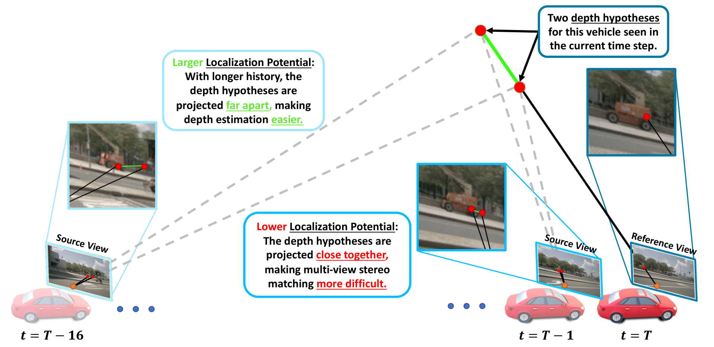
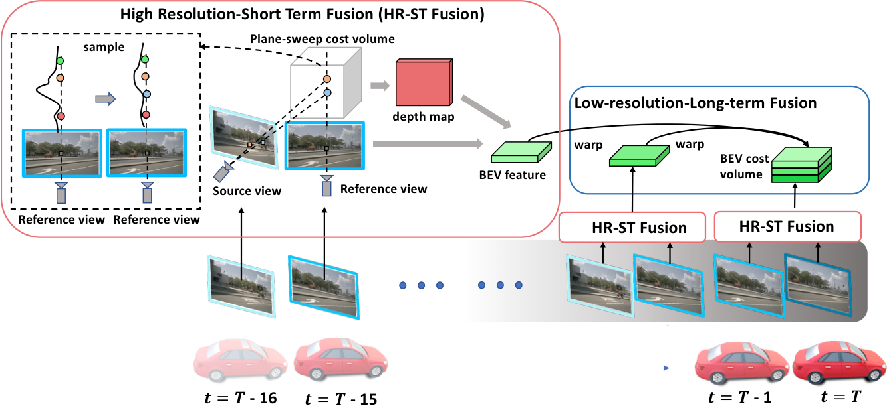

# SOLOFusion: Time Will Tell

## 一句话结论

SOLOFusion 把多帧相机 3D 感知重新解释为“时间立体匹配”：相隔更久的帧往往为远处目标提供更大的有效基线，因此用低分辨率长时 BEV 融合补位置和速度，再用高分辨率相邻帧 stereo cost volume 补深度；它证明时间可以部分替代空间分辨率，但固定 16 帧的稠密缓存、动态物体和遮挡仍限制这套立体几何解释。

## 论文信息

- Authors: Jinhyung Park, Chenfeng Xu, Shijia Yang, Kurt Keutzer, Kris Kitani, Masayoshi Tomizuka, Wei Zhan
- Year: 2023
- Venue: ICLR 2023（Notable Top 5%）
- Source: arXiv:2210.02443
- Local input: `_inbox/papers/SOLOFusion/main.tex`
- Code: <https://github.com/Divadi/SOLOFusion>
- Paper: <https://arxiv.org/abs/2210.02443>

## 核心问题：为什么旧帧仍然有用

常见直觉认为当前帧最清晰，越旧的图像越容易因运动与遮挡失效。SOLOFusion 指出，对深度估计而言，当前与历史相机位置之间的位移就是 stereo baseline；远处目标在相邻帧中的视差过小，适当拉长时间间隔反而更容易区分深度。

因此论文没有只问“堆几帧”，而是把两个变量一起考虑：

- 时间跨度决定可获得的基线分布；
- 图像特征分辨率决定微小视差能否被保留。

## Localization potential



论文用 source image 横坐标对 reference depth 的敏感度表示定位潜力：

$$
\left|\frac{\partial x_b}{\partial d_a}\right|
=
\frac{f\bar t\cos\alpha\left|\sin(\alpha-(\theta+\beta))\right|}
{\left[d_a\cos(\alpha-\theta)+t_z\cos\alpha\right]^2}.
$$

若时间间隔为 $t$，平移量随时间增长，表达式中的分子乘 $t$，分母中的 $t_z$ 也相应乘 $t$。这个量越大，两种相近深度在另一帧上的投影越容易分开，匹配更有判别力。

它给出三个结论：

1. 远处点的相邻帧视差小，较长间隔通常更有帮助。
2. 最优间隔随像素位置、深度、相机朝向和自车运动变化，单一固定间隔不可能处处最优。
3. 下采样相当于减小有效焦距，定位潜力会下降；时间跨度可以补偿一部分分辨率损失。

但这只是分析模型，不是严格性能定理。推导近似平面运动、静态场景和理想相机，也忽略遮挡、动态目标、外观变化与视野重叠；旧帧并非单调地越旧越好。

## 方法拆解

### 双路径总体结构



SOLOFusion 基于 BEVDepth/LSS，将时间信息分成两个互补分支：

- **Low-resolution Long-Term（LR-LT）**：在 $1/16$ 图像特征上逐帧生成 BEV，按 ego-motion 对齐过去 16 帧，将其拼成 BEV cost volume，供检测头学习长期运动与位置证据。
- **High-resolution Short-Term（HR-ST）**：在 $1/4$ 特征上对当前帧与相邻前一帧做 plane-sweep stereo matching，用 group correlation 构造 cost volume，改善当前帧深度分布。

两者分工很明确：长时分支需要覆盖多种 baseline，因此用低分辨率控制成本；高分辨率分支只保留相邻两帧，专门捕捉细小视差。

### 长时 BEV fusion

每帧先独立通过显式 depth distribution lift 到 BEV，再将历史 BEV warp 到当前 ego frame。过去 16 帧的对齐 BEV 沿通道拼接，由卷积融合。它是因果在线系统：训练和推理都只依赖当前与过去，并按顺序缓存各帧 BEV。

ego warp 对静态世界有效，却不会补偿车辆和行人的独立运动。动态目标在 cost volume 中形成轨迹，检测网络需要自行从这些错位模式估计当前位置和速度。

### 短时 stereo 与 Gaussian-Spaced Top-k

对当前像素，单目深度网络给出离散深度概率。若对全部 112 个深度平面做高分辨率匹配，显存和速度不可接受；只取概率最高的 top-$k$ 又会把候选挤在同一个峰附近。论文迭代选择一个峰并抑制其高斯邻域：

$$
P_{l+1}(d)=P_l(d)
\left[1-P_{\mathcal N(d_l,\sigma)}(d)\,\sigma\sqrt{2\pi}\right].
$$

默认取 $k=7$。它在“相信单目 prior”与“覆盖多个相异深度假设”之间折中，再只对这些候选深度做跨帧特征相关性。

## 实验怎么读

### 长时窗口主要改善速度

| History frames | mAP | NDS | mATE $\downarrow$ | mAVE $\downarrow$ |
| ---: | ---: | ---: | ---: | ---: |
| 0 | 0.307 | 0.347 | 0.743 | 1.148 |
| 1 | 0.316 | 0.423 | 0.734 | 0.456 |
| 16 | **0.377** | **0.474** | 0.655 | **0.307** |
| 41 | 0.367 | 0.467 | **0.650** | 0.314 |

从 0 到 1 帧，最大变化是速度误差；继续增加历史后定位也逐渐改善。到 41 帧反而回落，印证可见区域重叠变少、动态错位和无效历史会抵消更长 baseline 的收益。

### 两条路径互补，但长时分支贡献更大

| Configuration | mAP | NDS | mATE $\downarrow$ | FPS | Memory |
| --- | ---: | ---: | ---: | ---: | ---: |
| Baseline | 0.321 | 0.349 | 0.722 | 17.6 | 3.3 GB |
| HR-ST only | 0.343 | 0.389 | 0.670 | 12.2 | — |
| LR-LT only | 0.386 | 0.479 | 0.650 | 15.9 | 3.6 GB |
| Both | **0.404** | **0.495** | **0.605** | 11.4 | — |

长期 BEV 对 NDS 的贡献明显更大，高分辨率 stereo 则继续降低位置误差。双分支增益成立，但 11.4 FPS 也说明精度并非免费获得。

### 深度候选设计是有效工程折中

全部 112 个深度候选不可训练，约 2.9 FPS / 8.5 GB；均匀 28 个候选为 $0.345/0.377$、7.4 FPS；普通 top-7 为 $0.336/0.390$；Gaussian-spaced top-7 达到 $0.343/0.389$、$0.670$ mATE。它不是全面压倒各指标，但以 7 个平面接近更多候选的定位效果。

### “时间替代分辨率”应谨慎表述

半分辨率 SOLOFusion 达到 $0.427$ mAP / $0.534$ NDS、11.4 FPS、3.6 GB；全分辨率 BEVDepth 为 $0.405/0.523$、2.3 FPS、7.3 GB。结果说明较低空间分辨率配合时间信息可以超过高分辨率单帧基线，但两者结构和时间融合不同，不能据此宣称时间与分辨率普遍等价。

ConvNeXt-B 的 nuScenes test 结果为 $0.540$ mAP / $0.619$ NDS，mATE $0.453$、mAVE $0.276$；强 backbone 与完整时间模块共同构成该数字。

## 与 VideoBEV、StreamPETR 的关系

- [VideoBEV](../2024-videobev/README.md) 认为固定窗口并行拼接重复计算且长度受限，改用单个 recurrent BEV state 压缩全部历史。
- [StreamPETR](../../query-based-bev-temporal-fusion/2023-streampetr/README.md) 更进一步，只传递 top-$K$ object queries；检测效率更高，但不能自然服务稠密任务。
- SOLOFusion 的独特价值不是“第一篇多帧 BEV”，而是用 localization potential 解释为什么**时间间隔分布**与**特征分辨率**应共同设计。

## 局限与问题

- 固定 16 帧稠密 BEV 缓存与拼接使内存、融合通道和训练成本随窗口增长。
- ego-motion 对齐不处理动态目标；长期轨迹需要卷积网络隐式解码。
- stereo 分支依赖单目深度 prior，若正确深度未进入 7 个候选，后续匹配无法恢复。
- 理论分析假定静态、可见且近似平面运动，和真实 deep feature matching 之间仍有距离。
- 41 帧性能回落说明“更长 baseline”与“更多有效信息”不是同义词。
- 仅使用过去帧，满足在线因果性；它不能利用未来帧做离线补全。

## 个人复盘

- 最有启发性的不是双分支结构，而是把帧数从经验超参数转化为几何可分析的 baseline 选择问题。
- 长时 BEV 的主要收益首先体现在速度，短时高分辨率 stereo 才更直接改善深度定位；二者不应笼统地都叫 temporal fusion。
- 后续应比较在相同 backbone、输入分辨率和历史预算下，固定窗口与递归记忆究竟谁保留更多长期信息。

## 建议阅读顺序

1. 先理解 localization potential 的变量关系，不必纠结完整几何推导。
2. 再看双路径图，明确 HR-ST 修深度、LR-LT 聚合运动。
3. 看帧数和模块消融，尤其注意 16 到 41 帧的回落。
4. 最后接着读 VideoBEV，理解固定窗口为何被改成 recurrent memory。

## QA

### Q：SOLOFusion 的 ego warp 是怎么做的？warp 后各帧 BEV 如何拼接和融合？

A：SOLOFusion 的 LR-LT 分支是在 **BEV feature map** 上做 ego-motion warp，而不是直接 warp 图像特征或 3D box。每帧先经 LSS/BEVDepth 风格的 view transformation 得到

$$
B_t\in\mathbb{R}^{B\times C\times H\times W},
$$

官方 R50 配置中 $C=80$。

#### Ego warp

历史缓存不是 $T$ 个独立 tensor，而是已经沿通道打包的

$$
\mathcal H_{t-1}\in\mathbb{R}^{B\times TC\times H\times W}.
$$

其中所有历史特征都已递归对齐到 $t-1$ 时刻。到达当前帧 $t$ 后，代码为当前 BEV 的每个输出网格位置构造齐次坐标，并计算它在上一时刻 BEV 中的采样位置。记：

- $S$：`feat2bev`，把 BEV 网格索引转换为以米为单位的 LiDAR/BEV 坐标；
- $A_t,A_{t-1}$：当前帧和上一帧的数据增强变换；
- $T_{t\rightarrow t-1}$：由 nuScenes ego pose 得到的 current-LiDAR-to-previous-LiDAR 变换。

则 backward sampling 的坐标变换为

$$
u_{t-1}
=
S^{-1}A_{t-1}T_{t\rightarrow t-1}A_t^{-1}S u_t.
$$

也就是：

```text
当前 BEV 网格
  -> 当前增强坐标中的米制位置
  -> 撤销当前增强
  -> 当前 LiDAR 坐标变到上一帧 LiDAR 坐标
  -> 应用上一帧增强
  -> 上一帧 BEV 网格坐标
  -> 双线性采样历史特征
```

得到的坐标归一化到 $[-1,1]$ 后，通过 `F.grid_sample(..., align_corners=True, mode='bilinear')` 一次性采样全部 $TC$ 个历史通道。之所以使用“当前位置 $\rightarrow$ 历史采样位置”的变换，是因为 `grid_sample` 做的是 backward warp：为每个当前输出 cell 查询历史 feature map，而不是把历史 cell 向前散射到当前网格。[官方实现中的坐标构造与采样](https://github.com/Divadi/SOLOFusion/blob/683edce81b619098d1ba143d7b15b1e6aa23337a/mmdet3d/models/detectors/solofusion.py#L315-L347)

官方实现采用滚动缓存：缓存中的多帧特征已经对齐到上一帧，所以每个新时刻只需用同一个 $t\rightarrow t-1$ sampling grid 对整个缓存再 warp 一次，而不是分别从每个历史帧的原始 pose 重新计算到当前帧的变换。这样实现简单，但较老特征会经历多次插值。ego warp 只消除了自车运动造成的静态场景位移，不会补偿车辆、行人的独立运动，因此动态目标仍会在各通道中形成错位轨迹。

#### 拼接与融合

设 warp 后的历史缓存为

$$
\widetilde{\mathcal H}_{t-1}
\in\mathbb{R}^{B\times TC\times H\times W}.
$$

融合过程是：

1. 沿 **channel 维** 拼接当前 BEV 和全部已对齐历史 BEV：

   $$
   F_{cat}=[B_t;\widetilde{\mathcal H}_{t-1}]
   \in\mathbb{R}^{B\times (T+1)C\times H\times W}.
   $$

2. reshape 为 $B\times(T+1)\times C\times H\times W$，给每一帧的每个 BEV cell 再拼一个时间差通道。默认关键帧间隔为 $0.5$ 秒，所以时间值为 $0,0.5,1.0,\ldots$ 秒。
3. 对每个时刻共享一个 $1\times1$ convolution，将 $C+1$ 个通道（feature 加时间）编码回 $C$ 个通道。
4. 再把时间维展平到 channel 维，通过另一个 $1\times1$ convolution 将 $(T+1)C$ 压缩到融合后的 $C_{out}$，随后送入 BEV encoder 和检测头。[官方实现中的时间编码、拼接与压缩](https://github.com/Divadi/SOLOFusion/blob/683edce81b619098d1ba143d7b15b1e6aa23337a/mmdet3d/models/detectors/solofusion.py#L349-L381)

官方 R50 phase-2 配置为 $T=16$ 个历史帧、$C=80$、$C_{out}=160$，所以当前帧加历史一共形成 17 组 BEV feature，时间编码后先得到 $17\times80=1360$ 个拼接通道，再由 $1\times1$ convolution 压到 160 通道。[官方配置](https://github.com/Divadi/SOLOFusion/blob/683edce81b619098d1ba143d7b15b1e6aa23337a/configs/solofusion/r50-fp16_phase2.py#L82-L99)

因此这里的“拼接”可以概括为：**空间位置先用 ego pose 对齐，时间帧再沿通道堆叠，最后用带时间差输入的 $1\times1$ convolution 学习跨帧融合**；它不是沿 BEV 的宽或高拼接，也不是求和或 temporal attention。
