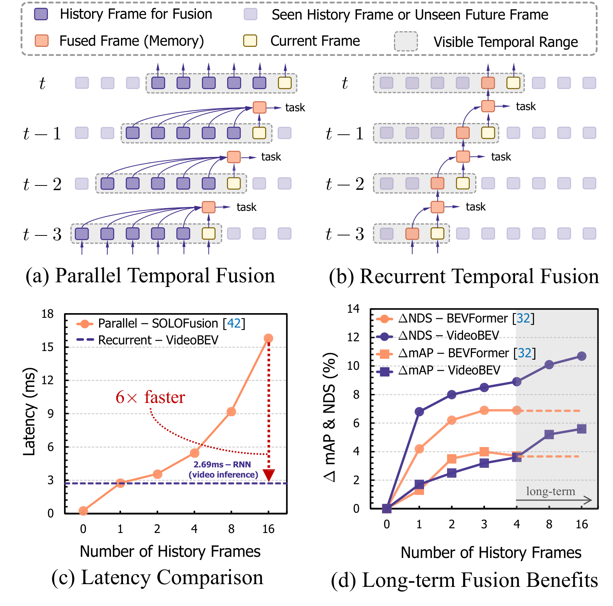
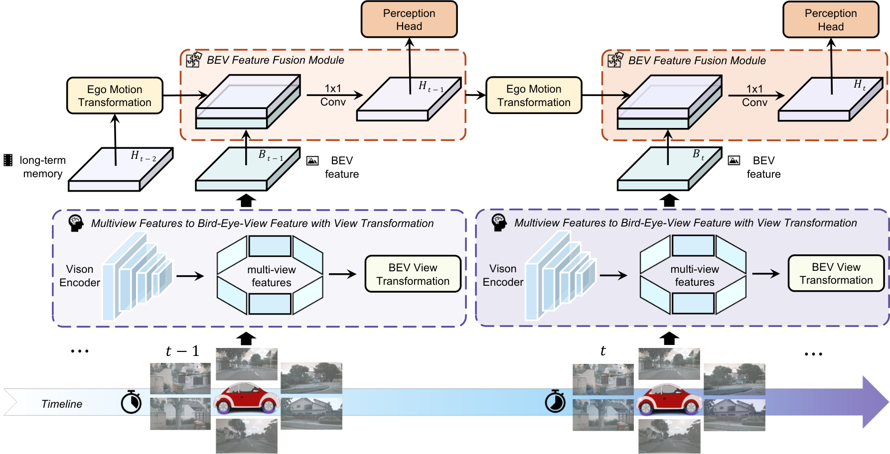
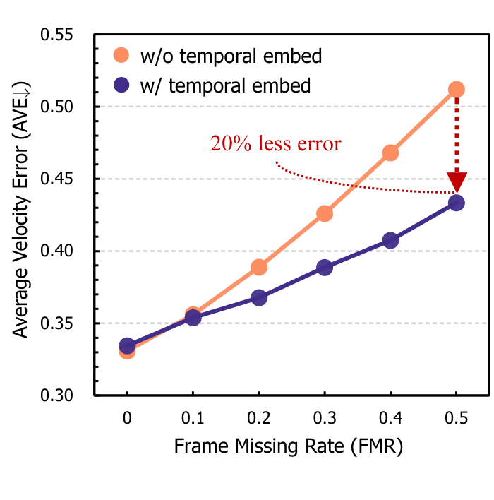

# VideoBEV: Exploring Recurrent Long-Term Temporal Fusion for Multi-View 3D Perception

## 一句话结论

VideoBEV 用一个按自车运动对齐的 recurrent BEV state 替代 SOLOFusion 式固定多帧拼接：每次只融合上一状态与当前 BEV，使推理成本基本不随历史长度增长，并用时间间隔 embedding 提升掉帧时的速度鲁棒性；代价是全部历史被反复压缩进一个稠密状态，遗忘、漂移和动态目标错位都缺少显式约束。

## 论文信息

- Authors: Chunrui Han, Jinrong Yang, Jianjian Sun, Zheng Ge, Runpei Dong, Hongyu Zhou, Weixin Mao, Yuang Peng, Xiangyu Zhang
- Year: 2024
- Venue: IEEE Robotics and Automation Letters, 9(7):6544–6551
- Source: arXiv:2303.05970
- DOI: 10.1109/LRA.2024.3401172
- Local input: `_inbox/papers/VideoBEV/videobev_arxiv.tex`
- Paper: <https://arxiv.org/abs/2303.05970>

## 从 parallel fusion 到 recurrent fusion

固定窗口方法保存 $k$ 个逐帧 BEV，全部 warp 到当前坐标系后拼接。窗口越长，缓存、通道和融合计算越大，而且最早帧到期后被硬丢弃。VideoBEV 把上一时刻融合结果当成 memory，每一帧只做一次状态更新，因此理论上可接收从视频开始以来的全部历史。

## 方法拆解

### 总体结构

每帧先用 LSS/BEVDepth 风格 view transformation 得到当前 BEV $B_i$。上一融合状态 $\bar H_{i-1}$ 根据 ego pose warp 到当前坐标系，与 $B_i$ 拼接后通过 $1\times1$ 卷积得到新状态 $\bar H_i$。任务 head 从该状态完成 3D 检测、地图分割、跟踪或运动预测。

这种设计把 view transformation 与 temporal fusion 解耦：前者逐帧抽取观测，后者只负责状态递推，因此可以接到不同 BEV extractor 和任务 head 上。

### 递归为何能表示长历史

固定窗口的线性融合可写成：

$$
\widehat H_i=
[\operatorname{warp}(B_{i-k+1});\ldots;B_i]*U
=\sum_j \operatorname{warp}(B_{i-k+j})*U_j.
$$

递归更新写成：

$$
\bar H_i=
[\operatorname{warp}(\bar H_{i-1});B_i]
*[V_{mem};V_{cur}].
$$

在线性近似下展开得到：

$$
\bar H_i=
\sum_{j=1}^{i}
\operatorname{warp}(B_j)*V_{cur}*V_{mem}^{,i-j}.
$$

论文据此解释：同一历史特征经过 $V_{mem}$ 的次数编码了“年龄”，无需显式为每个帧距学习一个独立权重。

这个推导应理解为直觉而非严格等式。真实网络包含 warp、边界裁切与非线性，卷积核反复相乘也可能衰减或放大某些模式；“数学上包含全部历史”不等于“有效信息被长期保留”。

### Temporal embedding 与掉帧

自动驾驶流中帧间隔并不总固定。若某帧缺失，相同空间位移对应的速度应按更长 $\Delta t$ 解释。VideoBEV 将时间差编码为：

$$
E_i=e(\Delta t_i\mathbf 1),
\qquad
\bar E_i=[\bar E_{i-1};E_i]*K,
$$

并把融合后的 temporal embedding 输入速度 head。它不改变 BEV 几何本身，而是帮助回归头区分“移动得快”和“时间隔得久”。

### 训练与推理

训练仍需展开有限序列，消融最长到 16 帧；推理则按视频顺序只缓存一个状态。因而部署内存基本固定，但训练显存和反向传播长度仍随展开窗口增长。模型是因果的；论文另报使用 future frames 的离线结果，不能与在线系统混为一谈。

## 实验怎么读

### 历史越长，速度收益最明显

| History | mAP | NDS | mATE $\downarrow$ | mAOE $\downarrow$ | mAVE $\downarrow$ |
| --- | ---: | ---: | ---: | ---: | ---: |
| 0 | 0.323 | 0.382 | 0.701 | 0.598 | 0.936 |
| 16 frames | **0.379** | 0.489 | 0.641 | 0.524 | 0.343 |
| 全视频递归 | **0.379** | **0.492** | **0.636** | **0.519** | **0.331** |

从 16 帧到全视频只获得小幅增益，说明 recurrent state 确实能利用窗口之外的信息，但边际收益已经很小。最显著的变化和其他时序方法一致，仍是 mAVE。

### 与 SOLOFusion 基本打平，而非全面超越

nuScenes val、R50 设置下，VideoBEV 使用 8 个训练帧达到 $0.422$ mAP / $0.535$ NDS；SOLOFusion 使用 17 帧为 $0.427/0.534$。二者各胜一个指标，不能宣称明显精度领先。VideoBEV 更扎实的优势是递归推理只保存一个状态，延迟和缓存不会随窗口线性增加。

ConvNeXt-B 的因果 test 结果为 $0.554$ mAP / $0.629$ NDS；加入未来帧的离线版本达到 $0.592/0.670$。后者说明双向上下文很有价值，但不适合实时在线驾驶。

### 掉帧实验验证 temporal embedding

当 frame missing rate 为 0.5 时，不使用 temporal embedding 的速度误差约升至 0.51，使用后约为 0.43。论文总结掉帧使 mAVE 增加 54.69%，temporal embedding 可将增幅降低 25.13%。这支持时间间隔编码，但只直接验证了速度 head，并不代表整个 recurrent memory 对异步传感器都鲁棒。

### 一个状态可以服务多个任务

论文还报告地图分割、跟踪和运动预测：地图 IoU 在 drivable/lane/vehicle 上为 $0.827/0.461/0.486$，优于同表 BEVDepth 的 $0.816/0.453/0.460$；跟踪 AMOTA 为 $0.548$；预测 minADE/minFDE/MR/EPA 为 $0.80/0.99/0.067/0.463$。这说明稠密 recurrent BEV 的适用面比 object memory 更广，但不同任务使用不同 head 和训练配置，不能视为同一个统一模型同时达到所有数字。

## 与 SOLOFusion、BEVFormer、StreamPETR 的关系

- [SOLOFusion](../2023-solofusion/README.md) 显式保留固定窗口中的每张 BEV，信息较少被压缩但成本随窗口增长；VideoBEV 用一个状态换取固定在线成本。
- [BEVFormer](../../query-based-bev-temporal-fusion/2022-bevformer/README.md) 也递归保存上一帧 BEV，但其 current BEV 由 query-based spatial attention 构造，时间更新使用 deformable attention；VideoBEV 强调 LSS 特征与简单卷积递推及长训练窗口。
- [StreamPETR](../../query-based-bev-temporal-fusion/2023-streampetr/README.md) 传播稀疏 object queries，检测更省；VideoBEV 的稠密状态更适合地图、占用和多任务共享。

## 局限与问题

- 单一 state 是信息瓶颈；早期细节经过多次更新后可能被遗忘、模糊或覆盖。
- ego warp 只对齐静态场景，运动目标会在递归状态中留下错位或 ghosting。
- recurrent error 会累积，论文没有专门评估长视频重置、漂移或跨场景状态污染。
- 训练仍只展开有限帧，所谓全历史能力来自测试时递归外推，不受完整长序列梯度监督。
- 展开公式忽略非线性与边界，不能证明每个历史时刻都被稳定保留。
- temporal embedding 主要接入速度 head，无法直接修复外观缺失或几何记忆错误。
- future-frame 结果是离线设定，不能作为在线方法的部署指标。

## 个人复盘

- VideoBEV 的贡献更像“状态管理原则”而非复杂新算子：如果历史最终都要服务当前帧，就在每一步完成压缩，避免每次重新融合整个窗口。
- 与 SOLOFusion 的真正取舍是显式历史容量对固定在线成本，而不是简单的精度高低。
- 对 recurrent 方法，平均 NDS 不够；更需要按序列长度、遮挡持续时间和状态重置间隔测遗忘与漂移。

## 建议阅读顺序

1. 先比较 parallel 与 recurrent 示意图，明确存储对象的差别。
2. 展开递推式，理解历史年龄为何由重复卷积隐式编码，同时记住线性化假设。
3. 看 0、16 帧和全视频实验，判断长期历史的边际收益。
4. 最后看掉帧实验和多任务结果，区分时间鲁棒性与通用 BEV 表征两类主张。
