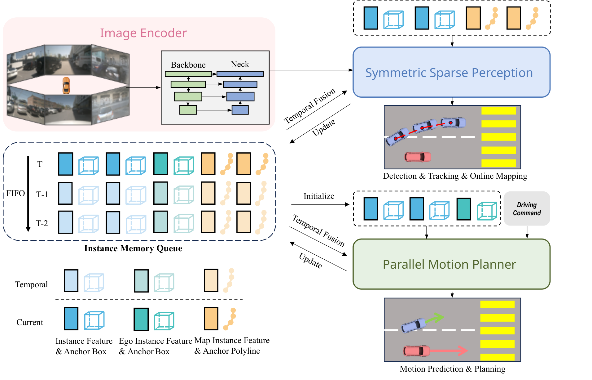
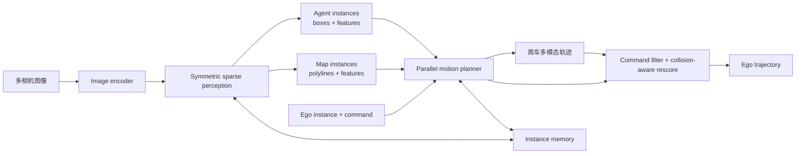
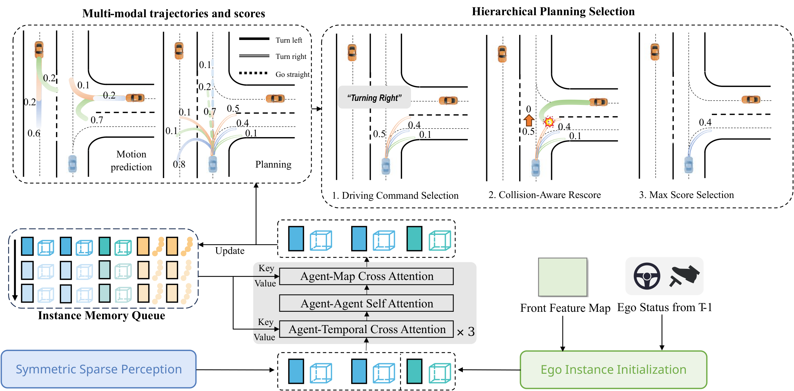

# SparseDrive: End-to-End Autonomous Driving via Sparse Scene Representation

## 一句话结论

SparseDrive 不再把稠密 BEV 当作检测、地图、预测和规划之间的公共“总线”，而是用 sparse instances 表示动态 agents、静态 map elements 与 ego vehicle：对称稀疏感知同时完成 detection/tracking/mapping，parallel motion planner 再让所有 agent 与 ego 并行预测多模态未来，并通过 command filtering 与 collision-aware rescore 选出安全轨迹。

## 论文信息

- Authors: Wenchao Sun, Xuewu Lin, Yining Shi, Chuang Zhang, Haoran Wu, Sifa Zheng
- Year: 2025
- Venue: IEEE International Conference on Robotics and Automation (ICRA 2025)
- Source: arXiv:2405.19620
- Project: <https://github.com/swc-17/SparseDrive>
- Paper: <https://arxiv.org/abs/2405.19620>
- Local input: `_inbox/papers/SparseDrive/main.tex`

## 背景问题

UniAD 一类端到端系统把 perception、prediction 和 planning 联合训练，但仍常依赖大尺寸 BEV tensor，在 BEV 上串行执行 motion prediction 再 planning。这同时带来两类问题：稠密特征计算昂贵；prediction 与 planning 被当作上下游任务，忽略了二者都在预测交通参与者未来、都需要语义/几何/时序交互、也都具有多模态不确定性。

SparseDrive 的出发点是：场景中真正需要下游消费的是有限个 agent 与 map instances，而不是每个 BEV cell；ego planning 本质上也可以作为“特殊 agent 的 motion prediction”与其他车辆并行求解。

## 核心贡献

1. 提出 Sparse-Centric 端到端范式，以 instance feature + geometric anchor 统一动态 agent、静态地图元素和 ego 状态，不构造稠密 BEV scene representation。
2. 设计 symmetric sparse perception：detection 与 online mapping 使用对称 decoder，tracking 直接复用检测 instance 的跨帧传播身份。
3. 设计 parallel motion planner，把周车预测和 ego planning 并行建模，并加入 ego semantic/geometric initialization 与 instance memory queue。
4. 以多模态轨迹、导航 command 和 predicted-agent collision check 做 hierarchical planning selection。
5. 在论文的 nuScenes open-loop protocol 上同时报告 perception、mapping、prediction、planning 与效率提升。

## 方法拆解

### 总体架构

多相机图像先经 backbone/neck 得到多尺度 perspective-view features；之后存在两条相互耦合的稀疏状态流：

关键变化不是简单删除 BEV，而是把“跨任务共享信息”的载体改成有限个带几何含义的 instances。图像 feature maps 仍然是稠密的，但检测、地图、时间记忆和规划不再维护稠密 BEV state。

### 对称稀疏感知

动态 agent instance 表示为：

$$
(F_d,B_d),\qquad
B_d=\{x,y,z,\ln w,\ln h,\ln l,
\sin\theta,\cos\theta,v_x,v_y,v_z\}.
$$

Static map instance 则把 box anchor 换成 $N_p$ 点 polyline：

$$
(F_m,L_m),\qquad
L_m=\{x_0,y_0,\ldots,x_{N_p-1},y_{N_p-1}\}.
$$

两条分支都通过 deformable aggregation 围绕 anchor 生成几何 keypoints，从多相机、多尺度图像特征采样；decoder 结构基本对称，差异主要在 anchor parameterization 和 prediction head。Detection 使用一个 non-temporal decoder 发现新目标，后续 temporal decoders 融合上一帧 instances；tracking 在检测置信度超过阈值后分配 ID，并随 instance propagation 保持该 ID。

### Ego instance 初始化

Ego 也表示为 feature $F_e$ 和 11 维 box/status anchor $B_e$，但车体自身不在相机视野中，不能像周车一样围绕 box 采样。论文使用 front camera 最小尺度 feature map 的全局平均作为语义初始化：

$$
F_e=\operatorname{AveragePool}(I_{front,S}).
$$

Ego 的位置、尺寸和朝向来自已知车体参数；速度若直接使用 GT 会造成 ego-status leakage，因此网络辅助预测 velocity、acceleration、angular velocity 和 steering angle，并用上一帧预测速度初始化当前 anchor。

### Parallel motion planner

首先将 ego 与周车 instances 拼接：

$$
F_a=\operatorname{Concat}(F_d,F_e),
\qquad
B_a=\operatorname{Concat}(B_d,B_e).
$$

然后执行三类交互：

- agent-temporal cross-attention：同一 instance 查询自身历史 memory，而不是与全部历史 instances 做 scene-level interaction；
- agent-agent self-attention：建模 ego 与周围交通参与者的双向影响；
- agent-map cross-attention：让未来轨迹受局部 map geometry 约束。

Motion head 为每个周车输出 $\mathcal K_m$ 条轨迹；planning head 按 left/right/straight command 输出 $\mathcal K_p$ 条 ego trajectories。二者并行生成，因此周车预测不再是规划器的单向前置模块。

### Hierarchical planning selection

推理时先按高层导航 command 保留对应的 ego trajectory modes，再用已预测的周车轨迹检查碰撞；发生碰撞的候选 score 被置零，最后选择最高分轨迹：

$$
\tau_p^*=\arg\max_{\tau\in\mathcal T_{cmd}}
\tilde s(\tau),
\qquad
\tilde s(\tau)=
\begin{cases}
0,&\tau\text{ 与预测 agent trajectory 冲突},\\
s(\tau),&\text{otherwise}.
\end{cases}
$$

这比连续 post-optimization 简单，也避免优化器把轨迹推离 imitation target；但它仍是显式规则选择，并不完全由网络端到端学习。

### 训练

Stage 1 从头训练 detection、tracking 与 mapping 的稀疏 scene representation；Stage 2 加入 motion/planning，所有模块联合训练且 perception 不冻结。总损失为：

$$
\mathcal L=\mathcal L_{det}+\mathcal L_{map}
+\mathcal L_{motion}+\mathcal L_{plan}+\mathcal L_{depth}.
$$

Motion 与 planning 使用 winner-takes-all：只让离 GT 最近的 mode 承担主要 regression supervision；planning 另有 ego-status regression。Depth 是训练稳定性的辅助任务。

## 实验结论

论文在 nuScenes 的统一 open-loop 设置下报告：

| Task | SparseDrive-B | 论文中的主要对比 |
| --- | ---: | --- |
| Detection | 49.6 mAP / 58.8 NDS | UniAD 38.0 / 49.8 |
| Tracking | 50.1 AMOTA / 632 IDS | UniAD 35.9 / 906 |
| Online mapping | 56.2 mAP | VAD 47.6 |
| Motion prediction | 0.60 minADE / 0.96 minFDE | UniAD 0.71 / 1.02 |
| Planning | 0.58 m avg L2 / 0.06% collision | VAD 0.72 / 0.21% |

SparseDrive-S 使用 R50、$256\times704$，论文报告 20 h 两阶段训练、9.0 FPS、1294 MB 推理显存；SparseDrive-B 使用 R101、$512\times1408$，为 30 h、7.3 FPS、1437 MB。表中 UniAD 为 144 h、1.8 FPS，但两者训练/测试 GPU 分别是 A100 与 RTX 4090，速度倍数能说明量级差异，却不是严格同硬件 benchmark。

关键消融与方法动机一致：

- parallel 改回 sequential 后 collision 从 0.08% 升到 0.10%；
- 去掉 ego initialization 后 L2 从 0.61 m 升到 0.63 m、collision 到 0.11%；
- 单模态 planning 的 collision 为 0.25%，6 modes 最佳，9 modes 反而退化；
- 去掉 agent-temporal attention 后 L2 从 0.61 m 恶化到 0.77 m；
- collision-aware rescore 把 collision 从 0.12% 降到 0.08%，L2 基本不变。

## 局限与问题

- 主要 planning 证据来自 nuScenes open-loop L2/collision proxy；论文自己承认 open-loop 不能完整代表真实闭环驾驶。
- Collision-aware rescore 假设 motion prediction 足够准确；漏检、漏预测或多模态覆盖不足时，规则无法识别真实风险。
- 论文值与开源仓库后来修正的 collision evaluation 并不完全一致，复现实验必须固定 metric implementation，不能只照抄表格。
- Camera-only inference 仍用 LiDAR depth auxiliary supervision 训练，且 scene representation 对未被 detection/map queries 覆盖的“黑名单障碍物”只能依赖 ego 初始化中的稠密图像摘要。
- 两阶段训练、多个任务 loss 和 WTA mode assignment 仍需大量人工平衡；“统一”没有消除任务之间的 gradient conflict。
- Online mapping 仍低于专用单任务方法，说明紧凑 shared representation 会牺牲部分任务容量。
- Planning selection 依赖 command filter 与 hard collision rule，模型不是从 pixels 到 control 的纯神经端到端系统。

## 与其他论文的关系

- [Sparse4D TPAMI](../../sparse-query-3d-perception/2026-sparse4d-tpami/README.md) 提供动态 agent 的 anchor-feature 解耦、deformable aggregation、递归传播和检测即跟踪。
- Map branch 采用类似 [MapTR](../../online-vectorized-hd-mapping/2023-maptr/README.md) 的 polyline instance，但以 Sparse4D 风格的多点几何采样保持结构对称。
- 与 UniAD 的 BEV-centric sequential task heads 相比，SparseDrive 把共享状态改为 sparse instances，并把 prediction/planning 改为 parallel interaction。
- [SparseDriveV2](../2026-sparsedrive-v2/README.md) 不再把重点放在多任务统一，而是重新研究 planning candidate representation 与 scalable scoring。

## 个人复盘

- 我真正理解的部分：SparseDrive 的核心抽象是“ego 也是一个 agent instance，map 也是一种 geometric instance”；统一不是让任务头相同，而是让它们共享同一种稀疏状态语言。
- 仍然不清楚的问题：当关键障碍无法被有限 queries 表达时，front-camera pooled ego feature 到底能补偿多少信息。
- 后续要读的内容：SparseDriveV2 的超稠密 trajectory vocabulary，以及在 NAVSIM/Bench2Drive 下比旧 nuScenes open-loop metric 更可信的规划评估。
