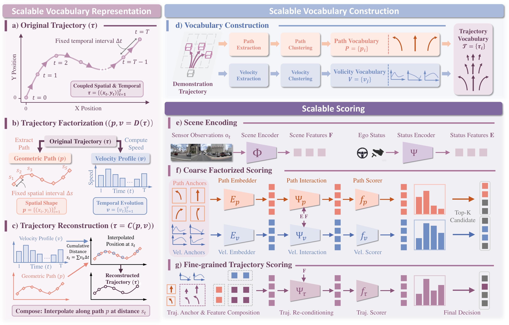
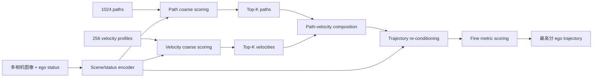

# SparseDriveV2: Scoring is All You Need for End-to-End Autonomous Driving

## 一句话结论

SparseDriveV2 的关键不是生成一条新轨迹，而是把轨迹拆成“走哪条几何路径”和“以什么速度前进”，用 $1024$ 条 path 与 $256$ 条 velocity profile 组合出 262,144 条候选，再通过 path/velocity 粗筛与 trajectory 细打分把计算集中到少量高质量组合上；它由此说明，静态 trajectory vocabulary 的主要瓶颈可能不是表达范式本身，而是覆盖密度和可扩展的 scoring。

## 论文信息

- Authors: Wenchao Sun, Xuewu Lin, Keyu Chen, Zixiang Pei, Xiang Li, Yining Shi, Sifa Zheng
- Year: 2026
- Venue: arXiv preprint（源码使用会议模板，但当前不据此推断已录用）
- Source: arXiv:2603.29163
- Project: <https://github.com/swc-17/SparseDriveV2>
- Paper: <https://arxiv.org/abs/2603.29163>
- Local input: `_inbox/papers/SparseDriveV2/main.tex`

## 背景问题

端到端规划器大致有两类：dynamic proposal 方法根据场景逐步回归或生成候选，表达灵活但推理链较复杂；scoring-based 方法预先聚类静态轨迹库，只需对候选排序，稳定而直接，却会受 vocabulary coverage 限制。

最朴素的扩容方式是增加完整时空轨迹 anchor。论文在 Hydra-MDP 上观察到 anchor 从 1,024 增至 16,384 时 EPDMS 从 85.02 升至 87.35，但显存从 9,531 MB 升至 38,877 MB，32,768 anchors 已经 OOM。因此真正的问题是：能否扩大候选覆盖，而不对几十万条完整轨迹逐一执行昂贵的 scene interaction？

## 核心贡献

1. 将轨迹因子化为只描述空间形状的 geometric path 和只描述时间进度的 velocity profile，使候选数量从相加的存储量得到相乘的组合覆盖。
2. 提出 coarse-to-fine scalable scoring：先独立给所有 path 和 velocity 打分、各自取 Top-$K$，再只对它们的笛卡尔积执行轨迹级细打分。
3. 在 fine stage 引入 trajectory re-conditioning，让已经组合的 path–velocity feature 再与场景交互，显式修正“急弯 + 高速”等不兼容组合。
4. 在 NAVSIM v1/v2 开环评估与 Bench2Drive 闭环评估上验证静态超密集 vocabulary，尤其把完整组合空间扩大到常见 8,192 anchors 的 32 倍。

## 方法拆解

### 总体结构

输入多相机图像和 ego status 后，scene encoder 不显式构造 BEV。规划器先在 factorized vocabulary 上做两级筛选：

这里“262,144 条轨迹”是潜在组合空间，并不意味着 262,144 个 trajectory queries 同时进入细粒度 decoder；计算可扩展性正来自先在两个小集合中粗筛。

### 轨迹的空间—时间因子化

常规轨迹按固定时间间隔采样：

$$
\tau=\{(x_t,y_t)\}_{t=1}^{T}.
$$

论文将它分解为按固定空间间隔 $\Delta s$ 采样的 path 与按固定时间间隔 $\Delta t$ 采样的速度序列：

$$
p=\{(x_i,y_i)\}_{i=1}^{S},
\qquad
v=\{v_t\}_{t=1}^{T},
\qquad
(p,v)=\mathcal D(\tau).
$$

速度由相邻时刻位移计算；反向组合时先累计路程，再在 path 上插值得到对应位置：

$$
v_t=\frac{\lVert(x_t,y_t)-(x_{t-1},y_{t-1})\rVert}{\Delta t},
\qquad
s_t=\sum_{k=1}^{t}v_k\Delta t,
\qquad
\tau=\mathcal C(p,v).
$$

这样“左转的形状”可以和多种加减速方式组合。分别对训练集中的 path 与 velocity 做 K-Means，得到：

$$
\mathcal P=\{p_i\}_{i=1}^{N_p},
\quad
\mathcal V=\{v_j\}_{j=1}^{N_v},
\quad
|\mathcal T|=N_pN_v.
$$

默认 $N_p=1024,N_v=256$，只保存 1,280 个基础 anchors，却隐式覆盖 $1024\times256=262{,}144$ 条完整轨迹。

### 粗粒度 factorized scoring

Path 和 velocity 先分别编码。Path 有明确空间坐标，因此可用 deformable aggregation 沿路径在多视角图像 feature 上采样；velocity 没有空间几何，只用 cross-attention 与 scene feature 交互。二者分别预测 $s_i^p$ 与 $s_j^v$，再选出：

$$
\mathcal T_{coarse}
=\{\mathcal C(p_i,v_j)\mid
p_i\in\mathcal P_{K_p},
v_j\in\mathcal V_{K_v}\}.
$$

NAVSIM 使用两层 progressive filtering：第一层保留 128 paths 和 64 velocities；第二层保留 20 和 20，最终只有 400 个组合进入 fine scoring。NAVSIM v2 为加速 metric target 计算，把第二层 velocity 数降为 10。

粗筛的假设是 path intent 与 velocity intent 各自已有足够判别力，例如直行场景可以淘汰转弯 path，拥堵场景可以淘汰高速 profile。但它只在边缘分布上取 Top-$K$，尚未判断某一对 path 与 velocity 是否彼此兼容。

### 细粒度 scoring 与 re-conditioning

对留下的 $(i,j)$，先相加已完成场景交互的两个 embedding：

$$
e_{i,j}^{\tau}=\widetilde e_i^p+\widetilde e_j^v.
$$

随后把组成后的完整 trajectory 当作几何 anchor，再用 deformable aggregation 与 scene features 交互：

$$
\widetilde e_{i,j}^{\tau}
=\Psi_{\tau}(e_{i,j}^{\tau},F),
\qquad
s_{i,j}^{\tau}=f_{\tau}(\widetilde e_{i,j}^{\tau}).
$$

这一步叫 trajectory re-conditioning。它把在粗筛阶段暂时忽略的 path–velocity 依赖补回来：同一条弯道在低速时合理，在高速时可能违反舒适性或安全性。

### 监督与最终决策

Path、velocity、trajectory 三层都不是只监督一个硬正样本，而是根据其与 GT 的距离构造 soft target distribution，再做交叉熵：

$$
\mathcal L_{path}=\operatorname{CE}(s^p,\operatorname{Softmax}(-\lambda_p d^p)),
$$

$$
\mathcal L_{vel}=\operatorname{CE}(s^v,\operatorname{Softmax}(-\lambda_v d^v)),
\qquad
\mathcal L_{traj}=\operatorname{CE}(s^\tau,\operatorname{Softmax}(-\lambda_\tau d^\tau)).
$$

NAVSIM 还让 rule-based teacher 为每条候选产生 safety、progress、comfort、rule compliance 等 metric sub-scores，并以 BCE 蒸馏：

$$
\mathcal L=\mathcal L_{path}+\mathcal L_{vel}+\mathcal L_{traj}
+\alpha\mathcal L_{metric}.
$$

推理时按 benchmark 相同权重聚合预测的 sub-scores，并选最高分轨迹。Bench2Drive 不使用 metric supervision，保持 pure imitation learning；最后再把选中的 trajectory 分解成 path 与 velocity，分别用于横向和纵向控制。

## 实验结论

| Benchmark | SparseDriveV2 | 关键信息 |
| --- | ---: | --- |
| NAVSIM v1 | 92.0 PDMS | R34，超过论文表中的 dynamic proposal 与 scoring baselines |
| NAVSIM v2 | 86.7 EPDMS$^*$ / 90.1 corrected EPDMS | $^*$ 是旧版有缺陷的评估；90.1 使用修正后的官方实现 |
| Bench2Drive | 89.15 Driving Score / 70.00% Success | 闭环 CARLA，multi-ability mean 67.67 |

Vocabulary 消融呈稳定趋势：$512\times128$、$512\times256$、$1024\times128$、$1024\times256$ 对应 EPDMS 88.7、89.2、89.5、90.1，说明 path 与 velocity 两个维度的覆盖都有效。

Scoring 消融则区分了两个收益来源：MHA 且无 re-conditioning 为 87.7；加入 re-conditioning 达 89.9；path interaction 换成 DFA、但无 re-conditioning 也为 89.9；DFA 与 re-conditioning 同时使用为 90.1。换言之，沿 path 的几何采样贡献最大，组合后的联合复核仍提供额外增益。

## 局限与问题

- Vocabulary 由训练数据聚类得到；遇到 OOD 道路几何或速度模式时，再密集的静态组合也可能没有合适候选。
- Factorization 在 coarse stage 暂时假设 path 与 velocity 可独立排序，可能提前裁掉“单项分数一般、组合后最优”的候选；fine re-conditioning 无法找回已被 Top-$K$ 删除的项。
- 固定空间/时间间隔、最大 path horizon 和插值算子都引入离散化假设；非常短的轨迹还需要 validity mask。
- NAVSIM 的 rule teacher 让模型直接拟合 benchmark metrics，性能可能部分来自 metric engineering；论文同时报告并明确区分旧版错误 EPDMS$^*$ 与 corrected EPDMS，这两个数字不能混用。
- Bench2Drive 虽是闭环，但仿真控制器、场景覆盖与真实世界仍有差距；Driving Score 与旧 SparseDrive 的 nuScenes open-loop L2/collision 也不能横向比较。
- SparseDriveV2 主要是 planner 的重构，不是 SparseDrive detection、mapping、tracking、motion 全栈的逐模块 V2；Bench2Drive 里这些任务仍作为辅助监督。

## 与其他论文的关系

- [SparseDrive](../2025-sparsedrive/README.md) 关注用 sparse instances 统一 perception、prediction 与 planning；V2 继承其无显式 BEV 的 scene encoder 思路，却把研究重心移到 planning vocabulary/scoring。
- [Sparse4D TPAMI](../../sparse-query-3d-perception/2026-sparse4d-tpami/README.md) 提供 geometry-guided deformable aggregation 的感知基础；V2 把类似思想用于 path–scene interaction 和 trajectory re-conditioning。
- 与 diffusion/autoregressive dynamic proposal 相比，V2 不生成新候选，而是证明“足够密的静态候选 + 可扩展评分”仍有竞争力。
- 与 Hydra-MDP 式 monolithic anchor scaling 相比，V2 用 factorization 将存储/粗评分复杂度从完整组合数解耦，再以 progressive Top-$K$ 控制细评分开销。

## 个人复盘

- 我真正理解的部分：这篇论文最漂亮的地方是把 trajectory coverage 从“多存完整轨迹”改写成“空间原语 × 时间原语”，再让计算量跟两个原语集合和筛后组合数相关，而不是跟完整笛卡尔积相关。
- 最需要警惕的部分：32 倍更密描述的是潜在组合空间，不是全部候选都经过同等强度的联合场景推理；性能依赖 coarse score 不把关键组合过早剪掉。
- 后续问题：如果让 Top-$K$ selection 可微，或在粗筛中加入低秩 path–velocity compatibility，是否能在基本不增加成本的情况下减少独立筛选误杀？
