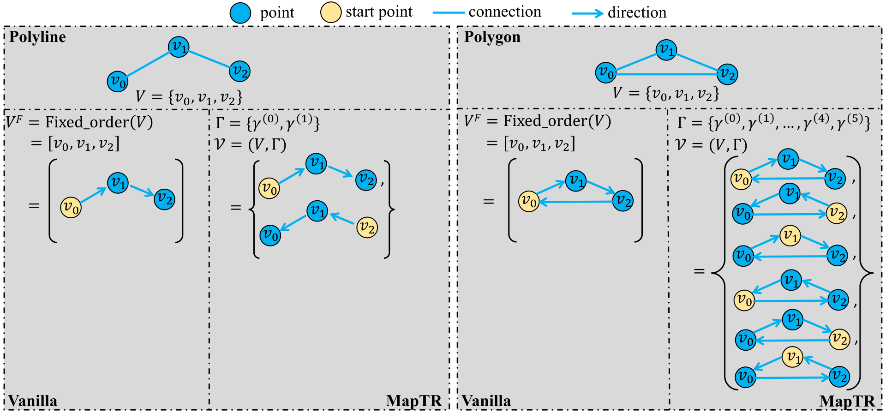
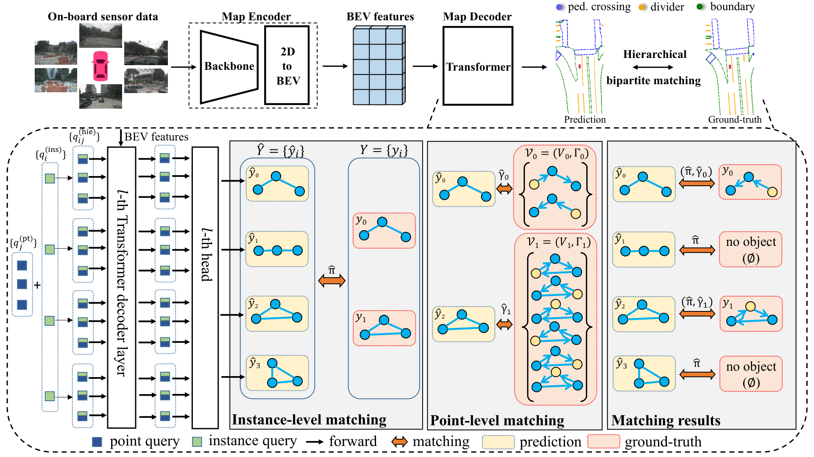

# MapTR: Structured Modeling and Learning for Online Vectorized HD Map Construction

## 一句话结论

MapTR 把在线矢量地图构建改写成 DETR 式并行集合预测，并指出折线/多边形没有唯一的点序：通过“点集 + 等价排列组”定义形状、先匹配地图实例再在等价排列中匹配点序，它消除了错误的固定顺序监督，配合 instance/point 层级 query，一次前向即可输出全部地图元素。

## 论文信息

- Authors: Bencheng Liao, Shaoyu Chen, Xinggang Wang, Tianheng Cheng, Qian Zhang, Wenyu Liu, Chang Huang
- Year: 2023
- Venue: ICLR 2023 Spotlight
- Source: arXiv:2208.14437
- Local input: `_inbox/papers/MapTR/main.tex`
- Project: <https://github.com/hustvl/MapTR>
- Paper: <https://arxiv.org/abs/2208.14437>

## 背景问题

在线 HD map 的输出不是普通语义分割：下游预测和规划需要“哪一条 divider、哪一段 boundary、哪一个 crossing”及其矢量几何。HDMapNet 从 raster segmentation 做聚类和后处理，实例结构不端到端；VectorMapNet 先检测粗关键点再自回归生成点序，推理慢且误差会累积。

直接套 DETR 也有一个地图特有问题：同一条无方向折线从左到右或从右到左是同一形状；闭合多边形还允许任意起点和两个绕行方向。若训练数据强制一种顺序，模型会被等价但冲突的标签拉扯。

## 核心贡献

1. 用 permutation-equivalent modeling 统一表示无方向 polyline 与闭合 polygon。
2. 用 instance query 与共享 point query 的和表示“第 $i$ 个实例的第 $j$ 个点”。
3. 先 Hungarian 匹配实例，再在合法排列组内寻找最低点误差的顺序。
4. 以 point loss 与 edge direction loss 同时约束位置和局部形状，无启发式矢量化后处理。

## 方法拆解

### 形状不是一个固定序列

一个地图元素表示为：

$$
\mathcal V=(V,\Gamma),\qquad
V=\{v_j\}_{j=0}^{N_v-1},
$$

其中 $V$ 决定几何位置，$\Gamma$ 收集所有表达同一形状的合法点序。无方向折线只有正反两个排列：

$$
\Gamma_{polyline}=\{\gamma^0,\gamma^1\},
\qquad
\gamma^0(j)=j,
\quad
\gamma^1(j)=N_v-1-j.
$$

闭合 $N_v$ 点多边形允许 $N_v$ 个起点和两个方向，因此有 $2N_v$ 个等价排列。这个定义很关键：网络仍然输出有序点列，但 loss 会在合法等价类中选最合适的一种，不要求数据预处理凭空决定方向和起点。

### Encoder–decoder 与层级 query

多相机图像先经 backbone 和 2D-to-BEV 模块得到 $\mathcal B\in\mathbb R^{H\times W\times C}$。默认使用 GKT，但论文验证 IPM、LSS 和 deformable attention 均可替换，说明 MapTR 的主要创新位于 map decoder 与监督定义。

对 $N$ 个实例和每实例 $N_v$ 个点，层级 query 为：

$$
q^{hie}_{ij}=q^{ins}_i+q^{pt}_j.
$$

$q^{ins}_i$ 表示“是哪一个地图实例”，共享的 $q^{pt}_j$ 表示“形状中的第几个采样位置”。decoder 对全部 $N\times N_v$ queries 做 self-attention，再以预测点作为 reference points 从 BEV 做 deformable cross-attention，逐层修正点坐标。分类头按实例输出类别，回归头输出 $2N_v$ 个归一化 BEV 坐标。

### 层级匹配

第一层匹配在实例集合上进行。对预测 $\hat y=(\hat p,\hat V)$ 与 GT $y=(c,V,\Gamma)$，代价结合类别与整体位置：

$$
\hat\pi=\arg\min_{\pi\in\Pi_N}
\sum_{i=0}^{N-1}\mathcal L_{ins\_match}(\hat y_{\pi(i)},y_i),
$$

$$
\mathcal L_{ins\_match}=\mathcal L_{Focal}(\hat p,c)+
\mathcal L_{position}(\hat V,V).
$$

第二层只对已匹配的正实例，在其排列组中选择点到点 Manhattan 距离最小的排列：

$$
\hat\gamma_i=\arg\min_{\gamma\in\Gamma_i}
\sum_{j=0}^{N_v-1}D_{Mht}(\hat v_j,v_{\gamma(j)}).
$$

这不是任意点集 matching：候选只限于保持折线/多边形拓扑的等价顺序，因此既消歧又保留相邻关系。

### 损失

$$
\mathcal L=\lambda\mathcal L_{cls}+
\alpha\mathcal L_{p2p}+\beta\mathcal L_{dir}.
$$

点损失监督匹配后的坐标；方向损失对相邻边向量做 cosine similarity：

$$
\mathcal L_{dir}=-\sum_{i,j}
\operatorname{cos\_sim}(\hat e_{\hat\pi(i),j},e_{i,\hat\gamma_i(j)}).
$$

它弥补了逐点 $L_1$ 对局部切向和折线连续性的弱约束，但并未显式保证无自交、拓扑连接或车道图连通性。

## 实验结论

nuScenes val 使用 crossing、divider、boundary 三类，Chamfer 阈值 $\{0.5,1.0,1.5\}$ m 下取 AP 平均。

| Method | Modality | Epochs | mAP | FPS |
| --- | --- | ---: | ---: | ---: |
| VectorMapNet | Camera | 110 | 40.9 | 2.9 |
| MapTR-nano, R18 | Camera | 110 | 45.9 | 25.1 |
| MapTR-tiny, R50 | Camera | 24 | 50.3 | 11.2 |
| MapTR-tiny, R50 | Camera | 110 | 58.7 | 11.2 |

最关键消融不是 backbone，而是表示定义：固定点序为 44.4 mAP，permutation-equivalent modeling 为 50.3，提升 5.9；其中 crossing 提升 11.9 AP，符合闭合多边形歧义更大的预期。去掉 edge direction loss 时 mAP 为 48.2，合适权重下为 50.3。

不同 2D-to-BEV 模块为 IPM 46.2、LSS 49.5、deformable attention 49.7、GKT 50.3 mAP，说明 decoder 可迁移，但“都稳定”不等于完全不依赖 encoder 几何质量。

## 局限与问题

- 单帧输入无法利用历史观测，在遮挡、曝光和远距离区域容易抖动或漏图。
- flatten 后的 $N\times N_v$ query 全局 self-attention 复杂度为 $O((NN_v)^2)$，增加实例或点数会迅速耗尽显存。
- 模型预测局部几何实例，不直接输出车道之间的拓扑关系和可行驶图。
- 每类元素使用固定点数，短直线可能冗余，长曲线可能欠采样。
- 评估使用 Chamfer AP，可能容忍不合理连接或局部拓扑错误；后来的 StreamMapNet 还指出官方 train/val 的地理重叠会高估泛化。

## 与其他论文的关系

- [MapTRv2](../2024-maptr-v2/README.md) 完整继承这里的形状建模和层级匹配，重点改进收敛、注意力复杂度、3D/centerline 扩展。
- [StreamMapNet](../2023-streammapnet/README.md) 也继承等价排列 loss，但改成一实例一 query，并用预测 polyline 的多个点做 cross-attention reference，从而适应更大范围。
- MapTR 将 DETR 的集合预测从 bounding boxes 推广到结构化 point sets，是后续在线矢量地图方法的基本基线。

## 个人复盘

- 我真正理解的部分：MapTR 的决定性创新是“定义正确的等价标签空间”，架构改动反而相对朴素。
- 仍然不清楚的问题：permutation equivalence 解决表示歧义后，如何进一步把实例级几何提升为带方向、连接和交通规则的拓扑图。
- 后续要读的内容：MapTRv2 的 one-to-many 与 decoupled self-attention、StreamMapNet 的时序记忆，以及显式 topology prediction 方法。

## QA

### Q：MapTR 中的 GKT、IPM、LSS 和 deformable attention 分别是什么意思？

A：它们在 MapTR 的消融实验中都是可互换的 **2D-to-BEV transformation**：输入为多相机透视图特征，输出为统一车体坐标系下的 BEV 特征，之后才交给 MapTR 的 map decoder。四者最直观的区别是如何解决“某个 BEV 位置应该从图像的哪里取特征”。

| 方法 | 核心做法 | 是否显式处理深度 | 主要特点与限制 |
| --- | --- | --- | --- |
| IPM | 假设目标位于固定地面平面，利用相机内外参把 BEV 网格与图像像素直接对应起来 | 否，深度由平面假设和几何关系唯一确定 | 简单直接，适合车道线等贴地元素；路面不平、物体离地或标定有误时，硬投影会失准 |
| LSS | 每个像素预测离散深度分布，将图像特征沿相机射线“Lift”成视锥，再按三维坐标“Splat”到 BEV pillar | 是，预测每个像素的深度概率分布 | 能表达不同深度和高度，不受单一地面平面限制；构造稠密视锥，计算/显存较大，结果受深度估计质量影响 |
| GKT | 将每个 BEV 网格以预设高度粗投影到各相机，在投影点周围展开固定局部 kernel，由 query 对窗口内特征做 attention | 不预测完整深度；几何只用于提供粗定位 | 介于硬投影和全局 attention 之间；局部窗口可容纳投影误差，并可用 LUT 预存 BEV-to-image 索引，部署高效 |
| Deformable attention | 以 BEV 网格的几何投影为 reference point，只在其附近学习少量 sampling offsets 和 attention weights，从多相机、多尺度特征取样 | 通常用多个预设高度参考点，而非像 LSS 那样预测稠密深度分布 | 稀疏、可学习，采样位置比固定窗口灵活；实现和算子相对复杂，并仍依赖参考点几何质量 |

可以进一步把它们理解为：

- **IPM（Inverse Perspective Mapping）**：“我假定它就在地面上的这个位置，所以直接去唯一对应的像素取值。”本质是基于平面假设的逆透视/单应性映射。
- **LSS（Lift-Splat-Shoot）**：“一个像素究竟有多远不确定，所以先预测它在多个深度 bin 上的概率，再把带权特征沿射线展开并汇聚到 BEV。”在 MapTR 中主要使用的是 Lift 和 Splat；原方法名称里的 Shoot 指下游在 BEV cost map 上评估规划轨迹，不是这里 2D-to-BEV 模块的必要步骤。
- **GKT（Geometry-guided Kernel Transformer）**：“几何投影只需告诉我大概在哪；我在附近取一个 $K_h\times K_w$ patch，让 attention 自己判断哪些像素有用。”它不像 IPM 那样只信一个精确对应点，也不像全局 attention 那样搜索整幅图像。
- **Deformable attention**：“几何先给 reference point，网络再学习少数几个偏移采样点及其权重。”与 GKT 相比，GKT 通常展开固定布局的局部 kernel 后加权，deformable attention 则显式学习稀疏采样位置，因而更灵活。

还要区分 MapTR 中 deformable attention 的两个位置：消融表里的 **Deform. Atten.** 是 BEVFormer 风格的 map encoder，用于“多相机图像 $\rightarrow$ BEV”；map decoder 里也有 deformable cross-attention，但它是让每个层级 point query 以当前预测的二维地图点为 reference point，从**已经生成的 BEV 特征**中取样。二者使用相似算子，但数据源和职责不同。

因此，MapTR 用 GKT 不是因为它定义了 MapTR 的核心方法，而是因为它在该实验设置中兼顾效果、速度和部署便利。原文的单层公平比较为 IPM 46.2、LSS 49.5、deformable attention 49.7、GKT 50.3 mAP；这些结果说明 MapTR decoder 能接不同 BEV encoder，并不表示四种变换在几何假设上等价。机制细节可参见 [GKT](https://arxiv.org/abs/2206.04584)、[LSS](https://arxiv.org/abs/2008.05711) 和 [BEVFormer](https://arxiv.org/abs/2203.17270)。
