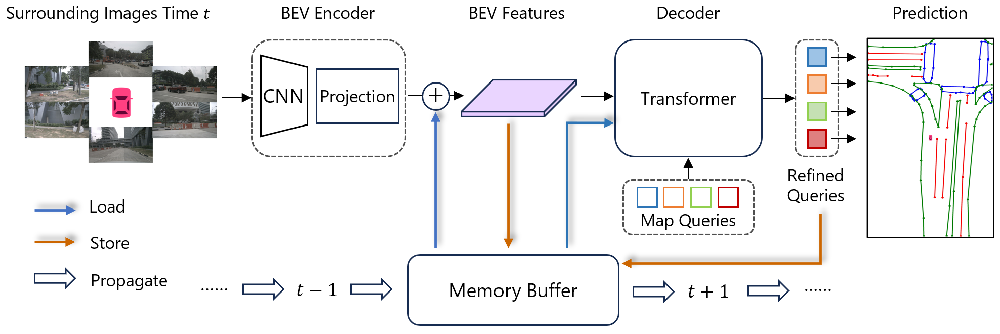
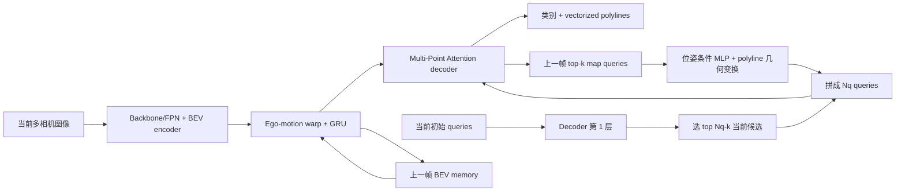
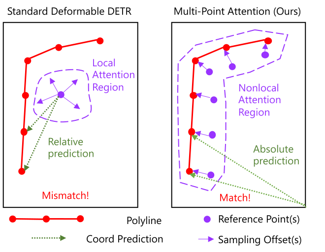
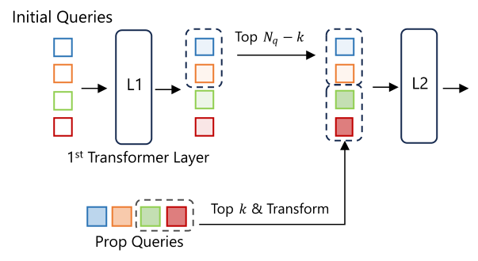

# StreamMapNet: Streaming Mapping Network for Vectorized Online HD Map Construction

## 一句话结论

StreamMapNet 为每个完整地图实例只分配一个 query，用上一 decoder 层预测的整条 polyline 作为多点 cross-attention 锚点，再同时递归传播高分 queries 和经 ego motion 对齐的稠密 BEV；它因此能在固定单帧成本下积累长时历史、扩大到 $100\times50$ m 范围，并通过重划无地理重叠的数据 split 揭示传统地图 benchmark 的严重位置泄漏。

## 论文信息

- Authors: Tianyuan Yuan, Yicheng Liu, Yue Wang, Yilun Wang, Hang Zhao
- Year: 2023
- Venue: arXiv preprint
- Source: arXiv:2308.12570
- Local input: `_inbox/papers/StreamMapNet/arxiv.tex`
- Code: <https://github.com/yuantianyuan01/StreamMapNet>
- Paper: <https://arxiv.org/abs/2308.12570>

## 背景问题

MapTR 等单帧方法通常只评估 $60\times30$ m，小范围内每个 point query 的局部取证尚可；范围扩大后，细长 boundary/divider 横跨更大区域，单 reference point 的 deformable attention 不匹配非局部形状，MapTR 的约 1000 个层级 point queries 也更难建立全局实例关系。

更根本的是地图是静态世界。相邻帧看到的是同一组道路结构，若每帧独立重建，不仅浪费历史可见区域，还会在大车遮挡、路口、曝光变化下产生对规划非常不友好的闪烁。

## 核心贡献

1. 一实例一 query，并沿该实例预测 polyline 的多个点从 BEV 采样，使 attention 范围适应细长非局部形状。
2. 稀疏 query propagation 与稠密 BEV GRU fusion 并行，兼顾实例连续性和场景级历史证据。
3. 用 streaming 而非 stacking，让每个时刻只读上一状态，历史长度不线性增加延迟和显存。
4. 发现 nuScenes/Argoverse2 原 split 中 train–val 地理区域分别约 85%/54% 重叠，并给出低重叠新 split。

## 方法拆解

### 总体流程

稀疏和稠密两条记忆互补：query 保存“有哪些地图实例及其形状”，BEV 保存未必已被正确实例化的环境特征。

### 一实例一 query 与 Multi-Point Attention

每个 query 输出类别和 $N_p$ 个 polyline 点 $P=\{(x_i,y_i)\}_{i=1}^{N_p}$。传统 deformable attention 围绕一个中心 reference $R_i$ 采样；StreamMapNet 让下一层围绕上一层预测的全部 polyline points 采样：

$$
Q_i=\sum_{j=1}^{N_p}\sum_{k=1}^{N_{off}}
W_i^{(j-1)N_{off}+k}
\operatorname{DA}
\left(Q_{i-1},P_i^j+O_i^{(j-1)N_{off}+k},F_{BEV}\right).
$$

$$
P_{i+1}=\sigma(\operatorname{Reg}(Q_i)).
$$

复杂度随 polyline 点数为 $O(N_p)$，而不是对 $HW$ 个 BEV token 做全局 attention。论文还发现 MapTR/DETR 常用的 residual coordinate refinement 与这里的多点锚定配合不佳，改成共享 MLP 直接预测绝对坐标后，单帧基线从 33.7 提到 41.7 mAP。

### Query propagation

上一帧 top-$k$ queries 先用相对位姿矩阵 $T$ 条件化：

$$
Q_t=\phi_t\left(\operatorname{Concat}(Q_{t-1},\operatorname{flatten}(T))\right)+Q_{t-1}.
$$

同时把上一帧预测 polyline 显式变换到当前 ego 坐标：

$$
P_t=T\cdot\operatorname{homogeneous}(P_{t-1}).
$$

当前初始 queries 先跑第一层并选出 top-$(N_q-k)$，再与 $k$ 个历史 queries 合并。额外 transformation loss 要求条件化后的 query 直接回归变换后的 polyline：

$$
\mathcal L_{trans}=\sum_{j=1}^{N_p}
\operatorname{SmoothL1}(\hat P^j,P_t^j).
$$

### BEV fusion

上一帧 BEV 先按 ego pose warp，再与当前 BEV 用 GRU 融合：

$$
\widetilde F^{t-1}_{BEV}=\operatorname{Warp}(F^{t-1}_{BEV},T),
$$

$$
F^t_{BEV}=\operatorname{LayerNorm}\left(
\operatorname{GRU}(\widetilde F^{t-1}_{BEV},F^t_{BEV})
\right).
$$

它与 VideoBEV 的递归场景记忆相似，但下游 decoder 是地图实例 query。query 和 BEV 都只显式访问上一帧，所谓长期信息依靠隐藏状态递归保留。

### Matching 与损失

StreamMapNet 沿用 MapTR 的等价排列组 $\Gamma$，用最优方向/起点下的逐点 Smooth-$L_1$ 定义 polyline 代价：

$$
\mathcal L_{line}(\hat P,P)=
\min_{\gamma\in\Gamma}\frac{1}{N_p}
\sum_{j=1}^{N_p}\operatorname{SmoothL1}(\hat p_j,p_{\gamma(j)}).
$$

Hungarian cost 由 line cost 与 focal classification cost 组成；训练再加 query transformation loss：

$$
\mathcal L_{train}=\lambda_1\mathcal L_{line}+
\lambda_2\mathcal L_{Focal}+lambda_3\mathcal L_{trans}.
$$

训练采用截断 streaming：memory 不向前一帧反传梯度；前 4 epochs 只训单帧以稳定收敛。

## 数据集重划为何重要

传统 nuScenes 700/150 scene split 面向动态物体检测设计，但同一路段的地图在多次采集中基本不变。论文按覆盖面积估计，原 nuScenes validation 约 85% 区域也出现在 train，Argoverse2 为 54%；模型可能记住“位置—地图模板”，而非从当前视觉泛化。

新 split 将 Argoverse2 重叠降到 0%，nuScenes 降到 11%。原 nuScenes split 上 StreamMapNet 为 62.9 mAP，新 split 同一 $60\times30$ m 任务只有 33.9；MapTR 也从约 48.7 降到 20.9。这个近 50% 的落差比模型组件本身的增益更值得警惕。

## 实验结论

### 新 Argoverse2 split

| Range | Method | mAP | FPS |
| --- | --- | ---: | ---: |
| $60\times30$ m | MapTR | 51.1 | 18.0 |
| $60\times30$ m | StreamMapNet | 58.1 | 14.2 |
| $100\times50$ m | MapTR | 40.2 | 18.0 |
| $100\times50$ m | StreamMapNet | 51.2 | 14.2 |

扩大范围时 MapTR 下降 10.9 mAP，StreamMapNet 下降 6.9，支持多点 attention 与时间记忆对大范围更稳健。

### 新 nuScenes split

$60\times30$ m 下 StreamMapNet 33.9 mAP，对 MapTR 的 20.9 提升 13.0；$100\times50$ m 下为 23.0，对 MapTR 的 14.8 提升 8.2。速度为 13.2 FPS。

### 组件消融

单帧 multi-point 基线在改用 direct prediction 后为 41.7 mAP；query propagation 为 42.8，transformation loss 为 43.7，再加 BEV fusion 为 46.1，高分辨率最终为 51.2。query 与 BEV 两条时间路径各自贡献增益，但实验没有报告跨时间一致性的专用 metric。

## 局限与问题

- recurrent memory 在训练中截断梯度，长时历史能否可靠保存主要由最终 AP 间接推断。
- top-$k$ query propagation 会丢弃弱实例并传播假阳性；dense BEV memory 也可能在 warp 误差下产生 ghost structures。
- 地图被假设为静态，施工改道、临时标线等真实地图变化可能被历史记忆压制。
- 论文强调 temporal consistency，却没有专门量化跨帧抖动、实例 ID 连续性或地图拓扑稳定性。
- 新 split 显著减少地理泄漏，但仍需防止相邻道路、城市纹理和 GPS/pose 线索造成隐式记忆。
- 一实例固定 20 点仍不能显式表达连接拓扑和复杂分叉。

## 与其他论文的关系

- 它继承 [MapTR](../2023-maptr/README.md) 的 permutation-equivalent loss，但取消 instance/point 层级 query，改为一条 polyline 一个 query。
- 与 [MapTRv2](../2024-maptr-v2/README.md) 相比，StreamMapNet 更关注大范围和时序；MapTRv2 更关注单帧训练收敛、显存与 3D/centerline 扩展。
- query propagation 与 Sparse4D v2 类似，BEV fusion 与 VideoBEV 类似；StreamMapNet 将两类记忆同时用于静态地图。

## 个人复盘

- 我真正理解的部分：Multi-Point Attention 把“形状预测”反过来当作下一层的取证坐标，一实例一 query 负责身份，多个 reference points 负责几何覆盖。
- 仍然不清楚的问题：当地图真的变化时，GRU 如何在历史先验和当前证据间选择，是否会出现长期错误坚持。
- 后续要读的内容：显式 temporal map consistency metric、地图变化检测、Neural Map Prior，以及带 topology graph 的在线 mapping。
