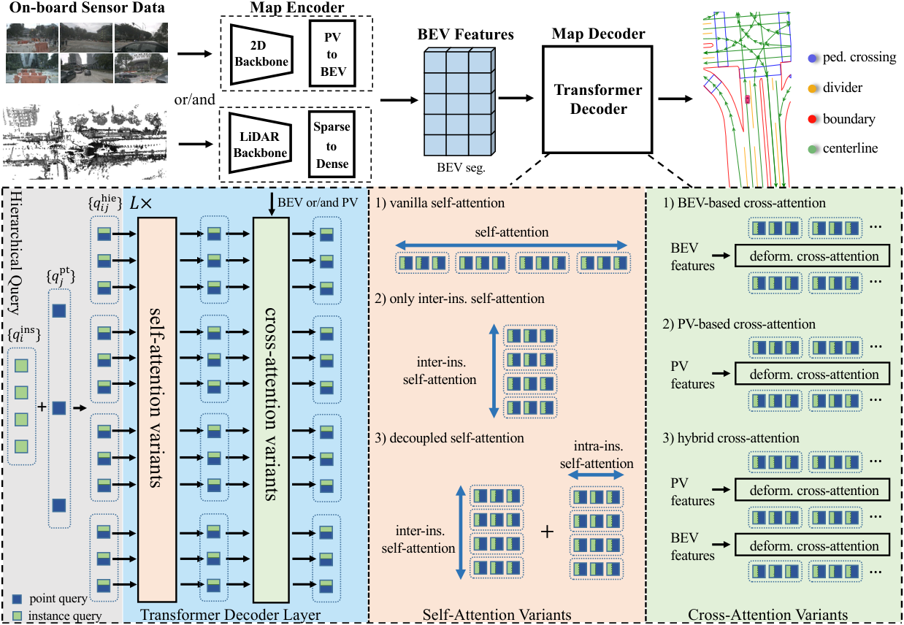
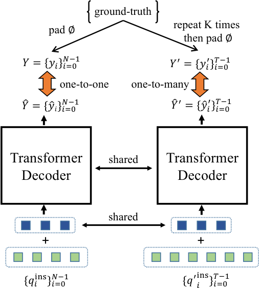

# MapTRv2: An End-to-End Framework for Online Vectorized HD Map Construction

## 一句话结论

MapTRv2 保留 MapTR 的等价排列、层级 query 和两级匹配，把性能瓶颈归因于稀疏 one-to-one 正样本、encoder 几何监督不足和扁平 query attention 的二次复杂度；它以训练期 one-to-many 分支、深度/PV/BEV 稠密辅助监督及 instance/point 两轴解耦 attention 显著加速收敛，并扩展到 3D 地图与有方向 centerline。

## 论文信息

- Authors: Bencheng Liao, Shaoyu Chen, Yunchi Zhang, Bo Jiang, Qian Zhang, Wenyu Liu, Chang Huang, Xinggang Wang
- Year: 2024
- Venue: IJCV 2024
- Source: arXiv:2308.05736 (latest source revision v2)
- Local input: `_inbox/papers/MapTRv2/main.tex`
- Project: <https://github.com/hustvl/MapTR>
- Paper: <https://arxiv.org/abs/2308.05736>

## 相对 MapTR 改了什么

| 维度 | MapTR | MapTRv2 |
| --- | --- | --- |
| 形状 | 无方向折线、闭合多边形的等价排列 | 保留，并增加有方向 polyline 的单一合法排列 |
| Encoder | 默认 GKT BEV | 默认 LSS/BEVPoolv2，并加 depth/PV/BEV dense losses |
| Self-attention | flatten 后对 $NN_v$ queries 全局注意力 | 分别沿 instance 与 point 轴做 attention |
| 匹配 | 仅 one-to-one | 推理 one-to-one + 训练期 one-to-many 辅助分支 |
| 输出 | 2D map elements | 支持 2D/3D map 与 directional centerline |

v2 不是推翻 v1，而是把 MapTR 从一个有效范式变成更容易训练、扩展和复用的框架。

## 方法拆解

### 总体架构

多相机 PV 特征通过 LSS/BEVPoolv2 生成 BEV；decoder 仍采用：

$$
q^{hie}_{ij}=q^{ins}_i+q^{pt}_j,
$$

并迭代预测每个地图实例的 $N_v$ 个 2D 或 3D 点。BEV cross-attention 以这些动态参考点采样长条形地图元素沿线证据；论文也实现 PV-only 和 BEV+PV 变体。

### Decoupled self-attention

MapTR 将 $N\times N_v$ queries flatten 后做全局 attention，复杂度为：

$$
O((NN_v)^2).
$$

MapTRv2 分别沿实例轴和点轴做 attention：先让不同地图实例交换全局关系，再让同一实例内部各点协调形状，复杂度近似降为：

$$
O(N^2+N_v^2).
$$

在 50 个 instance queries 下，训练显存从 10443 MB 降到 8458 MB，mAP 从 57.1 升到 57.6；当实例数增到 150，vanilla attention 已 OOM，decoupled 仍只用 11157 MB 并达到 61.2 mAP。

### 层级 one-to-one matching

基本监督与 MapTR 相同：先用 Hungarian 算法找实例排列 $\hat\pi$，再在每个 GT 的合法点序组 $\Gamma_i$ 中找 $\hat\gamma_i$。基础损失为：

$$
\mathcal L_{one2one}=
\lambda_c\mathcal L_{cls}+
\lambda_p\mathcal L_{p2p}+
\lambda_d\mathcal L_{dir}.
$$

点序匹配仍只在拓扑合法的等价排列中搜索，因此不会把 polyline 退化成无序点云。

### Auxiliary one-to-many matching

one-to-one 每个 GT 只给一个正 query，decoder 早期学习信号稀疏。v2 在训练时增加 $T$ 个 instance queries，与主分支共享 point queries 和 decoder，把 GT 重复 $K$ 次后做同样的层级 Hungarian matching：

$$
\mathcal L_{one2many}=\mathcal L_{Hungarian}(\hat Y',Y').
$$

默认 $T=300,K=6$。它只在训练增加正样本和显存，推理仍使用原始 one-to-one queries，所以 FPS 不变。消融中从无该分支的 57.6 mAP 提升到 61.5，但训练显存从 8458 MB 增至 19426 MB。

### Dense supervision

v2 同时在三个位置增加辅助任务：

$$
\mathcal L_{dense}=
\alpha_d\mathcal L_{depth}+
\alpha_b\mathcal L_{BEVSeg}+
\alpha_p\mathcal L_{PVSeg}.
$$

- depth：用 LiDAR 渲染深度图监督 PV features；
- PV segmentation：将地图 GT 投影到相机视角，监督图像特征；
- BEV segmentation：将矢量 GT rasterize，监督 BEV features。

最终损失为：

$$
\mathcal L=
\beta_o\mathcal L_{one2one}+
\beta_m\mathcal L_{one2many}+
\beta_d\mathcal L_{dense}.
$$

这些分支都可在推理删除，代价是训练依赖 LiDAR 深度和额外 rasterization。

### 2D、3D 与方向

无方向 polyline 仍有正反两个排列；有交通流方向的 centerline 只允许一个排列。nuScenes 缺少高度标签时 BEV cross-attention 明显优于 PV-only（61.5 vs 49.5 mAP）；Argoverse2 有 3D map 高度监督时，PV-only 缩小差距，BEV+PV 还能从 64.7 提到 65.6，说明准确高度是透视采样成立的关键。

## 实验结论

### MapTR → v2 路线图

R50、24 epochs、nuScenes val：

| 累积设置 | mAP |
| --- | ---: |
| MapTR baseline | 50.3 |
| + depth supervision | 55.2 |
| + BEV supervision | 56.5 |
| + PV supervision | 57.1 |
| + decoupled attention | 57.6 |
| + one-to-many | 61.5 |

v2 用 24 epochs 的 61.5 mAP 已超过 MapTR 110 epochs 的 58.7，核心证据是更快收敛而不只是更强 backbone。

### 主结果

- nuScenes camera-only R50：110 epochs 达 68.7 mAP / 14.1 FPS，比对应 MapTR 高 10.0 mAP；24 epochs 为 61.5。
- camera-only VoVNet-99：73.4 mAP；camera+LiDAR 为 74.0，但只有 4.5 FPS。
- Argoverse2：2D map 67.4 mAP，3D map 64.7 mAP；论文据此证明框架可直接回归高度。
- centerline 扩展：nuScenes 四类均值 54.0，Argoverse2 2D/3D 为 62.6/61.4。

## 局限与问题

- 仍是单帧模型，没有显式时间一致性；遮挡和瞬时视觉退化只能靠空间先验处理。
- one-to-many 显著抬高训练显存，默认 300 queries、6 次 GT 重复几乎吃满 24 GB。
- 默认 depth supervision 使用 LiDAR，camera-only 更准确地说是 camera-only inference。
- 模型输出实例几何和方向，但没有直接预测 centerline 连接关系、lane graph 或交通规则拓扑。
- 相机外参噪声达到较大水平时性能快速下降：例如旋转噪声标准差从 0.01 rad 增到 0.02 rad，mAP 从 59.8 降到 35.6。
- 论文对 24/110 epoch、不同 backbone 和不同模态给出大量设置，比较时必须控制变量。

## 与其他论文的关系

- [MapTR](../2023-maptr/README.md) 提供表示与匹配基础；v2 的新增组件大多服务于训练效率与可扩展性。
- [StreamMapNet](../2023-streammapnet/README.md) 走另一条扩展路径：一实例一 query、多点 attention 和递归时序，重点解决大范围与遮挡。
- MapTRv2 的 one-to-many 与 Hybrid-DETR 思路一致；dense losses 与 BEVDepth/语义分割辅助监督相呼应。

## 个人复盘

- 我真正理解的部分：v2 的提升来自给 encoder 和 decoder 都增加更密集的训练信号，同时把最耗显存的 query 交互按结构拆轴。
- 仍然不清楚的问题：训练期大量 one-to-many positives 是否会让模型更依赖数据集的固定地图模板，而非真正从当前传感器重建。
- 后续要读的内容：StreamMapNet 的无地理重叠 split、显式 map topology 方法，以及无需 LiDAR 深度监督的几何学习。
