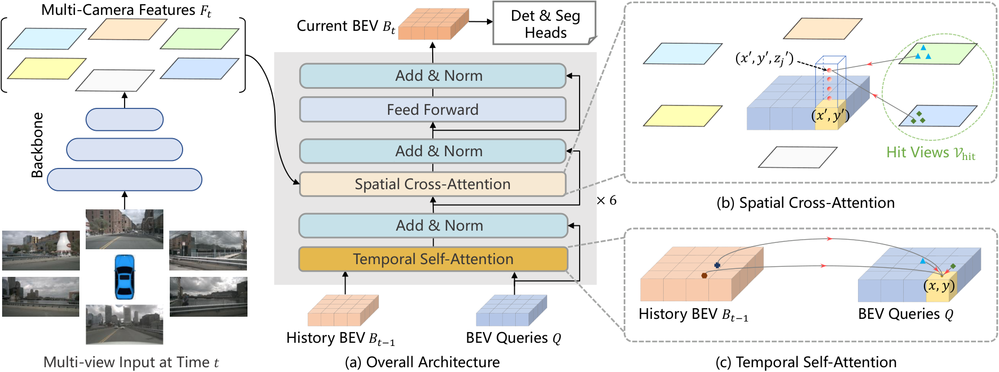
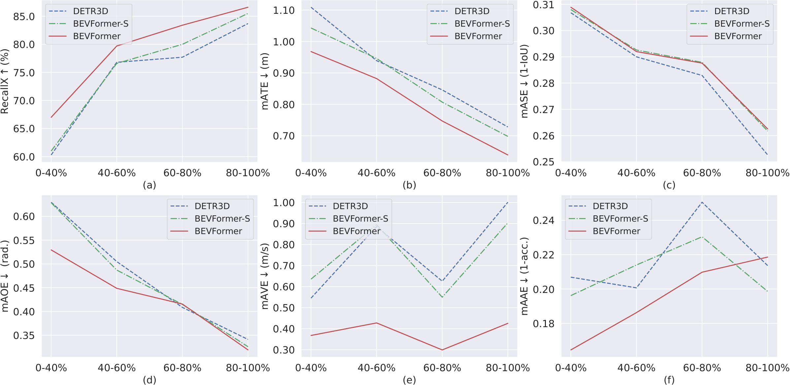

# BEVFormer: Learning Bird's-Eye-View Representation from Multi-Camera Images via Spatiotemporal Transformers

## 一句话结论

BEVFormer 的核心是把规则 BEV 网格变成一组带现实世界坐标含义的 query：空间上沿竖直柱采样 3D 参考点、投影到命中的相机并用可变形注意力取特征，时间上用自车运动对齐上一帧 BEV、再以可变形注意力补偿动态目标；它由此建立了一个不显式预测深度分布、可在线递归、能同时服务检测和地图分割的统一 BEV 表征，但仍强依赖相机标定和预设 3D 几何，并没有消除单目 2D 到 3D 的不适定性。

## 论文信息

- Authors: Zhiqi Li, Wenhai Wang, Hongyang Li, Enze Xie, Chonghao Sima, Tong Lu, Yu Qiao, Jifeng Dai
- Year: 2022
- Venue: ECCV 2022
- Source: arXiv:2203.17270v2
- Local input: `_inbox/papers/bevformer/main.tex`
- Project URL: <https://github.com/zhiqi-li/BEVFormer>
- Paper: <https://arxiv.org/abs/2203.17270>

## 背景问题

多相机 3D 感知需要把若干透视图中的局部、尺度变化明显且互相重叠的观测，统一到以自车为中心的 3D 空间中。BEV 很适合表达位置、尺寸、道路布局，也方便共享给检测、分割和后续规划，但从 2D 图像构造 BEV 是不适定问题。

BEVFormer 所针对的两类既有方案各有明显代价：

- 单目检测再跨相机后处理：每个视角独立，难以在特征层处理跨相机目标。
- 显式深度提升：先预测每个像素的深度或深度分布，再把图像特征 lift 到 3D/BEV；深度误差会传递给 BEV，形成复合误差。

另一个缺口是时间。单帧图像很难估计速度或找回重遮挡目标；直接堆叠多帧 BEV 又让计算量随窗口增长，并把无关历史一并带入。论文希望用类似 RNN hidden state 的上一帧 BEV 递归承载历史。

## 核心贡献

1. 用规则网格状、可学习的 BEV queries 建立现实 BEV 单元与多相机图像特征之间的稀疏查询接口。
2. 提出 Spatial Cross-Attention（SCA）：利用相机标定把每个 BEV 单元的一根 3D 柱投到相关视角，只在局部区域做 deformable attention。
3. 提出 Temporal Self-Attention（TSA）：先按自车运动对齐历史 BEV，再让当前 query 同时从当前 BEV query 与上一帧 BEV 中自适应采样。
4. 生成统一 BEV 特征，分别接 Deformable-DETR 风格 3D 检测头和 mask decoder，展示检测、地图分割及联合训练能力。

## 方法拆解

### 总体流程

一帧的处理顺序是：

1. 共享图像 backbone 和 FPN 从 $N_{\mathrm{view}}$ 个相机得到多尺度特征 $F_t=\{F_t^i\}$。
2. 将上一时刻 BEV $B_{t-1}$ 按自车运动对齐到当前坐标系。
3. 每层 encoder 先执行 TSA，从历史 BEV 取时间信息；再执行 SCA，从当前多相机图像取空间信息；最后经 FFN 更新 BEV queries。
4. 六层迭代后得到当前 BEV $B_t$，输入检测头或分割头，同时保存给下一时刻。

这里的 query 不是 DETR 中“一条 query 对一个目标”的 object query。它是稠密、固定网格上的 scene query；每个 $Q_p$ 负责一个 BEV 地理单元。检测头之后才使用稀疏 object queries。

### BEV queries：先固定输出空间，再向图像查询证据

论文定义：

$$
Q\in\mathbb{R}^{H\times W\times C},
$$

其中 $Q_p$ 对应网格位置 $p=(x,y)$。若每个 BEV 单元分辨率为 $s$ 米、BEV 中心是自车，则其现实平面坐标为：

$$
x'=\left(x-\frac{W}{2}\right)s,
\qquad
y'=\left(y-\frac{H}{2}\right)s.
$$

因此输出 BEV 的拓扑、范围和分辨率都是预先定义的，网络学习的是每个单元该从图像和历史中聚合什么，而不是先预测深度再把所有像素散射到 BEV。

### Spatial Cross-Attention：BEV 柱到多视角局部采样

对每个平面位置 $(x',y')$，沿高度轴放置 $N_{\mathrm{ref}}$ 个锚点 $z'_j$，形成一根离散柱。借助第 $i$ 个相机的已知投影矩阵 $T_i$：

$$
z_{ij}
\begin{bmatrix}
x_{ij} & y_{ij} & 1
\end{bmatrix}^{\!T}
=
T_i
\begin{bmatrix}
x' & y' & z'_j & 1
\end{bmatrix}^{\!T}.
$$

只有投影落在图像内的相机属于命中视角集合 $\mathcal V_{\mathrm{hit}}$。SCA 写成：

$$
\operatorname{SCA}(Q_p,F_t)
=
\frac{1}{|\mathcal V_{\mathrm{hit}}|}
\sum_{i\in\mathcal V_{\mathrm{hit}}}
\sum_{j=1}^{N_{\mathrm{ref}}}
\operatorname{DeformAttn}
\bigl(Q_p,\mathcal P(p,i,j),F_t^i\bigr).
$$

Deformable attention 不只取投影点本身，而是让 query 预测若干局部偏移 $\Delta p$ 和权重，再双线性采样。这有三层意义：

- 几何投影把搜索范围限制在物理上合理的位置；
- 学习偏移能修正参考高度离散、标定误差和投影点不精确；
- 局部稀疏采样避免每个 BEV query 与所有多相机像素做全局注意力。

所以论文所谓“不依赖深度”应准确理解为：**不显式预测像素深度或深度分布**。模型仍使用相机内外参、预定义 BEV 坐标和多个高度锚点，三维几何先验并未消失。

### Temporal Self-Attention：自车运动负责静态对齐，注意力负责剩余运动

先根据 ego-motion 把 $B_{t-1}$ warp 到当前坐标系，记为 $B'_{t-1}$。静态路面和建筑大致被对齐，但交通参与者在两帧间仍会独立运动。TSA 因而让当前 query 同时查询当前 query map 与历史 BEV：

$$
\operatorname{TSA}
\left(Q_p,\{Q,B'_{t-1}\}\right)
=
\sum_{V\in\{Q,B'_{t-1}\}}
\operatorname{DeformAttn}(Q_p,p,V).
$$

采样偏移与权重由 $Q$ 和 $B'_{t-1}$ 的拼接共同预测。直觉上，ego-motion warp 解决统一坐标系，deformable offsets 再学习目标自身运动造成的局部对应偏移。序列第一帧没有历史时，用 $\{Q,Q\}$ 替代 $\{Q,B'_{t-1}\}$，退化成无历史的 self-attention。

### 训练和在线推理

训练当前帧 $t$ 时，从过去两秒内采样三帧，与当前帧共四帧。前三帧递归产生 $B_{t-3},B_{t-2},B_{t-1}$，但不保留梯度；只在当前帧的任务损失上反向传播。这是截断式的时间训练，显著节省显存，但也意味着模型不通过完整 BPTT 学习跨帧信用分配。

推理严格按时间顺序保存上一帧 $B_{t-1}$。因此虽然训练只展开四帧，状态在在线推理中可以继续递归传播；不过信息必须持续压缩进单个 BEV state，远期细节是否保留没有显式保证。

### 下游任务

- 3D 检测：单尺度 $B_t$ 输入 Deformable-DETR 风格 decoder，直接预测类别、3D box 与速度；采用集合预测，不需要 NMS。
- 地图分割：用 Panoptic SegFormer 风格 mask decoder 和类别固定 queries，预测 car、vehicles、road、lane。

这说明 BEVFormer 的主要产品是场景级 BEV representation，而不仅是一个特定检测器。

## 关键实现设置

- nuScenes：六相机，BEV queries 为 $200\times200$，覆盖 $[-51.2,51.2]$ 米的 $x/y$ 范围，网格 $s=0.512$ 米。
- 图像特征：FPN 的 $1/16,1/32,1/64$ 三个尺度，通道 $C=256$。
- BEV encoder：六层；每个 BEV query 使用四个高度锚点，均匀分布于 $[-5,3]$ 米；每个投影参考点、每个 attention head 再采四个局部点。
- 训练：24 epochs，基础学习率 $2\times10^{-4}$。
- backbone：R101-DCN 版本从 FCOS3D 初始化；V2-99 版本从使用额外深度数据预训练的 DD3D 初始化。因此主结果不能解读为“完全不需要 3D/深度预训练”。

## 实验结论

### 时间建模是 v1 最有说服力的收益

在 nuScenes `val`、R101 设置下：

| Model | Temporal | NDS | mAP | mAVE $\downarrow$ |
| --- | --- | ---: | ---: | ---: |
| BEVFormer-S | 否 | 0.448 | 0.375 | 0.802 |
| BEVFormer | 是 | **0.517** | **0.416** | **0.394** |

相对静态版，时间信息带来 $+6.9$ NDS、$+4.1$ mAP，并将速度误差近乎减半。训练帧数从 1 增到 4 时，NDS 从 $0.448$ 增到 $0.517$；到 5 帧后基本饱和。该结果支持“上一帧 BEV 是有效时间载体”，但不能证明它能无限保留长期历史。

在 nuScenes `test` 的 V2-99 设置下，BEVFormer 达到 $56.9\%$ NDS、$48.1\%$ mAP、$0.378$ m/s mAVE；同表 DETR3D 为 $47.9\%$、$41.2\%$、$0.845$ m/s。最突出的变化仍是速度。

### 遮挡分析与时间机制相符

在仅有 $0$–$40\%$ 可见区域的目标上，BEVFormer recall 为 $0.670$，BEVFormer-S 为 $0.610$，DETR3D 为 $0.603$。时间模型在各可见度区间的平移、朝向和速度误差也普遍更低，而尺度误差几乎没有改善。这比只看总 NDS 更能说明 TSA 捕获的是运动与历史可见性，而不是普遍增强所有属性。

### SCA 在效果与显存间折中

静态版中，局部 deformable SCA 达到 $0.448$ NDS；只取投影点为 $0.423$，全局 attention 为 $0.404$。但全局版本为省显存采用了单尺度、$100\times100$ BEV 和 FP16，不能把差值全部归因于注意力形式。论文能稳妥支持的是：点采样感受野不足，全局注意力昂贵，几何引导的局部 deformable attention 是较好的工程折中。

### 多任务共享有效，但存在负迁移

联合检测与分割时，BEVFormer 达到 $0.520$ NDS，略高于仅检测的 $0.517$；vehicle 类分割也改善。但 road/lane IoU 低于各自单任务模型。统一 BEV 表征具备可迁移性，不等于多任务目标天然兼容。

### 精度与速度仍有明显矛盾

默认 R101 模型中，backbone、BEVFormer、head 分别约耗时 $391/130/19$ ms，总体仅 $1.7$ FPS。把 BEV 降到 $100\times100$、只用单尺度和一层 encoder，可把 BEVFormer 部分降到 $7$ ms、总体到 $2.3$ FPS，但 NDS 从 $0.517$ 降至 $0.478$。论文的“时间模块开销小”不等于整个系统实时，主要瓶颈仍是六路高分辨率图像 backbone。

## 局限与问题

- **不是无几何先验**：SCA 强依赖准确相机内外参、BEV 范围、网格分辨率和高度锚点。相机外参噪声会显著降低 NDS；训练时注入噪声或用昂贵全局注意力可提高鲁棒性。
- **没有解决 2D 到 3D 的本质歧义**：它把显式深度分布换成几何约束下的特征检索。远距、小目标和遮挡目标的准确 3D 定位仍困难。
- **递归记忆可能陈旧或产生 ghosting**：自车运动只能对齐静态世界，目标运动完全交给 learned offsets；遮挡时间较长、速度变化或跟踪关联错误时，历史特征可能误导当前帧。
- **训练梯度被截断**：前三个历史 BEV 无梯度，长期行为主要通过反复使用同一模块和短窗口训练间接获得。
- **主结果受预训练影响**：最强 V2-99 backbone 使用额外深度数据及单目 3D 预训练，不能只把相对 DETR3D 的提升归于 BEV 表征。
- **只证明感知输出，不证明规划收益**：统一 BEV 看起来适合作为规划接口，但论文没有进行闭环驾驶评测。

## 与 BEVFormer v2 的关系

[BEVFormer v2](../2023-bevformer-v2/README.md) 保留了 v1 的空间 BEV encoder，但认为 v1 的训练链条对图像 backbone 而言过深：BEV loss 要经过 DETR decoder、BEV features、3D-to-2D 投影和稀疏采样才能到达图像特征，监督既间接又稀疏。v2 因而增加直接作用于图像特征的透视 3D 检测头，并把其 proposals 变成第二阶段 BEV decoder 的 image-conditioned reference points；同时将递归 TSA 换成多帧 warp-concatenate temporal encoder。

最简洁的代际差异是：

- v1 主要解决**表示构造**：多相机与历史如何进入统一 BEV。
- v2 主要解决**优化与 backbone 适配**：BEV loss 为什么难以训练通用 2D backbone，以及怎样用透视监督补足。

## 个人复盘

- 我真正理解的部分：BEV query 的关键价值不是“用了 Transformer”，而是为输出空间的每个现实单元提供可学习的信息检索器；标定负责给出候选证据区域，attention 负责在不完美投影周围选择特征。
- 仍然不清楚的问题：不同高度锚点究竟学到可解释的垂直结构还是只充当更宽的采样模板？历史 BEV 在多长时间后仍保留有效信息？TSA 的 offsets 与真实目标光流/速度是否一致？
- 后续要读的内容：Deformable DETR 理解局部稀疏采样；DETR3D 对比 object-query 直接采图像特征；Lift-Splat/BEVDepth 对比显式深度路线；BEVFormer v2 理解优化视角的改进；后续 streaming BEV 方法比较长期记忆与在线延迟。

## 建议的阅读顺序

1. 先看总体结构图，区分 scene-level BEV queries 和 detection object queries。
2. 再手推“BEV 网格 $\to$ 现实平面 $\to$ 高度柱 $\to$ 各相机像素”的投影链。
3. 然后理解 TSA 中 ego-motion warp 与 deformable offsets 的分工。
4. 最后只看三组证据：BEVFormer-S 对比 BEVFormer、不同帧数、不同可见度；它们最直接验证时间模块。
