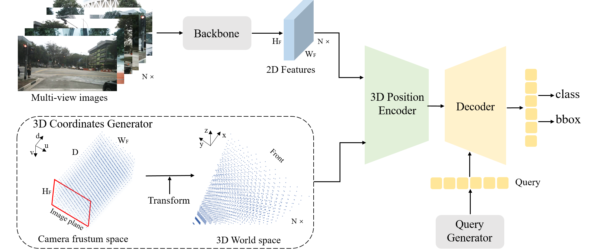
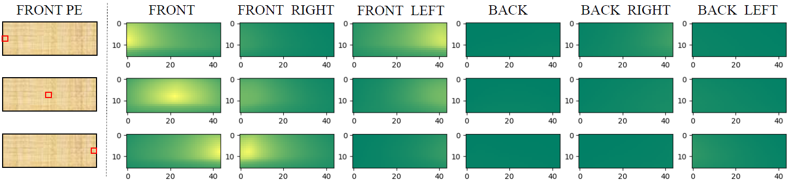

# PETR: Position Embedding Transformation for Multi-View 3D Object Detection

## 一句话结论

PETR 把每个图像位置对应的整条相机射线离散成一串 3D 坐标，再压缩为图像 token 的 3D 位置编码，让 object queries 能直接对全部多视角 token 做全局注意力并回归 3D 框；它用很简洁的方式建立了 2D 特征与 3D 世界的联系，但没有真正确定像素深度，而且全局注意力、单帧输入和慢收敛限制了效率与时序能力。

## 论文信息

- Authors: Yingfei Liu, Tiancai Wang, Xiangyu Zhang, Jian Sun
- Year: 2022
- Venue: ECCV 2022
- Source: arXiv:2203.05625
- Local input: `_inbox/papers/PETR/petr.tex`
- Code: <https://github.com/megvii-research/PETR>
- Paper: <https://arxiv.org/abs/2203.05625>

## 它在解决什么问题

多相机 3D 检测的核心困难不是把六张图拼起来，而是让图像特征知道自己在 3D 世界中可能对应哪里。DETR3D 的做法是：每条 object query 持有一个 3D reference point，每层 decoder 都把它投影到相机平面并采样局部图像特征。PETR 反过来问：能否预先给所有图像 token 注入 3D 位置信息，之后直接使用标准 Transformer decoder？

这一区别可以概括为：

- DETR3D：**query 去图像上找特征**，每层重复投影与采样。
- PETR：**图像 token 先携带 3D 几何**，query 再对全部 token 做内容匹配。

## 方法拆解

### 总体结构

流程只有四步：多相机图像经 backbone 得到 2D 特征；相机参数和视锥采样点生成 3D position embedding；二者相加得到 3D position-aware features；标准 Transformer decoder 用 object queries 查询这些特征并输出类别与 3D 框。

### 从像素射线构造 3D 坐标

在图像特征图的宽、高和深度方向建立网格 $(W_F,H_F,D)$。一个采样点写成：

$$
p_j^m=(u_jd_j,v_jd_j,d_j,1)^T.
$$

借助第 $i$ 个相机的投影矩阵 $K_i$，把它变换到统一 3D 坐标系：

$$
p_{i,j}^{3d}=K_i^{-1}p_j^m.
$$

坐标按预设的感知范围归一化。对同一个图像位置，把 $D$ 个深度候选对应的 3D 坐标沿通道拼接，再通过 MLP 得到 3D position embedding $P_i^{3d}$。最终：

$$
F_i^{3d}=\psi(F_i^{2d},P_i^{3d}),
$$

其中 $\psi$ 表示把图像特征与 3D 位置编码融合。

最容易误读的一点是：PETR **没有为像素选择一个深度**。一个图像 token 仍代表一条射线，只是它的编码同时包含 $D$ 个可能位置；decoder 需要结合物体 query、外观和多视角一致性，自己学会哪些射线与目标相关。因此它省掉的是显式深度预测，不是单目深度歧义。

### 3D object queries

PETR 均匀初始化一批 $[0,1]^3$ 中的可学习 3D anchor points，经 MLP 编码为初始 object queries。每条 query 负责提出一个候选物体，decoder 通过全局 cross-attention 从所有相机 token 中收集证据，最后直接预测中心、尺寸、朝向、速度和类别。

这些 anchor 并不是最终框中心，也不是像 DETR3D 那样逐层投影采样的 reference point；它们更像给 object query 提供一个 3D 空间先验。消融中，去掉这种 3D 初始化、退回 vanilla DETR query 会导致训练失败，说明几何先验是系统成立的关键。

### 训练目标

预测集合与真值集合通过 Hungarian matching 一一匹配，分类使用 focal loss，3D 框参数使用 L1 loss。集合预测避免了手工 anchor 分配和 NMS，但训练早期要同时学会“query 在哪里”和“该看哪些图像 token”，因此收敛比带显式投影采样的 DETR3D 慢。

## 关键实现设置

- 单尺度 P4 图像特征，分辨率约为输入的 $1/16$。
- 每条像素射线采样 64 个深度点，使用 LID 非均匀离散。
- 3D 范围：$x,y\in[-61.2,61.2]$ 米，$z\in[-10,10]$ 米。
- 使用 1500 个 3D object queries。
- 训练 24 epochs，论文主设置使用 8 张 V100；结果未使用 TTA。

## 实验怎么读

### 3D 位置编码是核心，不是装饰

仅加入普通 2D position embedding 时，模型只有 $0.208$ NDS / $0.069$ mAP；只用 3D position embedding 已达到 $0.356/0.305$，再叠加 2D 编码为 $0.359/0.309$。这说明提升主要来自相机几何构造的 3D 编码，而非 Transformer 本身。

用 $3\times3$ 卷积编码 3D 坐标几乎训练失败（$0.017$ NDS）。论文的解释很重要：图像位置与坐标通道必须逐像素对齐，空间卷积混合邻域后反而破坏了这种严格对应。

### 3D query 初始化同样必要

可学习 3D anchors 达到 $0.359$ NDS；固定 BEV anchors 和固定 3D anchors 分别为 $0.337$、$0.343$。这表明允许查询位置随数据分布调整有价值，但差距没有大到证明其学到了完整的物体空间先验。

### 主结果要拆开看预训练条件

论文在 nuScenes test 上使用外部预训练的 V2-99 backbone 时达到 $50.4$ NDS / $44.1$ mAP；Swin-B 设置为 $48.3/44.5$。这些数字证明方法具备竞争力，但不能全部归因于 position embedding transformation。较可比的 R101 验证设置约为 $44.2$ NDS / $37.0$ mAP，仍优于同表 DETR3D，但优势更温和。

论文报告 PETR 约 10.7 FPS，BEVDet 约 4.2 FPS；二者硬件分别为 V100 与 RTX 3090，不能把表中数字当作严格速度排名。

## 与相关路线的关系

- 相比 [BEVFormer](../2022-bevformer/README.md)，PETR 使用稀疏 object queries 和全局图像注意力，不先构造稠密 BEV scene representation；BEVFormer 则让规则 BEV queries 经几何引导的局部采样形成场景网格。
- 相比 DETR3D，PETR 把“每层 query 投影并采样”改成“预先给图像 token 编码整条 3D 射线”。它避免重复在线采样，但仍依赖相机内外参与预设 3D 范围。
- [StreamPETR](../2023-streampetr/README.md) 保留这条对象查询路线，把历史 object queries 变成稀疏时序记忆，从而补上 PETR 的单帧缺陷。

## 局限与问题

- 单个 token 压缩了整条射线上的 64 个候选位置，没有显式深度监督或可解释的深度选择。
- object queries 对全部多视角 token 做全局 attention，计算量随图像分辨率和相机数增长。
- 只处理单帧，速度、遮挡恢复和远距离弱观测都缺乏时间证据。
- 对标定、感知范围和深度离散敏感；所谓“无需采样”不能理解为无需几何。
- 早期收敛慢；更强主结果混入了外部检测或深度相关预训练。
- 论文定性结果仍会漏检远处小目标，也会混淆外观相近的车辆类别。

## 个人复盘

- 真正的新意不是“把坐标加到特征上”，而是把一条射线的 3D 候选位置编码到 token，使标准 decoder 能在统一坐标语义下跨相机匹配。
- 它与显式 lift 的差别是信息组织方式：lift 把一个像素按深度分布散射到多个 3D 单元；PETR 把多个 3D 候选压回一个像素 token。
- 最值得继续追问的是：全局注意力究竟在多大程度上学到了多视角几何一致性，而不是依赖数据集中的位置和外观先验？

## 建议阅读顺序

1. 先看总体图，区分图像 token 的 3D position embedding 与 object query 的 3D anchor。
2. 手推一个像素在多个深度上的反投影，理解“编码射线而非预测深度”。
3. 看 position embedding 和 query 初始化两组消融，确认系统为何能训练。
4. 最后读 StreamPETR，观察 object query 如何从单帧候选变成时序状态。
