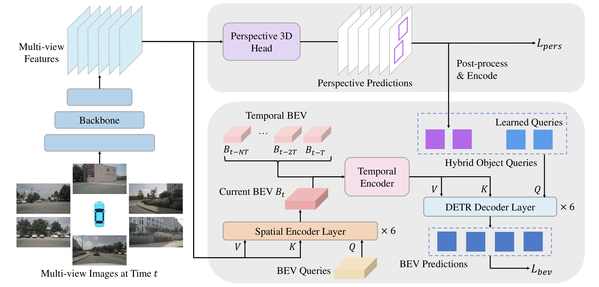
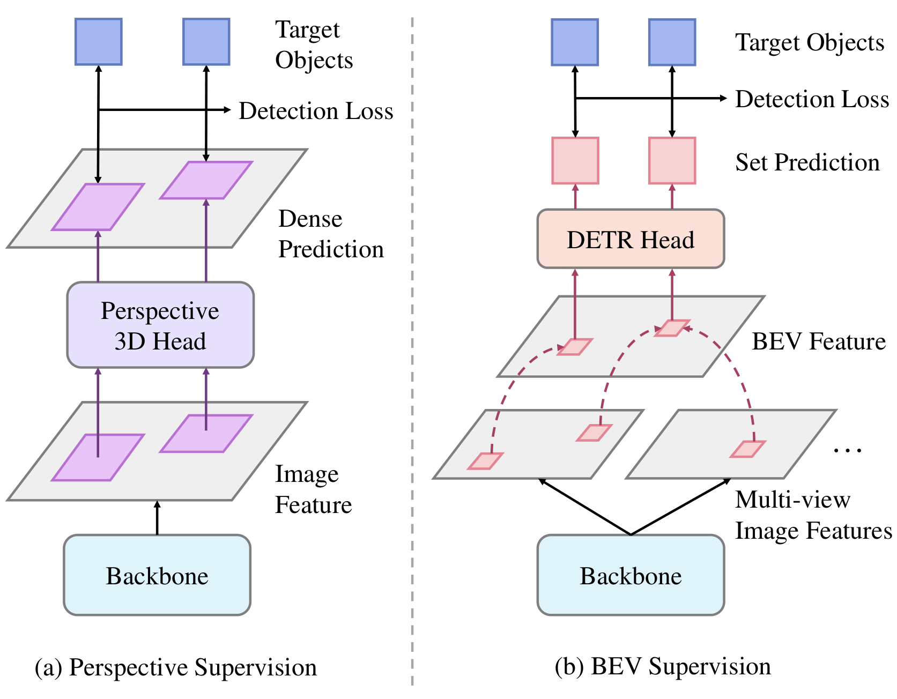
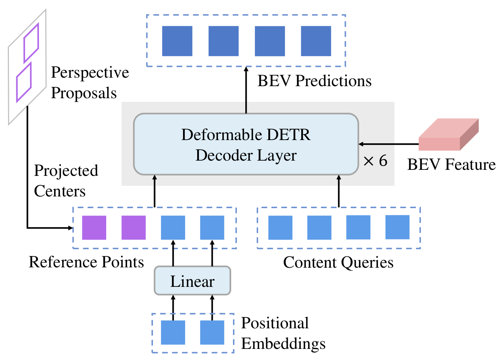

# BEVFormer v2: Adapting Modern Image Backbones to Bird's-Eye-View Recognition via Perspective Supervision

## 一句话结论

BEVFormer v2 的主要创新不是新的 image-to-BEV 几何，而是训练信号设计：在共享图像 backbone 上增加稠密、直接的透视 3D 检测监督，既补充深度/朝向等 3D 表征，又把透视 proposals 变成 BEV decoder 的逐图像参考点；消融支持这种监督能稳定提升多种 backbone 并加快收敛，但论文最高榜单结果还叠加了 InternImage、大间隔时间采样和可使用未来帧的双向 temporal encoder，不能全部归因于 perspective supervision，也不应与 v1 的在线设置直接等价比较。

## 论文信息

- Authors: Chenyu Yang, Yuntao Chen, Hao Tian, Chenxin Tao, Xizhou Zhu, Zhaoxiang Zhang, Gao Huang, Hongyang Li, Yu Qiao, Lewei Lu, Jie Zhou, Jifeng Dai
- Year: 2023
- Venue: CVPR 2023
- Source: arXiv:2211.10439v1
- Local input: `_inbox/papers/bevformerv2/main.tex`
- Paper: <https://arxiv.org/abs/2211.10439>
- Code: 本地 TeX 版本仅写明将发布，未给出代码地址

## 背景问题

v1 已经回答“怎样从多相机和历史构建 BEV”，v2 转而问：**为什么把更强的现代 2D backbone 直接接到 BEV 检测器上，收益常常不明显？**

论文给出两个原因：

1. 通用 2D 数据与自动驾驶 3D 场景存在 domain gap；ImageNet/COCO 预训练没有显式教 backbone 估深度、朝向和速度。
2. BEV 监督到 image features 的路径太长。3D box loss 要穿过 DETR set decoder、BEV features、跨视角投影与稀疏 attention sampling，梯度对图像特征既间接又稀疏。

这解释了当时很多 BEV 方法依赖 VoVNet-99 + DD3D/深度数据预训练：不是 VoVNet 对 BEV 天生特殊，而是单目 3D 预训练已经给 backbone 注入了当前 BEV loss 难以提供的 3D 信号。

## 核心贡献

1. 将 BEV backbone 适配问题归因于 BEV supervision 对图像特征的稀疏、间接优化，并提出直接作用在多尺度图像特征上的 perspective 3D supervision。
2. 用透视头与 BEV 头构成 two-stage detector：第一阶段的逐图像 3D proposals 经筛选、投影后，作为第二阶段 BEV decoder 的 image-conditioned reference points。
3. 把 v1 的递归 temporal self-attention 换成多帧 warp、拼接和残差融合，以更直接地利用较长时间跨度，并支持离线双向时间上下文。
4. 在多种 backbone 上验证 perspective supervision 的稳定收益，并将 InternImage-B/XL 接入 BEVFormer，报告当时 nuScenes camera-only SOTA。

## 方法拆解

### 总体结构

模型含五部分：共享 image backbone、Perspective 3D Head、Spatial Encoder、revamped Temporal Encoder 和 BEV Detection Head。

两条路径从同一组图像特征分叉：

- 透视路径直接在各相机特征上做稠密 3D 检测，产生 $\mathcal L_{\mathrm{pers}}$ 和第一阶段 proposals。
- BEV 路径沿用 v1 的空间 encoder 生成当前 $B_t$，融合若干已对齐历史 BEV，再用 DETR decoder 与混合 object queries 输出最终 $\mathcal L_{\mathrm{bev}}$。

### 1. 为什么 perspective supervision 更直接、更稠密

Perspective head 是 FCOS3D/DD3D 风格的单阶段 anchor-free detector，在 FPN 每个位置预测类别、2D box/centerness、3D 中心深度与投影偏移、尺寸、朝向和 3D confidence。于是目标附近大量 image-feature locations 都可直接收到监督。

相对地，BEV path 先把有限采样点聚合成 BEV grids，再由少量 DETR object queries 选出与目标有关的 grids；最终只有这些网格对应的少量投影像素收到显著梯度。v2 的判断是：BEV head 需要 image features 含 3D 信息，却没有充分教 backbone 如何编码这些信息。

整体目标为：

$$
\mathcal L_{\mathrm{total}}
=
\lambda_{\mathrm{bev}}\mathcal L_{\mathrm{bev}}
+
\lambda_{\mathrm{pers}}\mathcal L_{\mathrm{pers}},
$$

实验设置取 $\lambda_{\mathrm{bev}}=\lambda_{\mathrm{pers}}=1$。Perspective loss 进一步分解为：

$$
\mathcal L_{\mathrm{pers}}
=
\mathcal L_{2D}
+
\mathcal L_{3D}
+
\mathcal L_{\mathrm{conf}}.
$$

关键不是多加一个任意 auxiliary head，而是监督必须在 image feature 上足够直接、稠密且包含 3D 属性。论文中 DD3D 透视头优于较稀疏的 DETR3D 透视头，支持这一解释。

### 2. Perspective head 也提供逐图像 proposals

如果透视头只在训练时提供辅助损失，推理时可以丢弃；v2 进一步利用它的预测构成两阶段结构。逐相机预测的后处理为：

1. 每个视角独立做 perspective-view NMS，2D IoU 阈值 $0.75$。
2. 每个视角取 top-$k_1$，论文设置 $k_1=100$，避免少数视角独占候选。
3. 用相机外参把 3D boxes 投到 BEV，做 BEV NMS，IoU 阈值 $0.3$。
4. 全局再取 top-$k_2=100$，用 box 的 BEV 中心作为 decoder reference point。

这套 proposal 筛选包含离散 NMS/top-$k$，所以“联合训练两个 head”不等于两个阶段之间完全可微的 end-to-end proposal 传递。

### 3. Hybrid object queries：数据依赖位置 + 数据集先验

原始 BEVFormer 的 content queries 与由 positional embeddings 预测的 reference points 都是跨样本固定学习的，表达数据集层面的“哪里容易出现目标”。v2 加入透视 proposals 的 BEV centers，形成两类 reference points：

- per-image reference points：当前图像中高置信目标的候选位置，降低 decoder 从随机初始化位置搜索目标的难度。
- per-dataset reference points：保留原始 learned queries，补救透视头因遮挡或相机边界而漏掉的目标。

需要注意，第一阶段 proposal 只替换/补充 reference points；图中 content queries 仍是 learned embeddings。论文把二者整体称作 hybrid object queries。

### 4. 新 temporal encoder

v1 的 recurrent TSA 从一个上一帧 BEV 中 deformable sample。作者报告把递归步数从 4 增至 16 没有额外收益，因而改用更简单的多帧融合。

给定历史帧 $k$ 的 BEV $B_k$，依据当前帧与历史帧间变换：

$$
T_k^t=[\mathbf R\mid\mathbf t]\in\mathrm{SE}(3),
$$

先双线性 warp 得到当前坐标系下的 $B_k^t$，再把当前和若干历史 BEV 沿 channel 维拼接，用 residual blocks 降维、融合。保持历史 BEV 数量不变，但加大采样间隔，以覆盖更长时间跨度。

这比 v1 更像显式多帧 feature aggregation，而不是一个递归 hidden state。它也允许离线检测时同时输入未来 BEV；代价是需要缓存和并行处理多个时刻，且使用未来帧的版本不再满足在线因果部署。

## 实验设置

- 数据与指标：nuScenes camera-only 3D detection；核心指标 NDS、mAP，以及 mATE/mASE/mAOE/mAVE/mAAE。
- backbone：R50、DLA-34、R101、VoVNet-99、InternImage-B/XL，均从 COCO 2D detection checkpoint 初始化；论文强调不使用自动驾驶或深度预训练。
- FPN：backbone 输出 stride $8/16/32$，FPN 扩展到 $8/16/32/64/128$；Perspective head 用五层，BEV head 用前四层。
- 优化：AdamW，常规实验基础学习率 $4\times10^{-4}$，perspective/BEV loss 权重均为 1。
- 主榜单：InternImage-B/XL 训练 24 epochs，输入 $640\times1600$，使用 IDA、更长时间间隔和双向 temporal encoder。

## 实验结论

### 最干净的机制证据：相同 backbone、无时间信息

nuScenes `val`、R101、48 epochs：

| Supervision / Detector | NDS | mAP | mATE $\downarrow$ | mAOE $\downarrow$ | mAVE $\downarrow$ |
| --- | ---: | ---: | ---: | ---: | ---: |
| Perspective Only | 0.412 | 0.323 | 0.737 | **0.377** | 0.943 |
| BEV Only | 0.426 | 0.355 | 0.751 | 0.429 | 0.847 |
| Perspective & BEV | **0.451** | **0.374** | **0.730** | 0.379 | **0.773** |
| BEV & BEV | 0.428 | 0.350 | 0.750 | 0.388 | 0.842 |

Perspective & BEV 比 BEV Only 提升 $2.5$ NDS、$1.9$ mAP，并改善平移、朝向和速度误差；把第一阶段换成另一个 BEV head 几乎无益。这支持“收益来自透视视角的监督/候选，而不只是多一个 head 或两阶段结构”。

不过该对比同时改变了辅助监督和 proposal 来源，不能单独分离二者各自贡献。论文的核心论点主要由后续 head-choice、收敛和跨 backbone 实验共同补强。

### 稠密监督形式确实重要

在相同 R50、无时间、48 epochs、Deformable-DETR BEV head 下：

| Perspective head | NDS | mAP |
| --- | ---: | ---: |
| DD3D（稠密 per-pixel） | **0.428** | **0.349** |
| DETR3D（稀疏 set queries） | 0.409 | 0.335 |

这组对比支持 v2 不是泛泛主张“加辅助任务”，而是强调 direct and dense supervision。

### 跨 backbone 的收益稳定

在无时间信息、COCO 初始化、48 epochs 下，Perspective & BEV 相对 BEV Only 的 NDS 增益为：

| Backbone | BEV Only | Perspective & BEV | $\Delta$ NDS |
| --- | ---: | ---: | ---: |
| R50 | 0.400 | 0.428 | +0.028 |
| DLA-34 | 0.403 | 0.435 | +0.032 |
| R101 | 0.426 | 0.451 | +0.025 |
| V2-99 | 0.441 | 0.467 | +0.026 |
| InternImage-B | 0.455 | 0.485 | +0.030 |

这种跨 CNN、DLA 和 deformable-conv backbone 的一致增益，是论文“通用 backbone 适配方案”最有力的证据。

### 收敛更快，而不只是等价于多训几轮

R50 的 BEV Only 从 24 到 72 epochs 由 $0.379$ 增至 $0.410$ NDS；Perspective & BEV 在 24 epochs 已到 $0.414$，48/72 epochs 均约 $0.428$。更长训练不能完全弥补 BEV-only 的差距，说明问题不仅是收敛慢，也可能是优化信号质量和最终解不同。

### 最高 SOTA 结果是“完整系统收益”

nuScenes `test`：

| Model | Backbone | NDS | mAP |
| --- | --- | ---: | ---: |
| BEVFormer v1 | depth-pretrained V2-99 | 0.569 | 0.481 |
| BEVStereo | depth-pretrained V2-99 | 0.610 | 0.525 |
| BEVFormer v2 | InternImage-B | 0.620 | 0.540 |
| BEVFormer v2 | InternImage-XL | **0.634** | **0.556** |

该结果证明 v2 成功把现代大 backbone 用到 BEV detector，并建立了强系统；但不能用 $0.634-0.569$ 直接代表 perspective supervision 的纯增益，因为同时改变了 backbone、输入尺寸、temporal encoder、时间跨度、双向上下文和检测 head。较可信的纯机制增益应看前述同设定消融，约为 $2.5$–$3.2$ NDS。

在包含 IDA、长间隔和双向时间 encoder 的 R50 消融中，移除 perspective supervision 会从 $0.529/0.423$ 降到 $0.507/0.397$（NDS/mAP），即 perspective supervision 仍贡献 $+2.2$ NDS、$+2.6$ mAP。

## 局限与问题

- **主榜单是离线设置**：双向 temporal encoder 使用未来 BEV，这对数据集离线检测有效，却不适用于严格在线自动驾驶感知；与 v1 的递归在线推理不能直接做同口径比较。
- **SOTA 归因混杂**：InternImage-XL、Group DETR、IDA、时间间隔和双向融合共同作用。论文用消融证明 perspective supervision 约贡献 2–3 NDS，但 headline 增益更大。
- **增加训练和推理复杂度**：Perspective head 不是纯训练期 auxiliary head；两阶段版本在推理时仍需逐相机 3D 检测、两次 NMS、top-$k$ 与 proposal 编码。
- **两阶段连接含离散后处理**：NMS/top-$k$ 使 proposal 到第二阶段 reference points 的路径不可完全微分，且阈值、相机重叠和第一阶段校准会影响结果。
- **透视头仍面对单目 3D 歧义**：它用强监督迫使 backbone 学 3D 属性，但没有从根本上解决单目深度不确定性；第一阶段漏检仍需 learned queries 兜底。
- **时间模块的因果与成本边界变化**：warp-concatenate 直接保留多个历史 feature maps，不再像 v1 只递归保存一个 state；“同等复杂度”依赖固定帧数，覆盖更长时间只是加大采样间隔，不等于更高时间分辨率。
- **时间间隔描述需要复现时核对**：正文消融描述相邻历史采样间隔为 2 秒，而主结果训练设置表列 4 秒；二者可能分别对应消融与最终配置，但本地源码没有进一步解释定义差异。
- **论文自述局限较窄**：作者只强调尚未测试更多超大 backbone；实际部署还应考虑因果性、延迟、标定误差、NMS 稳定性及多任务能力，v2 本文只验证 3D 检测。

## 与 BEVFormer v1 的关系

| 维度 | [BEVFormer v1](../2022-bevformer/README.md) | BEVFormer v2 |
| --- | --- | --- |
| 主要问题 | 如何从多相机和历史构造统一 BEV | 如何让通用现代 backbone 被 BEV detector 有效训练 |
| 空间变换 | BEV pillar reference points + spatial deformable attention | 基本继承 v1 spatial encoder |
| 图像监督 | 主要由 BEV task loss 间接回传 | 增加 direct、dense perspective 3D loss |
| 时间融合 | 上一帧 BEV 的 recurrent TSA | 多帧 warp + channel concat + residual blocks |
| Object queries | 跨样本 learned queries/reference points | learned priors + perspective proposal reference points |
| 推理性质 | 因果、按帧递归 | 可只用历史，也可在主离线设置中双向使用未来 |
| 任务范围 | 3D detection + map segmentation | 重点验证 3D detection |

最值得吸收的研究方法是：v2 没有只在 BEV 模块内部继续堆结构，而是追踪 loss 到 backbone 的梯度路径，发现瓶颈在监督密度和直接性。这种“先诊断优化接口，再改系统”的思路比把 SOTA 归因于更大模型更有迁移价值。

## 个人复盘

- 我真正理解的部分：Perspective head 有两个相互关联但不同的作用——训练时提供 3D-aware dense gradients，推理时提供 image-conditioned locations；前者改善 representation，后者改善 decoder 初始化和搜索。
- 仍然不清楚的问题：若训练时保留 perspective loss、推理时完全移除 head/proposals，能保留多少收益？若对 BEV-to-image sampling 设计更稠密的辅助重建/深度监督，是否可以用更低成本获得同样效果？
- 后续要读的内容：DD3D/FCOS3D 理解 perspective loss 的参数化；Group DETR 区分最终 head 增益；InternImage 理解 backbone scaling；BEVDepth/BEVStereo 比较显式深度监督；因果 streaming BEV 方法比较在线时间融合。

## 建议的阅读顺序

1. 先看 supervision comparison，理解“直接/间接、稠密/稀疏”具体落在哪些 feature locations。
2. 再看总架构，把 auxiliary loss 与 proposal-to-query 两条作用路径分开。
3. 接着读四组干净消融：Perspective & BEV、BEV & BEV、DD3D vs. DETR3D、跨 backbone。
4. 最后再看 $63.4\%$ NDS，并主动拆出 backbone、双向时间和其他工程配置，避免错误归因。
