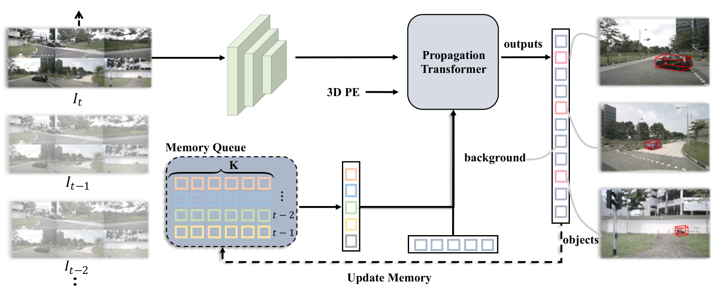
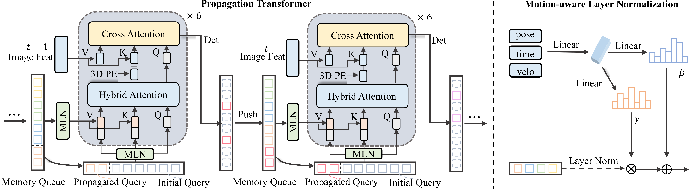

# StreamPETR: Exploring Object-Centric Temporal Modeling for Efficient Multi-View 3D Object Detection

## 一句话结论

StreamPETR 把历史帧压缩成少量高置信 object queries，并在每个新时刻将其按自车运动对齐、用姿态—速度—时间条件化，再与当前 queries 联合注意力；它以几乎不变的图像计算量获得很强的在线时序增益，但记忆是预测驱动且递归的，漏检、误检和运动误差也会被一起传播。

## 论文信息

- Authors: Shihao Wang, Yingfei Liu, Tiancai Wang, Ying Li, Xiangyu Zhang
- Year: 2023
- Venue: ICCV 2023
- Source: arXiv:2303.11926
- Local input: `_inbox/papers/StreamPETR/main.tex`
- Code: <https://github.com/exiawsh/StreamPETR>
- Paper: <https://arxiv.org/abs/2303.11926>

## 为什么需要对象级时间建模

相机 3D 检测的历史信息通常存成两类形态：稠密 BEV features，或过去多帧 perspective image features。前者每帧覆盖整个空间，即使大部分位置没有目标也要维护；后者要反复保留和查询大量图像 token。StreamPETR 认为检测真正需要跨帧传递的是少量物体状态，因此选择 object queries 作为循环记忆。

这个选择也明确限定了方法的适用边界：它适合 3D 框检测，却不天然适合车道、自由空间和 occupancy 等稠密任务。

## 方法拆解

### 整体数据流

当前六路图像仍由 PETR/Focal-PETR 风格检测器编码。不同之处是在 decoder 前加入 propagation transformer：历史 object queries 与当前初始化 queries 先融合，再只对**当前帧图像特征**做 cross-attention。预测完成后，选择 top-$K$ 前景 queries 写入 FIFO memory queue，供后续帧使用。

这避免了重新处理历史图像。历史信息若要长期存在，必须被不断写入新的 query state，因此它更接近 RNN hidden state，而不是显式保存所有历史观测。

### Memory queue 中保存什么

默认队列保存最近 $N=4$ 帧、每帧 $K=256$ 条高置信 query，包括：

- query context $Q_c$；
- 对应 3D 中心 $Q_p$；
- 预测速度 $v$；
- 相对当前时刻的时间间隔 $\Delta t$；
- 当时的自车位姿 $E$。

此外，模型把上一帧 256 条 queries 直接传播为当前候选，再加入 644 条随机初始化 queries。前者负责延续已存在目标，后者负责发现新目标和弥补历史漏检。

### 几何对齐与 Motion-aware LayerNorm

历史中心先变换到当前自车坐标系：

$$
E_{t-1}^{t}=E_t^{-1}E_{t-1},
\qquad
\widetilde Q_p^t=E_{t-1}^{t}Q_p^{t-1}.
$$

仅做刚体变换只能补偿自车运动，不能表达目标自身运动。论文没有硬编码速度外推，而是用 Motion-aware Layer Normalization（MLN）让网络按位姿、速度和时间差调制 query：

$$
\gamma=\xi_1(E, v, \Delta t),\qquad
\beta=\xi_2(E, v, \Delta t),
$$

$$
\widetilde Q=\gamma\odot\operatorname{LN}(Q)+\beta.
$$

同一组条件同时作用于历史位置编码和内容特征。这样，运动量不是直接改写中心，而是改变网络如何解释历史 query。消融中，显式速度补偿没有进一步收益，说明软条件化在该设置下更稳健，但它也降低了运动更新的可解释性。

### Hybrid attention

当前 queries 作为 query，历史 queries 与当前 queries 的拼接作为 key/value。这个 attention 同时做两件事：

1. 从历史状态取回同一目标的外观、位置和运动线索；
2. 在当前候选之间做类似 DETR self-attention 的去重和关系建模。

之后的 cross-attention 只读取当前图像。由此，每增加一个历史时刻，只增加少量 query 交互，而不是一整套图像 backbone 与 dense BEV 计算。

### 训练与在线推理

训练片段包含 8 帧，前 6 帧前向更新记忆但断开梯度，只对最后 2 帧计算损失并反传。推理按时间顺序持续更新队列。显式队列只有 4 帧并不意味着模型只看 4 帧：每条新 query 已融合更早状态，历史可以递归传递；同样，这也不保证早期信息不会衰减或漂移。

## 实验怎么读

### object memory 比保存 perspective features 更划算

在论文的轻量设置中：

| Temporal representation | mAP | NDS | mATE $\downarrow$ | mAVE $\downarrow$ | FPS |
| --- | ---: | ---: | ---: | ---: | ---: |
| 单帧 | 0.317 | 0.372 | 0.770 | 0.885 | 27.7 |
| 历史 perspective features | 0.361 | 0.459 | 0.731 | 0.374 | 18.9 |
| object memory | 0.395 | 0.496 | 0.703 | 0.363 | 27.1 |
| object memory + query propagation | **0.402** | **0.505** | **0.660** | **0.316** | 27.1 |

对象记忆在精度和速度上都优于保存透视特征；二者一起使用没有继续提升，却把速度降到 18.6 FPS。这是论文最直接、也最可信的证据。

### 显式窗口很短，但递归状态有效

显式历史从 1 帧增至 2 帧，mAP/NDS 从 $0.394/0.501$ 提升到 $0.401/0.505$；4 帧只到 $0.402/0.505$。收益很快饱和，说明关键不是把很多历史 query 全放入 attention，而是让相邻时刻稳定递归传播。

把训练从滑窗方式改为按视频顺序后，训练 8 帧达到 $0.402/0.505$；12 帧 NDS 小幅到 $0.509$。这支持 train–test temporal consistency，但没有证明超长期记忆仍保真。

### MLN 的贡献可分解

无运动条件时为 $0.378/0.483$；只加入 ego pose 条件后为 $0.398/0.501$；再加入时间和速度后为 $0.402/0.505$。主要收益来自坐标系变化，目标运动信息提供较小但稳定的增量。

### 它是可移植的时间插件

加入 DETR3D 后，结果从 $0.347$ mAP / $0.422$ NDS 提升到 $0.396/0.490$，速度只从 6.3 变为 6.2 FPS。这比只在 PETR 家族中报结果更能支持“对象级记忆是通用模块”。

### 最强数字不是纯方法对比

R101 加预训练版本达到 $0.504$ mAP / $0.592$ NDS；R50 轻量版达到 $0.450/0.550$、31.7 FPS；ViT-L test 达到 $0.620/0.676$。但这些设置还包含 Focal-PETR 的 2D 辅助监督、额外预训练、更多 epochs、query denoising 或更强 backbone，不能把全部提升归于 temporal memory。

## 与其他四篇的关系

- 它直接继承 [PETR](../2022-petr/README.md) 的 object-query 表征，把单帧 query 变成时序隐状态。
- [SOLOFusion](../../camera-based-bev-temporal-fusion/2023-solofusion/README.md) 和 [VideoBEV](../../camera-based-bev-temporal-fusion/2024-videobev/README.md) 传播的是稠密 BEV，更适合共享给地图、跟踪和预测，但状态更大。
- [BEVFormer](../2022-bevformer/README.md) 递归传播场景级 BEV 网格；StreamPETR 则只保留高置信目标，效率更高但会丢弃非目标区域。
- [FB-OCC](../../camera-based-3d-occupancy-prediction/2023-fb-occ/README.md) 要输出每个 voxel 的类别，无法只靠少量 object queries 表达完整空间。

## 局限与问题

- top-$K$ 选择会把误检写入记忆，也会永久丢掉未进入 top-$K$ 的弱目标。
- 没有显式 identity 或数据关联约束；“同一条 query”不必然对应真实世界中的同一目标。
- 速度、中心和位姿误差会递归累积，遮挡或急剧运动时可能产生漂移与 ghost boxes。
- 训练只对最后两帧反传，长期信用分配被截断；在线递归长度远超训练展开长度。
- 显式队列从 2 到 4 帧几乎不再提升，所谓长期能力主要是对递归状态的推断。
- 稀疏对象表征不覆盖道路、空闲空间和未知障碍，不适合作为完整场景记忆。

## 个人复盘

- StreamPETR 的关键价值是选对“记忆单位”：检测任务所需的时间证据可以压缩进少量 object states，不必保存整张历史图像或 BEV。
- 它不是传统 tracker。query 延续提供隐式关联，但目标身份没有被监督，评价指标也仍是逐帧检测。
- 最值得验证的是长遮挡后的记忆可靠性：平均 mAP/NDS 很难揭示状态污染、身份切换和递归漂移。

## 建议阅读顺序

1. 先读 PETR，明确 object query 在单帧中如何查询图像。
2. 看 memory queue 的字段，区分内容、位置、速度、时间和 ego pose。
3. 再读 MLN 与 hybrid attention，理解“几何对齐”和“学习式运动条件化”的分工。
4. 最后只比较 object memory、perspective memory、显式窗口长度和 DETR3D 插件实验。
