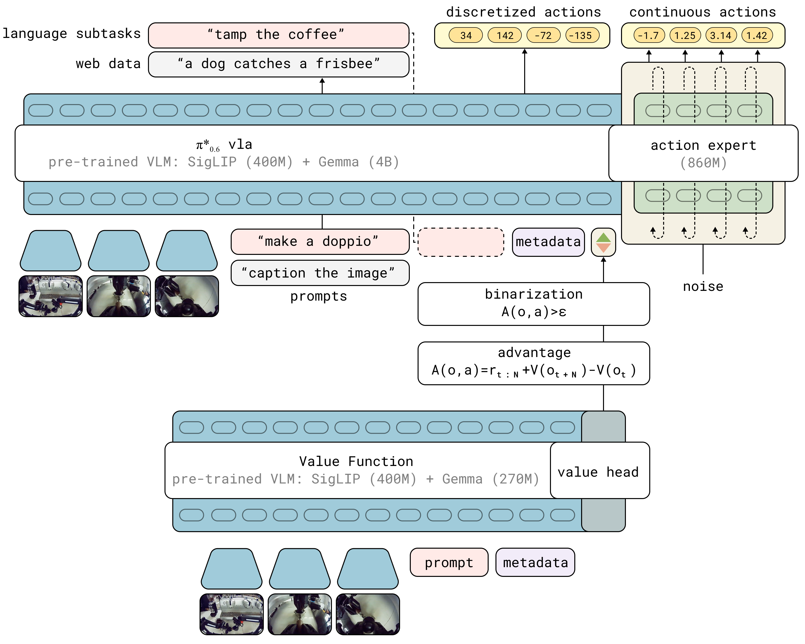
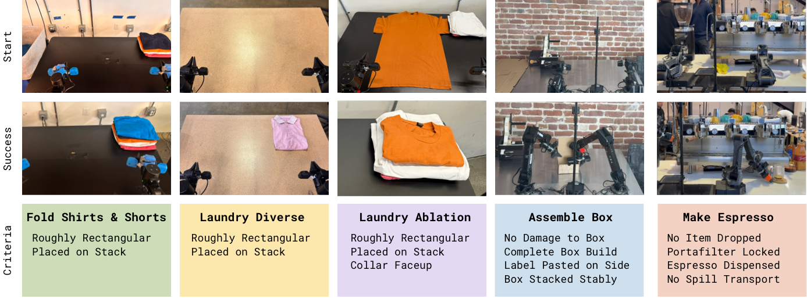

# $\pi^*_{0.6}$: a VLA That Learns From Experience

## 一句话结论

RECAP 把真实机器人试错、稀疏奖励、人类纠正和离线 RL 组织成一个适合大型 VLA 的训练流程：先用价值函数估计动作优势，再把优势离散成条件输入，让 VLA 学会在同一批混合数据中模仿“更可能改进任务结果”的动作。

## 论文信息

- Authors: Physical Intelligence, Ali Amin et al.
- Year: 2025
- Venue: arXiv / technical report
- Source: TeX source tree
- Local input: `_inbox/pi_series/pi0.6/main.tex`
- Project URL in source: `https://pi.website/blog/pistar06`

## 背景问题

通用机器人 VLA 已经可以通过语言提示执行多类任务，但只靠示范学习会遇到两个核心瓶颈：示范质量决定上限，部署时出现的错误会累积。论文要解决的是，如何让一个大规模 VLA 像人一样通过真实练习变强，同时还能处理真实机器人场景里的稀疏成功标签、人类临场纠正、异构历史数据和长时序连续控制。

这不是简单把 PPO 套到 VLA 上。$\pi_{0.6}$ 这类模型含有 flow matching action expert，连续动作 likelihood 不容易直接用于传统策略梯度；真实机器人采样又昂贵，所以方法必须能充分利用旧数据、示范、失败轨迹和纠正片段。

## 核心贡献

1. 提出 RECAP: RL with Experience and Corrections via Advantage-conditioned Policies，用优势条件化替代复杂的在线策略梯度式 policy extraction。
2. 将 VLA、分布式价值函数、稀疏成功奖励、人类 intervention 和真实机器人 rollouts 组织为可迭代的离线 RL 流程。
3. 在洗衣折叠、咖啡制作、纸箱组装等长时序真实任务上展示吞吐量和成功率提升，困难任务上吞吐量可超过 $2\times$，失败率约减半。

## 方法拆解

### 总体流程

RECAP 每轮包含三步：

1. 部署当前 VLA，收集自主 rollouts，给 episode 打成功/失败标签，并可让人类专家在执行中介入纠正。
2. 用到目前为止的全部数据训练多任务分布式价值函数，估计状态离任务成功还有多远。
3. 用价值函数计算动作优势，把优势阈值化成 `Advantage: positive/negative` 条件，训练 VLA 在正优势条件下产生更优动作。

预训练阶段只执行价值函数训练和优势条件化训练，使用大规模历史示范数据。下游任务阶段先用示范 SFT 得到初始策略，再迭代收集真实机器人数据、重训价值函数、重训策略。

### 价值函数

价值函数输入 observation 和语言指令，输出离散 value bin 的分布。论文把 return 离散到 201 个 bins，用 cross entropy 训练分布式 value function。它预测的不是“最终能不能成功”这么粗的量，而是归一化后的剩余完成步数：成功 episode 越接近终点 value 越接近 0，失败 episode 给很大的负值。

这个设计的好处是奖励接口很通用。每个 episode 只需要成功/失败标签，就能构造 reward：

$$
r_t =
\begin{cases}
0, & t = T \ \text{and episode succeeds} \\
-C_{\mathrm{fail}}, & t = T \ \text{and episode fails} \\
-1, & \text{otherwise}
\end{cases}
$$

因此 value 既能判断失败，也能反映速度和进度，后续 throughput 提升就有了训练信号。

### 优势条件化策略提取

核心想法是避免直接优化难处理的 flow matching policy likelihood。RECAP 不把高优势动作简单加权，也不丢掉低优势数据，而是让策略同时学习无条件行为分布和带优势条件的行为分布。

训练目标包含两部分：

- 普通行为建模：学习 $\pi(a \mid o, \ell)$。
- 条件行为建模：学习 $\pi(a \mid I, o, \ell)$，其中 $I = \mathbb{1}[A(o, a, \ell) > \epsilon_{\ell}]$。

推理时给定 `Advantage: positive`，模型就采样更接近“相对当前参考策略有改进”的动作。人类纠正片段被强制标为 positive，因为作者假设专家纠正动作是有益的。

### $\pi_{0.6}$ 到 $\pi^*_{0.6}$

$\pi_{0.6}$ 基于 $\pi_{0.5}$，使用 Gemma 3 4B VLM backbone 和 860M 参数 action expert。模型既输出离散 token，包括高层子任务文本，也输出 50 Hz 的连续 action chunks。$\pi^*_{0.6}$ 在此基础上加入优势条件输入，让动作生成可以被 value function 估计出的正负优势调制。

训练时优势条件会被随机 dropout $30\%$，这样模型既能无条件采样，也能在测试时使用类似 classifier-free guidance 的条件增强。

### 数据与迭代

论文强调每轮训练都从预训练 checkpoint 开始 fine-tune，而不是从上一轮模型继续训练，以减少多轮迭代漂移。下游数据由示范、自主 rollouts 和人类 intervention 混合组成，不要求都是 on-policy 新数据。

## 实验结论

实验覆盖三类真实任务：洗衣折叠、咖啡制作、纸箱组装。任务时长从 5 到 15 分钟，包含布料、液体、纸箱形变、多阶段操作和较强的时间约束。

机器人平台是双臂 6 DoF 系统，平行夹爪，50 Hz 关节位置控制，观测包括关节/夹爪状态和三路相机图像。

主要结果：

- 相比监督式 $\pi_{0.6}$、RL 预训练模型和 offline RL + SFT，最终 $\pi^*_{0.6}$ 在所有任务上都有明显提升。
- 多样衣物折叠和 espresso 任务中，加入真实机器人数据后 throughput 超过 $2\times$。
- 困难任务失败率约减少 $2\times$；除多样衣物外，最终模型成功率达到 $90\%$ 以上。
- 多轮迭代有效：T-shirt/shorts 折叠两轮后 throughput 提升约 $50\%$；纸箱组装两轮后 throughput 约 $2\times$。
- 在严格衣物朝向的 failure-mode removal 实验中，两轮、每轮 $600$ 条轨迹后成功率达到 $97\%$。
- 与 AWR 和 PPO 的 controlled comparison 中，优势条件化策略提取的 throughput 明显更高；AWR 能提高成功率但动作更慢，PPO 在 off-policy 设置下受稳定性约束影响表现较弱。

## 关键公式与定义

### 分布式价值函数训练

$$
\min_{\phi}\ \mathbb{E}_{\tau \in \mathcal{D}}
\left[
  \sum_{o_t \in \tau}
  H\left(R_t^B(\tau), p_{\phi}(V \mid o_t, \ell)\right)
\right]
$$

这里 $R_t^B$ 是离散化后的 empirical return，$p_{\phi}$ 是 value bin 分布。

### 改进策略形式

$$
\hat{\pi}(a \mid o, \ell)
\propto
\pi_{\mathrm{ref}}(a \mid o, \ell)
\left(
  \frac{\pi_{\mathrm{ref}}(a \mid I, o, \ell)}
       {\pi_{\mathrm{ref}}(a \mid o, \ell)}
\right)^{\beta}
$$

当 $\beta = 1$ 时，直接使用 positive advantage 条件下的策略。

### 条件化训练目标

$$
\min_{\theta}\ \mathbb{E}_{\mathcal{D}}
\left[
  -\log \pi_{\theta}(a_t \mid o_t, \ell)
  -\alpha \log \pi_{\theta}(a_t \mid I_t, o_t, \ell)
\right]
$$

$$
I_t = \mathbb{1}
\left[
  A_{\mathrm{ref}}(o_t, a_t, \ell) > \epsilon_{\ell}
\right]
$$

论文实现里用 indicator dropout 替代手调 $\alpha$，并在预训练和 fine-tuning 中用不同分位数设定任务阈值。

## 局限与问题

- 系统仍依赖人工成功标签、人类 intervention 和人工 reset，不是全自动 RL pipeline。
- 探索方式较朴素，主要依赖已有策略随机性和专家纠正，不是主动探索。
- 训练是批量收集数据后再离线更新，不是边采集边更新的 fully online RL。
- 实验非常真实但成本高，结论主要覆盖长时序操作任务，尚不能说明所有 VLA/RL 场景都适用。
- 成功率和 throughput 指标很实用，但论文没有充分展开数据效率、人工成本和失败标签一致性的系统分析。

## 与其他论文的关系

- 相对 DAgger / human-gated DAgger：RECAP 继承 intervention 纠错，但不只把纠正当监督数据，还用自主失败/成功轨迹训练 value function。
- 相对 PPO/REINFORCE 类 VLA RL：RECAP 避免直接在大 flow-matching VLA 上做高方差策略梯度。
- 相对 AWR/CRR：RECAP 不把低优势数据简单丢弃或降权，而是把优势作为条件变量，保留全部数据的行为建模价值。
- 相对 reward-conditioned / decision-transformer 思路：RECAP 的条件不是目标 return，而是由价值函数估计的动作优势 indicator。
- 相对 $\pi_{0.5}$ / $\pi_{0.6}$：$\pi^*_{0.6}$ 是在 $\pi_{0.6}$ 架构上增加优势条件化和 RL 经验学习能力的版本。

## 个人复盘

- 我真正理解的部分：这篇论文的关键不是“VLA 可以 RL”，而是把 policy extraction 改成了条件生成问题，从而绕开大模型连续动作策略梯度的工程和稳定性难点。
- 仍然不清楚的问题：value function 的标注噪声、episode 成功标签一致性、不同任务阈值选择对结果有多敏感。
- 后续要读的内容：$\pi_{0.5}$ / $\pi_{0.6}$ model card、Knowledge Insulation、FAST tokenizer、CFGRL、AWR/CRR、DPPO/FPO 在 diffusion policy 上的实现。
