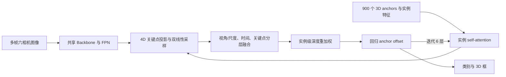
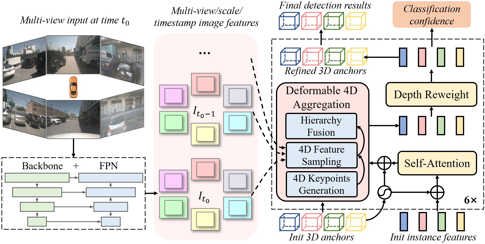
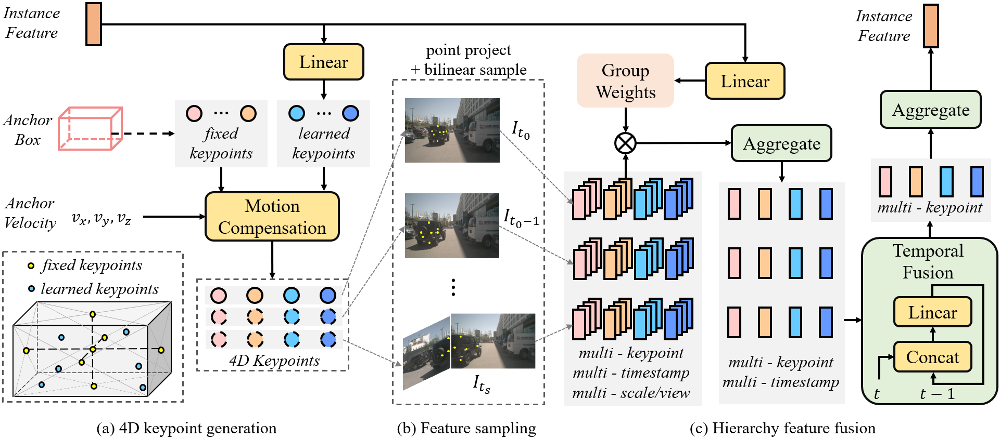

# Sparse4D: Multi-view 3D Object Detection with Sparse Spatial-Temporal Fusion

## 一句话结论

Sparse4D 不构造稠密 BEV，也不让 object query 对所有图像 token 做全局注意力；它围绕每个 3D anchor 生成少量可学习/固定关键点，将关键点按目标运动和自车运动投影到多帧、多相机、多尺度特征上取样，再逐级聚合并迭代修正 3D 框，由此证明稀疏几何采样也能有效利用时序信息。

## 论文信息

- Authors: Xuewu Lin, Tianwei Lin, Zixiang Pei, Lichao Huang, Zhizhong Su
- Year: 2022
- Venue: arXiv preprint
- Source: arXiv:2211.10581
- Local input: `_inbox/papers/Sparse4D/Paper.tex`
- Code: <https://github.com/linxuewu/Sparse4D>
- Paper: <https://arxiv.org/abs/2211.10581>

## 背景问题

多相机 3D 检测当时主要有两条路线。稠密 BEV 方法把图像重排到统一鸟瞰网格，便于空间和时间融合，但计算量与 BEV 分辨率、范围绑定；DETR3D 一类稀疏方法只围绕少量 reference point 读取图像，效率更友好，却容易因为单点证据不足和缺少时序信息落后于 BEV 方法。

Sparse4D 的核心判断是：3D 框本身已经给出了结构化空间先验，不必先填满整个 BEV 平面。真正需要的是在候选框的多个代表位置上，准确读取跨视角、跨尺度、跨时刻的图像证据。

## 核心贡献

1. 用固定点与可学习点共同覆盖 3D anchor 内部，比 DETR3D 的单参考点拥有更完整的目标上下文。
2. 将 3D 点按恒速目标运动和 ego motion 外推到历史帧，形成可投影的 4D keypoints。
3. 按“视角/尺度 → 时间 → 关键点”分层融合，而不是对全部采样特征一次性混合。
4. 用实例级深度分布给稀疏特征重加权，缓解多个 3D 点投影到相近 2D 位置的深度歧义。

## 方法拆解

### 总体流程

图中最重要的是“以 anchor 为中心取证”：图像特征从未被整体变换成稠密 3D/BEV 网格，decoder 的每一层只为有限个实例采样有限个点。

### 4D 关键点

每个 anchor 表示为位置、尺度、朝向和速度：

$$
B_m=(x,y,z,\log w,\log h,\log l,\sin\theta,\cos\theta,v_x,v_y,v_z).
$$

固定点位于框中心和六个面中心；可学习点先由实例特征预测框内归一化偏移，再按朝向、尺寸和平移映射到真实 3D 空间：

$$
D_m=R_{\theta}\left[\sigma(\Phi(F_m))-0.5\right],
$$

$$
P^L_{m,t_0}=D_m\odot(w_m,h_m,l_m)+(x_m,y_m,z_m).
$$

历史时刻的点先按恒速模型补偿目标运动，再转换到历史 ego 坐标系：

$$
P'_{m,t}=P_{m,t_0}-d_t(t_0-t)(v_x,v_y,v_z),
$$

$$
P_{m,t}=R_{t_0\rightarrow t}P'_{m,t}+T_{t_0\rightarrow t}.
$$

这一步把“同一个潜在物体在不同时间应该去哪里找”显式写进采样位置。消融也说明 ego motion 是主要增益来源，目标速度补偿主要改善速度误差。

### 稀疏采样与分层融合

关键点经相机投影后，在每个可见相机和 FPN 尺度上做双线性插值：

$$
f_{m,k,t,n,s}=\operatorname{Bilinear}(I_{t,n,s},P^{\rm img}_{m,k,t,n}).
$$

每个实例得到一个带有关键点、时间、视角、尺度和通道维度的特征张量。网络从实例特征预测分组权重，先聚合不同相机与尺度，再用线性层融合时间，最后汇总多个关键点。这个次序利用了各维度的结构，也避免对庞大扁平序列做全局注意力。

### 深度重加权

3D-to-2D 投影存在射线歧义：深度不同的 anchor 可能采到近似相同的图像特征。论文从聚合后的实例特征预测离散深度分布，并在 anchor 中心距离处取置信度：

$$
C_m=\operatorname{Bilinear}\left(\Psi_{\rm depth}(F'_m),\sqrt{x_m^2+y_m^2}\right),
\qquad
F''_m=C_mF'_m.
$$

监督只使用标注框中心深度，不需要额外 LiDAR 点云；它更像一个实例级的“这个 anchor 深度是否可信”门控，而不是完整深度图。

### 训练

使用 Hungarian matching 做 one-to-one 分配，总损失为：

$$
\mathcal L=\lambda_1\mathcal L_{cls}+\lambda_2\mathcal L_{box}+\lambda_3\mathcal L_{depth}.
$$

分类用 focal loss，框回归用 $L_1$，深度用二元交叉熵。历史图像特征在训练时会 detach，以控制显存，这意味着长时序的端到端梯度并不完整。

## 实验结论

在 nuScenes validation、ResNet101 设置下：

| Setting | mAP | NDS | mAVE $\downarrow$ |
| --- | ---: | ---: | ---: |
| Sparse4D, 单帧 | 38.2 | 45.1 | 0.806 |
| Sparse4D, 4 帧 | 43.6 | 54.1 | 0.317 |
| Sparse4D, 9 帧 | 44.5 | 54.7 | 0.303 |

时间融合主要改善定位、速度和综合 NDS。相同主干的 FLOPs 对比中，4 帧模型相对单帧只从 1019.2G 增至 1113.8G，却获得 $+5.4$ mAP 和 $+9.0$ NDS；不过它仍需保存并采样所有历史帧，成本随帧数线性增长，这正是 v2 要解决的问题。

在较小消融设置中，无时间模型为 32.2 mAP / 40.1 NDS；加入 3 帧但不做运动补偿为 33.4/42.4，加入 ego motion 后为 37.6/48.8，再加入目标运动后 NDS 到 49.5、mAVE 从 0.398 降至 0.329。深度重加权与可学习关键点单独增益较小，组合后由 43.2/53.3 提升到 43.6/54.1。

## 局限与问题

- 历史窗口的图像特征必须保留并重新采样，时间复杂度与显存随 $T$ 增长。
- 恒速模型对急转、加减速和长遮挡并不可靠；错误 anchor 还会引导后续层在错误位置取证。
- 深度重加权只预测实例中心深度，不能替代像素级几何，也难以处理目标内部严重深度变化。
- 训练对历史特征 detach，实验中的长历史收益不能等同于真正的长程信用分配。
- test set 最强结果使用更强预训练和不同主干，不能把全部增益归因于 4D sampling。

## 与其他论文的关系

- 相比 DETR3D，它把每个 query 的单参考点扩展成框内多点，并显式加入时间轴。
- 相比 BEVFormer、BEVDepth，它不维护覆盖全场景的稠密 BEV，计算更聚焦于候选实例，但不天然服务 occupancy、地图等稠密任务。
- [Sparse4D v2](../2023-sparse4d-v2/README.md) 保留 anchor/keypoint 稀疏采样思想，却用递归实例状态替换 v1 的历史图像窗口。
- [Sparse4D v3](../2023-sparse4d-v3/README.md) 进一步把重点从表示与效率转向 decoder 训练质量和检测—跟踪统一。

## 个人复盘

- 我真正理解的部分：v1 的关键不是“用了很多点”，而是把 3D 框的结构、运动和相机投影共同变成了稀疏取样坐标。
- 仍然不清楚的问题：历史帧数继续增加时，性能收益来自真实长时记忆，还是更多多视角几何观测带来的深度改善？
- 后续要读的内容：DETR3D 的单点采样、BEVFormer 的 dense BEV query，以及 Sparse4D v2 的递归状态压缩。
