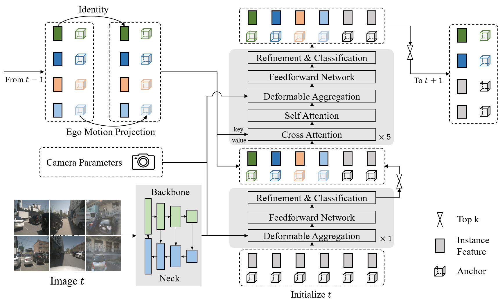
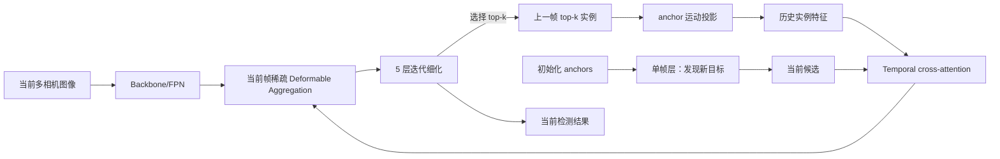
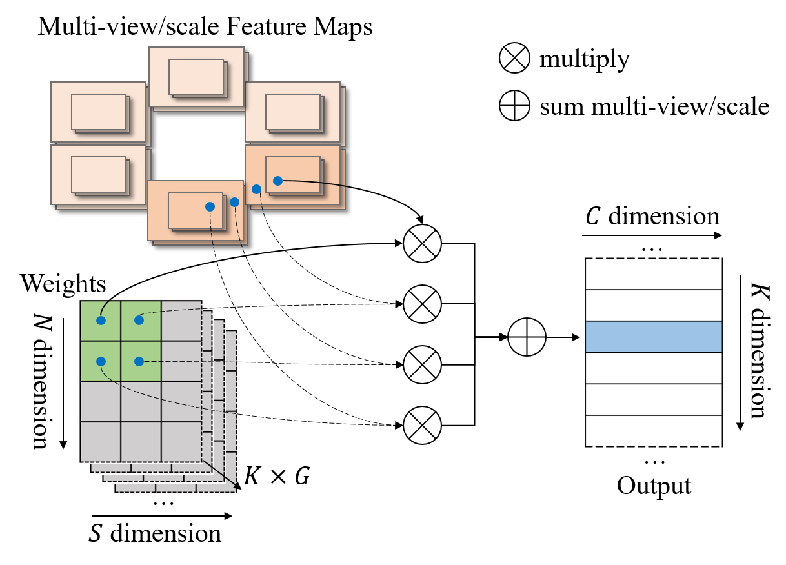

# Sparse4D v2: Recurrent Temporal Fusion with Sparse Model

## 一句话结论

Sparse4D v2 将 v1“当前 anchor 去每一帧历史图像重新采样”的滑窗融合，改成“上一帧稀疏实例状态投影后递归传给当前帧”，使时间融合的单帧成本从 $O(T)$ 降到 $O(1)$；同时用融合 CUDA 算子、显式相机参数编码和稠密深度辅助监督解决部署效率、几何泛化与训练不稳定问题。

## 论文信息

- Authors: Xuewu Lin, Tianwei Lin, Zixiang Pei, Lichao Huang, Zhizhong Su
- Year: 2023
- Venue: arXiv preprint
- Source: arXiv:2305.14018
- Local input: `_inbox/papers/Sparse4Dv2/neurips_2023.tex`
- Code: <https://github.com/linxuewu/Sparse4D>
- Paper: <https://arxiv.org/abs/2305.14018>

## v1 的瓶颈

v1 的时间融合在当前帧为每个 anchor 构造跨 $T$ 帧关键点，保留历史图像特征并逐帧采样。历史越长，延迟、显存和训练成本越高：论文在 RTX 3090、R50、$704\times256$ 输入上报告，v1 从 1 帧的 21.5 FPS / 424 MB 降到 9 帧的 6.1 FPS / 1149 MB。

v2 的关键变化不是简单减少历史帧，而是改变记忆载体：图像证据被压缩到实例 feature 中，结构化的 anchor 单独做几何变换；每个时刻只读取当前图像和上一时刻的稀疏状态。

## 方法拆解

### 整体结构

decoder 包含 1 个单帧层和 5 个多帧层。单帧层从初始化 anchors 中发现新目标并选出高分候选；多帧层接收上一帧传播来的历史实例与当前候选，在固定总 anchor 数下融合二者。默认 900 个 anchors 中，600 个来自历史，300 个来自当前单帧层。

### 实例状态解耦与递归传播

一个实例拆成 anchor $A$、图像语义 feature $F$ 和由 anchor encoder 得到的位置 embedding $E$。跨帧时只变换有物理意义的 anchor，语义 feature 原样传播：

$$
A_t=\operatorname{Project}_{t-1\rightarrow t}(A_{t-1}),\qquad
E_t=\Psi(A_t),\qquad
F_t=F_{t-1}.
$$

对 3D 框，中心先按速度外推，再用 ego motion 转换；尺寸不变，朝向向量和速度随旋转矩阵变换：

$$
p_t=R_{t-1\rightarrow t}(p_{t-1}+\Delta t\,v_{t-1})+T_{t-1\rightarrow t},
$$

$$
v_t=R_{t-1\rightarrow t}v_{t-1}.
$$

这个设计让时序记忆成为 RNN hidden state：显式只传一帧，隐式可携带更久历史；代价是误检、漏检和状态偏差也会递归传播。

### Efficient Deformable Aggregation

v1 的实现先把各尺度双线性采样结果写回高带宽显存，再堆叠、乘权和求和，产生大量中间张量。v2 将采样与 view/scale 加权融合成单个 CUDA op，每个线程只需处理至多可见的两个相机和 $S$ 个尺度。

它没有改变数学目标，改变的是内存访问和 kernel 边界，因此是非常实用的系统级贡献：训练 batch size 从 3 增至 8，训练和推理显存大约减半。

### Camera Parameter Encoding

v1 从实例 feature 直接预测各相机采样权重，相机几何被隐式记在参数里；交换相机输入顺序时，权重不会自然同步变化。v2 把输出坐标系到图像坐标系的变换矩阵编码成高维向量，与实例 feature 相加后再预测对应视角权重。这样相机顺序、外参增强和跨 rig 泛化拥有显式条件。

### Dense Depth Supervision

v2 在每个 FPN 尺度增加 $1\times1$ 卷积预测深度，以 LiDAR 点云投影为监督、用 $L_1$ loss 训练；该分支仅训练时启用。它替换了 v1 的实例级 depth reweight，目的主要是给图像 encoder 提供更密集、稳定的几何梯度。

需要注意：v1 宣称不依赖 LiDAR 训练，而 v2 的默认训练已经使用 LiDAR 深度标签。模型推理仍是 camera-only，但训练数据要求发生了变化。

## 实验结论

### 效率证据

| 实现 | 训练显存 | 最大 batch | 100 epoch 时间 | 推理显存 | FPS |
| --- | ---: | ---: | ---: | ---: | ---: |
| 基础 aggregation | 6328 MB | 3 | 23.5 h | 925 MB | 13.7 |
| EDA | 3100 MB | 8 | 14.5 h | 432 MB | 20.3 |

同一轻量配置下，v2 的递归时序为 19.4 FPS；v1 的 9 帧滑窗只有 6.1 FPS。这里的 $O(1)$ 指每个新时刻对历史长度的增量成本，不代表整个模型与序列长度无关。

### 组件贡献

在 R50、$256\times704$、nuScenes val 上，非时序模型为 34.1 mAP / 41.4 NDS，完整 v2 为 43.9/53.9，说明递归时序是主要增益。去掉单帧新目标层后 mAP 从 41.9 降到 38.4；去掉相机参数编码 mAP 下降 2.0；去掉稠密深度监督的训练发生梯度崩溃，只得到 35.4/43.5。

### 主结果

- R50 低分辨率：43.9 mAP / 53.9 NDS / 20.3 FPS，略高于 StreamPETR 的 43.2/53.7，但慢于其 26.7 FPS。
- R101 高分辨率：基础 v2 为 48.5/58.0 / 8.4 FPS；加入 nuImages 预训练为 50.5/59.4。论文带未来帧的离线变体为 52.1/60.8，不能与纯在线设置混为一谈。
- nuScenes test、VoVNet-99：55.7 mAP / 63.8 NDS，相比 v1 的 51.1/59.5 全面提升。

## 局限与问题

- top-$k$ 历史实例既是压缩瓶颈也是错误传播通道；弱目标一旦未被选择，后续很难靠历史恢复。
- 递归 feature 没有显式可解释的时间跨度，长期信息可能逐步遗忘或被污染。
- 默认训练依赖 LiDAR 深度监督，camera-only 指推理模态而非完整训练模态。
- EDA 的速度优势依赖自定义 CUDA/芯片算子，移植到新后端需要额外工程工作。
- 相机参数编码改善了显式条件化，但论文没有充分验证跨相机 rig、跨数据集标定分布的泛化。

## 与其他论文的关系

- 相比 [Sparse4D v1](../2022-sparse4d/README.md)，v2 将历史图像窗口替换为实例级循环记忆，是系列最重要的架构转折。
- 它与 [StreamPETR](../../query-based-bev-temporal-fusion/2023-streampetr/README.md) 都传播稀疏 object queries；Sparse4D v2 的 cross-attention 仍是围绕 3D anchor 的多点局部采样，而 StreamPETR 使用 PETR 风格全局图像注意力。
- 与 VideoBEV 的递归 dense BEV memory 相比，v2 状态更小、更适合检测，但不保留完整场景背景。
- [Sparse4D v3](../2023-sparse4d-v3/README.md) 基本沿用这里的递归推理结构，主要改进训练和跟踪解释。

## 个人复盘

- 我真正理解的部分：v2 的效率来自“只传充分统计量式的实例状态”，而非把 v1 的多帧采样做得更快。
- 仍然不清楚的问题：被递归 feature 编码的早期证据能保留多久，以及状态污染是否随遮挡长度快速上升。
- 后续要读的内容：StreamPETR 的 object memory、VideoBEV 的 dense recurrent memory，以及 v3 的 temporal denoising。
