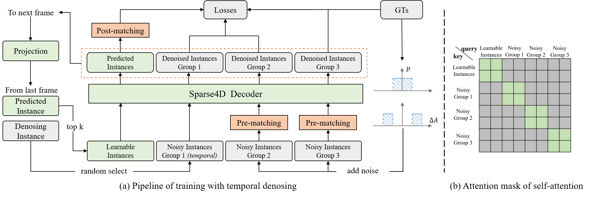
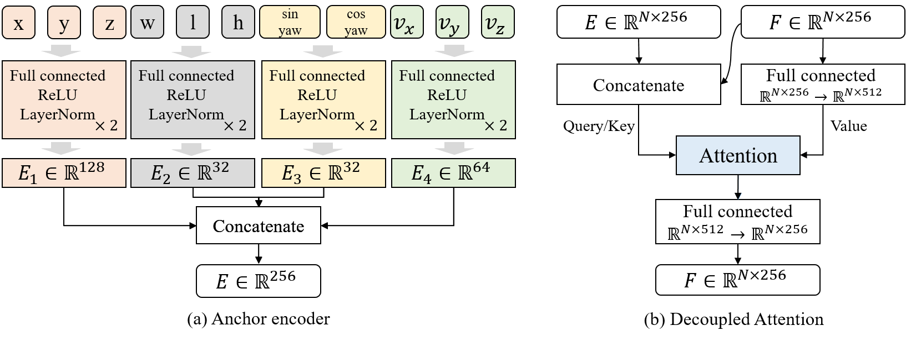
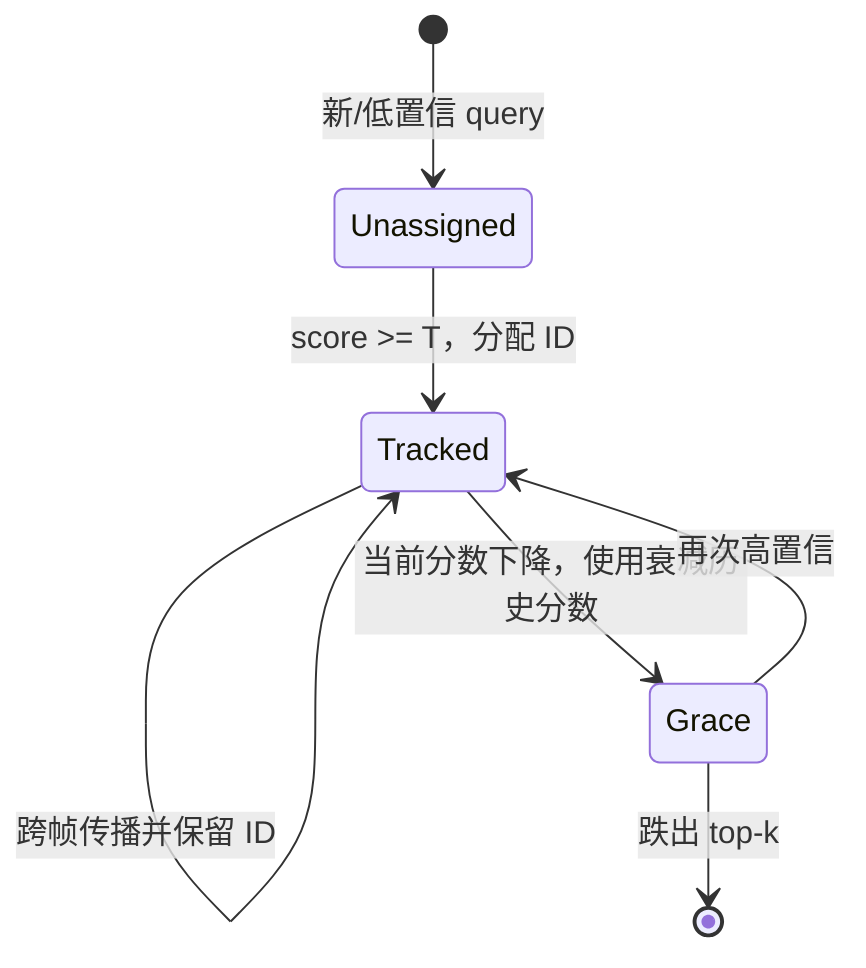

# Sparse4D v3: Advancing End-to-End 3D Detection and Tracking

## 一句话结论

Sparse4D v3 不再重做 v2 的时间表示，而是修复 query-based detector 的训练与排序：用时序去噪增加稳定正样本，用 centerness/yawness 让置信度反映框质量，用解耦 attention 避免内容与位置相加造成干扰；最后把跨帧传播的 query 直接解释成轨迹并在首次高置信时分配永久 ID，无需 tracking loss 或数据关联器即可完成 3D MOT。

## 论文信息

- Authors: Xuewu Lin, Zixiang Pei, Tianwei Lin, Lichao Huang, Zhizhong Su
- Year: 2023
- Venue: arXiv preprint
- Source: arXiv:2311.11722
- Local input: `_inbox/papers/Sparse4Dv3/Paper.tex`
- Code: <https://github.com/linxuewu/Sparse4D>
- Paper: <https://arxiv.org/abs/2311.11722>

## 背景问题

v2 已经把时序计算降为递归 $O(1)$，但 one-to-one Hungarian matching 在训练早期分配不稳定、正样本稀少；分类分数只回答“是不是该类别”，并不保证高分框位置和朝向更准；anchor embedding 与 instance feature 直接相加后做 attention，也可能让空间编码异常值主导相似度。

另一方面，v2 的 600 个 temporal instances 天然跨帧延续，已经很像 track queries。v3 的问题是：能否不引入 ID 监督、不重新训练 tracker，只靠这条 query 生命线输出轨迹？

## 核心贡献

1. 将 DN-DETR 式去噪扩展到 3D 时序实例，并用组间 attention mask 防止标签泄漏。
2. 预测 centerness 与 yawness，校准检测排序质量。
3. 将位置 embedding 与内容 feature 从相加改为拼接后参与 query attention。
4. 将 temporal query 的持续传播直接转成 ID 生命周期管理，实现无 tracking fine-tuning 的联合检测跟踪。

## 方法拆解

### Temporal Instance Denoising

训练时除正常可学习 anchors 外，还从 GT 3D 框生成多组带噪 anchors：

$$
A_{noise}=\{A_i+\Delta A_{i,j,k}\mid i\in\mathbb Z_N,j\in\mathbb Z_M,k\in\mathbb Z_2\}.
$$

近噪声与远噪声分别从 $(-x,x)$ 和 $(-2x,-x)\cup(x,2x)$ 采样，但论文不直接把它们硬标为正负，而是每组与 GT 做二分图匹配，避免远噪声偶然更接近其他 GT 时错标。每帧随机挑选部分 noisy groups 像普通 temporal instances 一样传播到下一帧：anchor 做 ego/速度补偿，feature 直接传递，并按实例 ID 延续正样本。

每组 noisy queries、正常 queries 之间通过 attention mask 隔离，确保 decoder 不能通过其他组或正常 query 偷看答案。它的作用既是增加正样本数量，也是让“已知 GT 附近如何回归”成为稳定辅助任务。

### Quality Estimation

v3 为正样本定义位置质量与朝向质量：

$$
C=\exp\left(-\lVert p_{pred}-p_{gt}\rVert_2\right),
$$

$$
Y=(\sin\theta,\cos\theta)_{pred}\cdot(\sin\theta,\cos\theta)_{gt}.
$$

网络额外预测 centerness 与 yawness，并用交叉熵与 focal loss 监督：

$$
\mathcal L_{quality}=\lambda_1\operatorname{CE}(Y_{pred},Y)+
\lambda_2\operatorname{Focal}(C_{pred},C).
$$

推理排序时把 centerness 与类别分数结合，使高置信预测更可能真的靠近 GT。论文的 PR 和 confidence–translation-error 曲线显示，这一改动主要改善高阈值、低 recall 区间的定位质量。

### Decoupled Attention

v2 将 anchor embedding $E$ 与实例内容 $F$ 相加后参与 self/temporal cross-attention。v3 对 anchor 的不同物理分量分别编码，并在多头 attention 外部把 $E$ 与 $F$ 拼接；内容与空间不再被强制落在同一向量坐标上。

这里的“decoupled”与 MapTRv2 按 instance/point 两个轴拆分 attention 不同：Sparse4D v3 解耦的是 query 的内容与位置模态。

### 从 temporal instance 到轨迹

每个 temporal instance 保存 $(c,a,id)$。当前推理后：

1. 若预测分数超过阈值 $T=0.25$，且它来自新 query 或尚无 ID，则分配新 ID；已有 temporal query 保留原 ID。
2. 历史 query 的写回分数取 $\max(c'_i,S c_i)$，其中 $S=0.6$，给短暂低分目标一个衰减后的生存机会。
3. 从全部输出中选 top-$N_t$ 作为下一帧 temporal instances；top-k 同时承担轨迹生命周期管理。

它没有显式关联矩阵；“哪条轨迹对应哪个检测”由 query 在网络内部持续被同一实例更新来隐式完成。

## 实验结论

### v2 → v3 的受控改进

R50、$256\times704$、nuScenes val：

| Setting | mAP | NDS | mATE $\downarrow$ | mAVE $\downarrow$ | AMOTA |
| --- | ---: | ---: | ---: | ---: | ---: |
| Sparse4D v2 | 43.9 | 53.9 | 0.598 | 0.282 | 41.4 |
| + 单帧去噪 | 44.7 | 54.8 | 0.586 | 0.257 | 44.5 |
| + 解耦 attention | 45.8 | 55.1 | 0.599 | 0.238 | 47.2 |
| + 时序去噪 | 46.2 | 55.7 | 0.581 | 0.246 | 45.7 |
| + centerness + yawness = v3 | 46.9 | 56.1 | 0.553 | 0.227 | 49.0 |

各行是累积消融，因此不能把 AMOTA 的非单调变化解释成单模块独立效果。完整 v3 相比 v2 为 $+3.0$ mAP、$+2.2$ NDS、$+7.6$ AMOTA，速度只从 20.3 降到 19.8 FPS。

### 主结果与“最佳模型”边界

- R101 validation：53.7 mAP / 62.3 NDS / 8.2 FPS，相比 v2 的 50.5/59.4/8.4 基本不牺牲速度。
- VoVNet-99 test：57.0 mAP / 65.6 NDS；同一模型 tracking 为 57.4 AMOTA、669 IDS。
- 论文摘要的 71.9 NDS / 67.7 AMOTA 来自 EVA02-Large 加未来 8 帧的云端离线配置。未来帧本身把 R101 NDS 从 65.8 提到 69.0，强主干再推至 71.9，不能视为在线 v3 的默认结果。

## 局限与问题

- 所谓“端到端 tracking”不使用 ID loss，却仍包含阈值、分数衰减和 top-k 生命周期规则；它是极简后处理，不是完全无规则系统。
- ID 一旦分配就随 query 固定，若 query 内部发生 identity drift，系统没有显式 re-association 机制纠正。
- temporal denoising 依赖 GT ID 来传播 noisy positives，而论文同时强调 tracker 不需要 ID 训练；应区分辅助去噪中的时序标识与最终 tracking loss。
- quality score 针对中心与朝向，未直接建模尺度、速度或类别校准质量。
- 最强离线结果使用未来帧和超大预训练 backbone，部署意义与在线模型不同。

## 与其他论文的关系

- [Sparse4D v1](../2022-sparse4d/README.md) 解决稀疏多点时空采样，[v2](../2023-sparse4d-v2/README.md) 解决递归效率，v3 解决训练、排序与跟踪解释。
- Temporal Instance Denoising 来自 DN-DETR/DINO 的训练思想，但增加了 3D anchor 噪声、时序传播和组隔离。
- 与 MOTR/MUTR3D 的 track-query 训练不同，v3 不为正常 queries 强制 ID 一致匹配，也不加入 tracking-specific loss。
- 与 StreamPETR + 外部 QTrack 相比，v3 直接把 detector 自身的 temporal instances 当作轨迹载体。

## 个人复盘

- 我真正理解的部分：v3 最有价值的观点是“递归 detector 已经隐式完成了大部分 association”，跟踪可以先从 query identity 而非额外匹配器出发。
- 仍然不清楚的问题：不使用 ID 约束时，长遮挡、相互交叉和 query 竞争下的 identity 稳定性究竟由什么保证。
- 后续要读的内容：DN-DETR/DINO 的 query denoising、MOTR 的 track-query matching，以及概率化的置信度校准方法。

## QA

### Q：Sparse4D v3 中 Temporal Instance Denoising 的原理是什么？二分图匹配又是什么？

A：先抓住一句话：Temporal Instance Denoising 是一个**只在训练时使用的辅助任务**。它不是消除图像噪声，而是把 GT 3D box 加上人为扰动，做成一批“离答案不太远的 noisy queries”，让 decoder 反复练习把它们修正回正确目标，并把其中一部分沿时间传播。

#### 为什么需要 denoising？

普通 DETR/Sparse4D 的 learnable queries 一开始既不知道目标在哪里，也没有固定负责哪个 GT。网络输出后，需要通过 Hungarian matching 临时决定 query–GT 对应关系。训练早期预测很差，相邻 epoch 或 decoder layer 中，同一个 GT 可能不断换 query，导致监督不稳定；而 one-to-one matching 对每个 GT 最多只产生一个正样本，decoder 能获得的有效回归训练也很少。

去噪分支相当于给 decoder 增加“带提示的练习题”。对每个 GT anchor $A_i$，生成多组：

$$
A_{noise}=A_i+\Delta A_{i,j,k}.
$$

其中一类扰动较小，另一类扰动更远。由于 noisy anchor 已经从 GT 附近起步，decoder 更容易学会“看到这个位置附近的图像特征后，应当怎样修正中心、尺寸、朝向和速度”。论文默认生成 5 组，因此每个 GT 可以在辅助分支中提供多组训练信号；这些 noisy queries 与正常 learnable queries 通过 attention mask 隔离，组与组之间也隔离，避免不同组互相泄露答案。推理时整个 noisy 分支都会删除。

“Temporal”表示论文不只做单帧去噪：它随机选择部分 noisy groups，像正常 temporal instances 一样传到下一帧；anchor 经过 ego-motion 和目标速度补偿，instance feature 直接延续。于是 decoder 不仅学习“把当前帧的扰动框修正回来”，还学习“一个近似正确的实例经过时序传播后，怎样在下一帧继续定位同一目标”。

#### 什么是二分图匹配？

把两类节点放在图的两边：左边是 queries，右边是 GT boxes；任意 query 与任意 GT 之间都有一条边，边的 cost 表示它们有多不匹配。普通 DETR 常用分类代价和 box 几何代价组成 cost matrix：

$$
C_{ij}=\operatorname{cost}(q_i,g_j).
$$

Hungarian algorithm 在这个矩阵中寻找总 cost 最小的一组连线，并满足：一个 query 最多连接一个 GT，一个 GT 也最多连接一个 query。这就是 one-to-one bipartite matching。被匹配的 query 是对应 GT 的正样本，未匹配 query 作为背景/负样本。

例如有两个 GT：汽车 A、汽车 B，以及三个 queries。即使 $q_1$ 和 $q_2$ 都很靠近 A，匹配也不能把二者同时分给 A；它可能选择 $q_1\rightarrow A$、$q_3\rightarrow B$，而让 $q_2$ 成为未匹配项。它解决的是**全局唯一分配**，不只是为每个 query 各自找最近 GT。

#### 为什么 noisy queries 也要匹配？

不能简单规定“小扰动一定是正样本，大扰动一定是负样本”。假设由汽车 A 生成的远扰动 anchor 恰好落到汽车 B 附近，那么按噪声幅度硬标成 A 的负样本会与真实几何关系冲突。Sparse4D v3 因此在**每个 noisy group 内**先将 noisy anchors 与当前帧 GT 做一次二分图匹配：每个 GT 最多选一个最合适的 noisy anchor 为正样本，其余作为负样本。论文只说明这里是 anchor–GT pre-matching，没有展开具体 cost 的组成，因此不应擅自等同于某一套固定的分类/L1/IoU 权重。

可以把完整流程记成：

$$
\text{GT 加噪生成 queries}
\rightarrow
\text{每组二分图匹配确定正负}
\rightarrow
\text{decoder 学习还原 GT}
\rightarrow
\text{部分 query 跨帧传播继续还原}.
$$

因此，普通 learnable queries 仍负责真正的自由检测；Temporal Instance Denoising 只是训练期的“脚手架”。它用更多、对应关系更稳定的辅助正样本改善收敛，最终并不会要求测试输入包含 GT。
