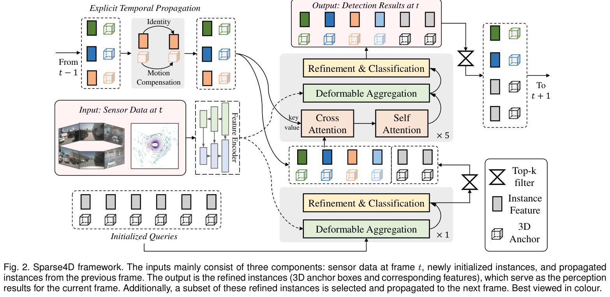
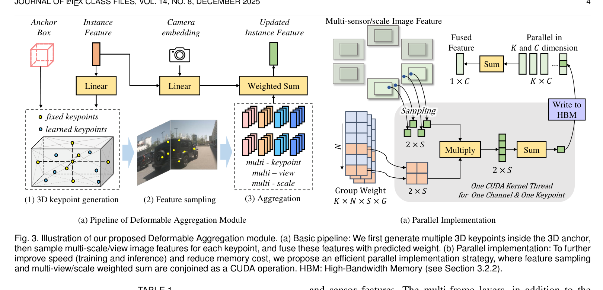

# Sparse4D: Sparse-based End-to-End Multi-Sensor Temporal Perception

## 一句话结论

Sparse4D 的正式 TPAMI 版本把 v1 的 deformable aggregation、v2 的递归实例传播和 v3 的去噪/质量估计/跟踪统一成一个持续维护稀疏 4D instances 的框架：每个实例由显式几何 anchor 与隐式 feature 解耦表示，只围绕少量 3D keypoints 从多视角、多尺度、时序和多模态特征中取证，避免构造全局稠密 BEV，同时用跨帧实例身份直接完成检测—跟踪。

## 论文信息

- Authors: Xuewu Lin, Zixiang Pei, Keyu Li, Tianwei Lin, Lichao Huang, Chenyao Yu, John See, Zhizhong Su, Cong Yang
- Year: 2026
- Venue: IEEE Transactions on Pattern Analysis and Machine Intelligence, early access
- DOI: <https://doi.org/10.1109/TPAMI.2026.3688545>
- Project: <https://github.com/HorizonRobotics/Sparse4D>
- Local input: `_inbox/pdfs/Sparse4D-TPAMI.pdf`
- Source note: 作者接受稿；没有公开 TeX，本文笔记直接依据 19 页 PDF

## 背景问题

多相机时序 3D 感知常先把所有传感器信息投到稠密 BEV，再在 BEV 中做空间和时间融合。这条路线表示规整，但代价随 BEV 范围和分辨率增长，超远距离感知、低成本芯片部署和高度信息保留都比较困难。

早期稀疏 query 方法不构造 BEV，却通常只在单个 reference point 取少量图像特征，空间证据和时序上下文不足。Sparse4D 要回答的是：能否让少量 object instances 成为贯穿空间融合、时间融合、检测和跟踪的唯一状态载体，同时达到或超过稠密 BEV 方法？

## 核心贡献

1. 以“显式 anchor + 隐式 instance feature”定义可持续传播的稀疏 4D instance，并统一 camera、LiDAR 与 camera–LiDAR fusion。
2. 用 deformable aggregation 围绕 3D anchor 生成多个 keypoints，从多视角、多尺度特征中采样并动态加权；再把采样与加权融合成 Efficient Deformable Aggregation CUDA 算子。
3. 用递归实例传播把历史复杂度从随窗口长度增长的 $O(T)$ 改为逐帧 $O(1)$ 状态更新，并显式补偿目标运动和 ego motion。
4. 直接给跨帧传播 instance 分配稳定 ID，以极简生命周期管理实现联合检测与跟踪，不需要 tracking GT 或为 tracker 额外微调。
5. 正式版本不是简单拼接三个预印本：论文称其重新设计了统一 feature encoding 接口，并加入多传感器、传感器失效、标定噪声和实车运行验证。

## 方法拆解

### 总体结构

每帧输入包含三部分：当前传感器特征、新初始化 instances、上一帧传播过来的 temporal instances。decoder 先用一个 single-frame layer 发现新目标，再把高置信候选和历史 instances 送入五个 temporal layers。每层通过 temporal cross-attention、instance self-attention、deformable aggregation 和 box refinement 反复更新状态；最后 Top-$K$ instances 进入下一帧。

一个 3D detection instance 被明确拆成：

$$
I_i=(F_i,A_i),
$$

其中 $F_i$ 是高维语义特征，anchor 为：

$$
A_i=\{x,y,z,w,l,h,\sin\theta,\cos\theta,v_x,v_y,v_z\}.
$$

二者解耦很关键：$F_i$ 可以原样跨帧携带外观与历史信息；$A_i$ 则能用速度和 ego pose 显式运动补偿，还可编码为位置 embedding $E_i=\Psi(A_i)$。

### Deformable aggregation

每个 anchor 内生成 $K$ 个固定或可学习 3D keypoints，将它们投影到第 $n$ 个传感器、第 $s$ 个尺度的特征图并做双线性采样：

$$
f_{k,n,s}=\operatorname{Bilinear}(I_{n,s},P^{img}_k).
$$

权重不只依赖 query，还显式编码 anchor 和相机参数：

$$
W=\Psi\bigl(F+E+\Phi(\mathrm{Cam})\bigr)
\in\mathbb R^{K\times N\times S\times G}.
$$

随后沿 keypoint、sensor/view 和 scale 聚合：

$$
F'=\sum_{k,n,s}W_{k,n,s}\odot f_{k,n,s}.
$$

这与普通 deformable attention 的主要差别是采样首先受显式 3D box geometry 约束，并把多视角、多尺度直接纳入同一次 instance-level 聚合。EDA 将 bilinear sampling 与 view/scale weighted sum 融合为一个 CUDA kernel，避免把巨大的中间张量反复写入 HBM。

### 递归时序建模

上一帧 instance feature 不做稠密 warping，而是保持 $F_t=F_{t-1}$；几何 anchor 按目标速度和 ego pose 投影到当前坐标系：

$$
A_t=\operatorname{Project}
\left(A_{t-1}+\Delta t\,v_{t-1},T_{(t-1)\rightarrow t}\right).
$$

更新后的 temporal instances 与当前 frame 的候选交互，再从当前图像重新取证。这样历史被压缩进固定数量的实例状态，推理成本不随已经观察的帧数增长；代价是未被 Top-$K$ 保留的证据会永久丢失。

### 检测即跟踪

如果一个传播 instance 的置信度超过阈值，就为它分配 ID；之后只要该 instance 继续传播，ID 保持不变。低置信度 instance 的 score 会衰减，生命周期由 Top-$K$ 自动管理。该方法不另做 box-to-track Hungarian association，但严格说仍包含阈值、score decay 和 Top-$K$ 等推理规则，不是完全无启发式后处理。

### 训练增强

正式模型使用四类损失：

$$
\mathcal L=\lambda_1\mathcal L_{cls}
+\lambda_2\mathcal L_{box}
+\lambda_3\mathcal L_{depth}
+\lambda_4\mathcal L_{qua}.
$$

- temporal instance denoising：给 GT anchors 加噪并跨帧传播，组内匹配正负样本，组间用 mask 隔离；
- decoupled attention：把 anchor embedding 与 instance feature 由直接相加改为拼接式参与 attention，减少几何和语义互相污染；
- dense depth supervision：只在训练期用 LiDAR depth 帮助图像 backbone 建立几何；
- quality estimation：除分类置信度外预测 centerness 与 yawness，改善 box 质量排序。

centerness 和 yawness 分别为：

$$
C=\exp\left(-\lVert p_{pred}-p_{gt}\rVert_2\right),
\qquad
Y=[\sin\theta,\cos\theta]_{pred}^{\top}
[\sin\theta,\cos\theta]_{gt}.
$$

### 多传感器扩展

Camera 分支在 3D keypoints 投影后的多视图特征上聚合；LiDAR 分支先 voxelize 得到多尺度 BEV features，再用 anchor 的 2D 投影位置取样。两种 modality 分别生成同一个 instance 的特征，最后在 instance level 融合。它避免构造 camera BEV，但 LiDAR 分支仍使用稠密 BEV 特征，因此“fully sparse”主要描述统一的任务状态和融合中心，而不是所有底层 feature maps 都稀疏。

## 实验结论

### 模块增益与效率

R50、$256\times704$ 的逐项消融从 32.3 mAP / 39.7 NDS 增长到完整模型的 46.9 mAP / 56.1 NDS。最显著的跃迁来自引入 temporal layers 和 recurrent temporal modelling；相较非时序模型，论文报告 temporal fusion 带来 9.3 mAP 与 13.2 NDS。

EDA 的工程收益非常直接：训练显存从 5705 MB 降至 2853 MB，最大 batch size 从 3 增至 8，100 epochs 训练时间从 23.5 h 降至 14.5 h；推理显存从 964 MB 降至 469 MB，速度从 13.1 提升到 19.8 FPS。

### Detection、tracking 与多模态

| Setting | mAP | NDS | Tracking |
| --- | ---: | ---: | --- |
| Camera R50 val | 46.9 | 56.1 | 49.0 AMOTA / 430 IDS |
| Camera R101 val | 53.7 | 62.3 | 56.7 AMOTA / 557 IDS |
| Camera VoVNet-99 test | 57.0 | 65.6 | 57.4 AMOTA |
| Camera EVA02-Large test | 63.0 | 69.4 | 64.3 AMOTA |
| LiDAR+Camera val | 71.3 | 73.6 | — |
| LiDAR+Camera test | 71.4 | 74.4 | — |

在相同 R50 设置下，Sparse4D 的 46.9 mAP 高于表中的 StreamPETR 43.2，同时 19.8 FPS 低于 StreamPETR 所报 26.7 FPS，说明“性能—效率双优”成立于整体 Pareto 对比，不意味着它在所有单项速度上最快。

论文还报告两台实车、五次每次 20 分钟的 field runs：Sparse4D 为 0.763 mAP@0.5、128 ms latency、5.3 GB memory；但测试规模、标注与域和公开 benchmark 不同，这组结果更适合视为可部署性证据，而不是通用排行榜结论。

## 局限与问题

- 3D keypoint projection 依赖相机内外参；论文虽加入 camera encoding、噪声测试和噪声微调，但几何误差仍会直接改变采样位置。
- Top-$K$ recurrent memory 高效但有不可逆遗忘：低置信、远距或短时遮挡目标可能在被保留前就消失。
- 夜间仍是明显短板：night subset 只有 26.8 mAP / 34.4 NDS，远低于 rain subset 的 51.8 / 59.5。
- “无需 tracking labels”依赖检测 query 自身已经学出稳定跨帧身份；阈值、score decay 和 Top-$K$ 对 ID 生命周期的敏感性值得跨数据集验证。
- Dense depth auxiliary loss 仍使用 LiDAR supervision；camera-only inference 不等于完全 camera-only training。
- TPAMI 结果横跨不同 backbone、预训练、分辨率和 offline future-frame 设置；比较时必须控制配置，不能把最强 detection、tracking 和实时速度数字拼成同一个模型。

## 与其他论文的关系

- [Sparse4D v1](../2022-sparse4d/README.md) 提出多 keypoint 的稀疏时空聚合；正式版将其整理为支持 camera/LiDAR 的 deformable aggregation 与 EDA。
- [Sparse4D v2](../2023-sparse4d-v2/README.md) 提出递归 instance propagation；正式版统一了空间和时间接口。
- [Sparse4D v3](../2023-sparse4d-v3/README.md) 引入 temporal denoising、quality estimation、decoupled attention 和检测即跟踪。
- [SparseDrive](../../end-to-end-autonomous-driving/2025-sparsedrive/README.md) 把同样的稀疏 instance 表征扩展到在线地图、运动预测与 ego planning。

## 个人复盘

- 我真正理解的部分：Sparse4D 的核心不是“少量 queries”本身，而是让同一批显式几何 + 隐式语义 instances 同时成为多视角采样坐标、跨帧记忆、检测输出和 tracking identity。
- 仍然不清楚的问题：在标定长期漂移、传感器异步和长遮挡下，固定容量 instance memory 的失效边界在哪里。
- 后续要读的内容：SparseDrive 的 agent/map 对称建模，以及 SparseDriveV2 如何把稀疏几何采样用于大规模候选轨迹 scoring。
